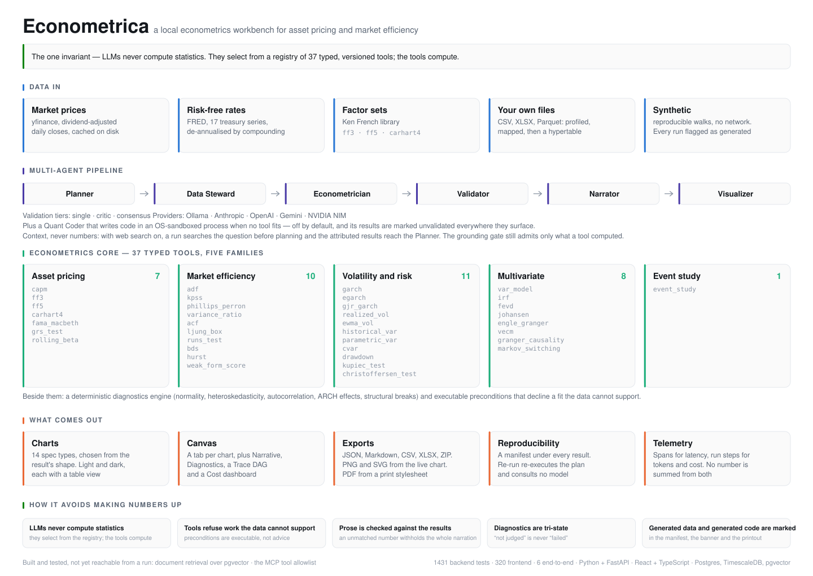

<picture>
  <source media="(prefers-color-scheme: dark)" srcset="docs/assets/capability-map-dark.svg">
  <source media="(prefers-color-scheme: light)" srcset="docs/assets/capability-map-light.svg">
  
</picture>

# Econometrica

Econometrica is a local, GenAI-powered econometrics workbench for financial asset
pricing and market efficiency analysis. A Python FastAPI backend serves a
React/TypeScript frontend, backed by Postgres with TimescaleDB and pgvector. LLM
agents select from a registry of typed, versioned econometric tools — they never
compute statistics themselves.

> **Status.** All six phases complete.
>
> **Working today:** projects and chats; the full econometrics core (37 tools
> across asset pricing, market efficiency, volatility, multivariate and event
> study); five LLM providers (Ollama, Anthropic, OpenAI, Gemini, NVIDIA NIM);
> a streaming chat pane you can hold a real conversation in; the
> multi-agent pipeline behind `POST /api/chats/{id}/runs` — Planner, Data
> Steward, Econometrician, Validator and Narrator, with executable tool
> preconditions and a numeric grounding gate; a renderer for each of the
> fourteen chart types a result can imply, themed light and dark, each with a
> table view of the same numbers; and **a canvas that runs an analysis and
> shows what came back** — charts in tabs, pinnable and full-screenable, with
> the refusals, the unjudged checks and the data-quality risks kept on screen
> beside them rather than behind a tab.
>
> **A result can be re-run from its manifest.** `POST /api/runs/{id}/rerun`
> re-executes the recorded plan against freshly resolved data and reports
> whether the numbers came back the same, naming the step and the reason when
> they did not. It asks no model anything.
>
> **And it can be taken away.** `GET /api/runs/{id}/export?format=…` serves the
> run as JSON, Markdown, CSV, XLSX or a ZIP of all of them, and every one
> carries the manifest that reproduces it — the data fingerprint, the tool
> versions, and the source the prices came from. Charts export to PNG and SVG
> from the browser, so the image is the one on screen. **PDF comes from the
> browser's own print pipeline** — a stylesheet, not a dependency in either
> stack: it forces light surfaces whatever theme you were reading in, keeps a
> chart card whole across a page break, and always prints the provenance block,
> because an exported artifact that cannot be traced back is what this project
> exists not to produce.
>
> The end-to-end gate runs it against a live local model. In a typical pass an
> 8B model plans five steps, four run, and **GARCH is refused** because the
> data has no ARCH effects to model.
>
> **Real market data works.** `ECONOMETRICA_PRICE_SOURCE=yahoo` fetches
> dividend-adjusted daily closes through yfinance, cached on disk so a run, its
> re-run and its exports share one fetch. The source and its adjustment policy
> are named in every quality report, because Yahoo's split-adjusted and
> dividend-adjusted closes for the same day can differ by 3% and reproducing a
> number means knowing which one produced it.
>
> An analysis can also ask for a **risk-free rate** (any of seventeen FRED
> series, converted to the frame's own frequency) and a **Fama-French factor
> set** — `ff3`, `ff5` or `carhart4` — fetched from Ken French's data library.
> With those, all 37 tools are reachable: AAPL against the three-factor set over
> 2018–2023 gives a market loading of 1.30 with negative size and value
> loadings, which is what a large-cap growth stock should look like.
>
> **A CSV, XLSX or Parquet file can be analysed the same way.** An upload is
> profiled, every column scored for the roles it *could* play, and the mapping
> confirmed by a person — in the app's Data screen, which opens when you select
> a project — before anything is stored. A model may only reorder candidates the
> profiler already found admissible, and only a confirmed mapping is ever
> ingested. The observations land in a Timescale hypertable and
> are served through the same `PriceSource` protocol as Yahoo, so nothing above
> that seam knows whether a series was fetched or uploaded.
>
> **A run reads a project's uploads first and falls through to the market
> source for everything else**, so an uploaded index and a listed ticker can be
> analysed in one frame — which is the point, since a question like "how does
> this index co-move with that stock" is unanswerable if a run can only read
> one kind of source. Any run drawing on more than one says so: the quality
> report names every ticker under the source that served it, and a re-run
> resolves against the same upload rather than quietly reproducing from the
> market.
>
> `ECONOMETRICA_PRICE_SOURCE=synthetic` still generates reproducible random
> walks so the pipeline runs with no network at all; it is never the default, it
> is not going away, and every run built on it carries a `synthetic_data` risk
> flag. Left unset, a run refuses with an explanation rather than inventing data.
>
> **A run can read the web for context**, when a project turns it on — off by
> default. A small model first turns the question into symbol-shaped lookups
> ("Nifty 50 ticker symbol Yahoo Finance"); those are searched before planning,
> and the attributed results go to the Planner — the agent that has to name a
> real ticker from prose, and that used to invent one. Nothing the search
> returns can become a number: the grounding gate admits only what a tool
> computed, so a figure read on a web page is exactly as ungrounded as one a
> model invented, and there is a test saying so.
>
> **A run also reads a project's own documents**, when it has any. Upload a
> `.txt`, `.md` or `.pdf` and it is chunked into pgvector; a run then retrieves
> the passages relevant to the question into the Planner's context — no toggle,
> having documents is the opt-in. Retrieved text is held to the same rule as the
> web: nothing read from a document can become a number, only what a tool
> computed can.
>
> **A run can also call a project's MCP tools**, when they are configured. A
> research agent runs a short tool-calling loop before planning, calling only the
> tools an explicit per-tool allowlist permits, and hands a summary to the
> Planner. Like the web and documents, nothing an MCP tool returns becomes a
> number. A stdio server is an unsandboxed local command, so it is
> trust-the-command; HTTP is the choice for anything less.
>
> Every run records its own trace — a DAG of model calls and tool
> invocations with tokens, latency and parent links, readable at
> `GET /api/runs/{id}`. Rejected attempts are steps in their own right,
> because they were billed. A search is a step too, carrying the query it sent
> and the snippets it handed to the Planner.
>
> **When no tool fits, a model may write code** — the escape hatch §2 of the
> design chose, built last and off by default. It runs in a separate process
> with no network, no filesystem to speak of, an import allowlist and
> OS-enforced memory, CPU and wall-clock caps, and every restriction has a test
> that tries to get out of it. Three conditions gate it: the project must
> enable it (a chat cannot), the Validator must sign off, and the result is
> **marked `unvalidated` everywhere it surfaces** — in the manifest, in the run
> banner and in the printed provenance. That marking is the point. A live probe
> found a real local model producing a plausible, cleanly-running and badly
> wrong formula one run in five; nothing in a sandbox can catch that, which is
> why the number never gets to look like one a tested tool produced.
>
> **The end-to-end suite runs on real market data.** Six Playwright specs
> drive the whole thing from a cold start: a project, an upload profiled and
> confirmed into the hypertable, an analysis on a real ticker planned by a live
> local model, the charts and the trace DAG and the cost dashboard read back in
> the browser, the ZIP export, and a re-run that reproduces the numbers from the
> manifest. The earlier gates deliberately stay on generated prices and assert
> that a run says so; the Phase 6 one asserts the opposite on real prices,
> because a flag that cried wolf would be worse than none.
>
> Working notes for contributors — and for Claude — are in `CLAUDE.md`. The
> design and phase plans are in `docs/plans/`.

## Prerequisites

- Docker (Docker Desktop on Windows) — runs the Postgres/TimescaleDB/pgvector stack
- [uv](https://docs.astral.sh/uv/) — manages the Python 3.12 toolchain and virtualenv
- Node.js 20+ and npm — for the frontend
- Optionally [Ollama](https://ollama.com/) — the one provider that needs no API key,
  and the quickest way to see the chat working

Python 3.12 is required and pinned via `requires-python` in `backend/pyproject.toml`;
`uv` downloads it automatically, so no system Python 3.12 install is needed.

## Quickstart

On Windows, one command does all of it — database, migrations, API and web app,
each in its own window:

```powershell
.\start.ps1
```

`start.cmd` is a double-clickable wrapper around the same script. It creates
`.env` if it is missing, starts Docker Desktop if the engine is down, waits for
the API to answer `/api/health` before opening the browser, and stops
everything again with `.\start.ps1 -Stop`. Use `-PriceSource synthetic` to work
offline on generated data, or `-SkipInstall` once dependencies are settled.

It puts the API on **port 8001**, not 8000 — see the note on ports below.

The rest of this section is what the script does, for anyone not on Windows or
wanting to run the pieces separately.

### 1. Configure the environment

```bash
cp .env.example .env
```

The defaults work for local development. `.env` is gitignored.

### 2. Start the database

```bash
docker compose up -d db
```

This starts `econometrica-db` on host port `5433` (mapped to container port 5432)
and, on a **fresh** volume, runs `infra/initdb/01-extensions.sql` to enable the
`timescaledb` and `vector` extensions in both the `econometrica` and
`econometrica_test` databases.

Verify the extensions loaded:

```bash
docker exec econometrica-db psql -U econometrica -d econometrica -c "SELECT extname FROM pg_extension;"
docker exec econometrica-db psql -U econometrica -d econometrica_test -c "SELECT extname FROM pg_extension;"
```

Both should list `timescaledb` and `vector`.

> The init scripts only run when the data volume is empty. If you change them,
> reset the volume first with `docker compose down -v`.

### 3. Install backend dependencies

```bash
cd backend
uv sync --extra dev
```

### 4. Run the tests

```bash
cd backend
uv run pytest
```

Around 40 of these need the database from step 2. Tests marked `live` talk to a
real Ollama daemon and skip when one is absent — a mock only ever proves the
adapter matches what we *believe* the wire format is, which is the assumption
worth checking.

The rest of the gate, all of which CI-equivalent work should pass:

```bash
cd backend && uv run ruff check src tests alembic && uv run mypy src
```

```bash
cd frontend && npx vitest run && npx tsc --noEmit
```

### 5. Install the frontend and run it

```bash
cd frontend
npm install
```

Start the API and the dev server in two terminals:

```bash
cd backend && uv run uvicorn econometrica.main:app --port 8000 --host 127.0.0.1
```

```bash
cd frontend && npm run dev
```

Then open <http://localhost:5173>. Create a project and a chat, pick a provider
and model, and send a message.

To run an *analysis* rather than a conversation, use the canvas in the middle
pane: type a question, choose the model that should plan and narrate it, and
press Run analysis. A run needs a data source, or it refuses rather than
inventing one — start the backend with `ECONOMETRICA_PRICE_SOURCE=yahoo` for
real prices, or `=synthetic` to work offline on generated data that every
report flags as such.

Every chart type is also rendered over fixture data at
<http://localhost:5173/gallery.html>, which is the quickest way to see them all
in either theme. It is a dev harness only; `vite build` takes `index.html`
alone, so it never ships.

> **The two servers want different addresses, and it is not arbitrary.**
>
> Open the **app** at `localhost:5173`. Left at its default host, Vite binds
> only the first address the OS resolves — `::1` on Windows — so
> `127.0.0.1:5173` is refused outright. Pass `--host 127.0.0.1` if you want it
> reachable there too, as `playwright.config.ts` does.
>
> **Port 8000 is not safely ours on a machine running another container on it.**
> Naming `127.0.0.1` is not enough: a container holding the wildcard address
> answers `127.0.0.1:8000` too, and it wins often enough that uvicorn's own
> successful bind proves nothing — a health poll got 25 consecutive 404s with
> `Server: SurrealDB` while uvicorn sat bound to `127.0.0.1:8000`. Run the API
> on a port nobody else wants and point the proxy at it with
> `ECONOMETRICA_API_URL`, as `start.ps1` does; `vite.config.ts` reads that
> variable and falls back to `http://127.0.0.1:8000`.

Providers other than Ollama need an API key, stored encrypted at rest:

```bash
curl -X PUT http://127.0.0.1:8000/api/providers/anthropic/key -H "Content-Type: application/json" -d "{\"api_key\":\"sk-ant-...\"}"
```

## Repository layout

```
backend/          FastAPI app, econometric tool registry, LLM provider adapters
  src/econometrica/
    econ/         The tool registry and the five tool families
      diagnostics/  Deterministic assumption checks, run before any verdict
      gates.py      Executable tool preconditions — refusals, not advice
    llm/          Provider-neutral types plus the five adapters
    agents/       The six roles, the orchestrator, and the grounding gate
    api/          Routers
    db/           SQLAlchemy models
  tests/
frontend/         React + TypeScript, three-pane workbench
  src/
    components/charts/  One renderer per chart spec type, plus the palette
    components/canvas/  The artifact canvas: runs, charts, findings, re-run
  gallery.html    Dev-only: every chart type over fixture data
  e2e/            Playwright specs
docs/plans/       Design and implementation plans
docs/assets/      The capability map above, and the script that generates it
infra/initdb/     SQL run once on first database startup
docker-compose.yml
start.ps1         Starts the whole stack; `-Stop` takes it down again
```

## How it avoids making numbers up

Three mechanisms, each testable and none of them a prompt:

- **LLMs never compute statistics.** They select from `econ/registry.py`; the
  tools compute. Every number traces to a `ResultSet` with a reproducibility
  manifest.
- **Tools refuse work the data cannot support.** A `Gate` is checked against
  the real series before a tool runs — fitting a GARCH to a series with no
  ARCH effects is declined, with the reason, rather than returning a
  persistence figure a reader would take seriously.
- **Prose is checked against the results.** Every number a Narrator writes is
  matched to a computed one. Unmatched figures are not edited out; the whole
  interpretation is withheld and the results are returned without it.
