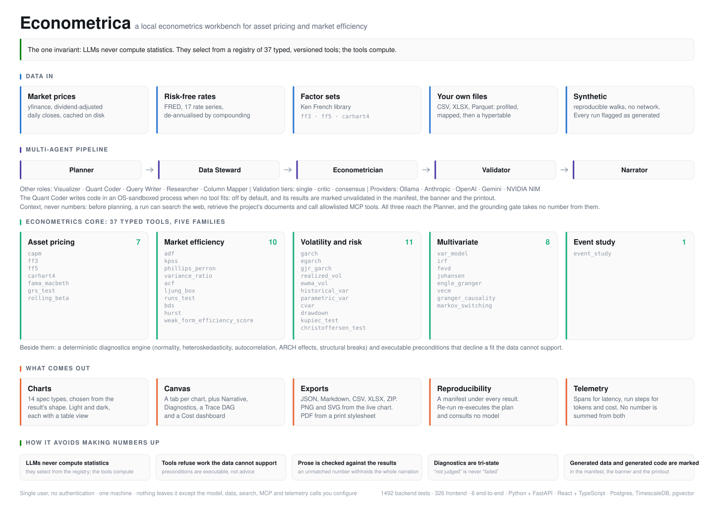
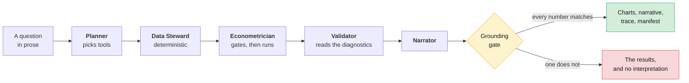

<picture>
  <source media="(prefers-color-scheme: dark)" srcset="docs/assets/capability-map-dark.svg">
  <source media="(prefers-color-scheme: light)" srcset="docs/assets/capability-map-light.svg">
  
</picture>

# Econometrica

**A local econometrics workbench where language models choose the methods and
tested functions do the arithmetic.**

Ask a question in prose. Get back charts, an interpretation, and a manifest
that reproduces every number in it.

- **Read time:** about 10 minutes, or 2 minutes for The problem and The
  answer alone.
- **Do first, on Windows:** run `.\start.ps1`. Everything else is under
  [Quickstart](#quickstart).

---

## The problem

**A language model's number looks the same whether it is right or wrong.**

Ask a good model for the beta of Apple against the S&P 500. You get a number
that is:

- formatted like a beta
- in a plausible range
- delivered in the same tone as a correct answer
- sometimes even right

"Sometimes" is the problem.

| If the model were | Then |
|---|---|
| always wrong | nobody would use it |
| always right | there would be nothing to solve |
| right sometimes, with no signal | you check every number by hand, and the model has saved you nothing |

**Letting it write code is better and still not enough.** We measured that. A
local model at temperature zero was asked five times for a Gini coefficient.

| Runs | What happened |
|---|---|
| 4 of 5 | correct code |
| 1 of 5 | ran cleanly, used only legal imports, finished in milliseconds, and reported **-42.49** |

A Gini coefficient is bounded in [0, 1]. Every guardrail held.

**A sandbox tells you code did not escape. It cannot tell you code was
right.**

## The answer

**LLMs never compute statistics. They select from a registry of 37 typed,
versioned, unit-tested functions, and the functions compute.**

Three mechanisms follow from that, and none of them is a prompt:

| | Mechanism | What it does |
|---|---|---|
| 1 | **A tool registry** | The model picks a tool by name. The tool computes, and every result carries a manifest that reproduces it |
| 2 | **Executable preconditions** | A gate is checked against the real series before a tool runs. A GARCH on data with no ARCH effects is declined, with the reason |
| 3 | **A numeric grounding gate** | Every number in the interpretation is matched against what the tools computed. One that does not match withholds the whole narration |

Each one is code with a test behind it. That is the difference between a
property you have and a property you hope for.


```mermaid
flowchart LR
    Q["A question<br/>in prose"] --> P["<b>Planner</b><br/>picks tools"]
    P --> D["<b>Data Steward</b><br/>deterministic"]
    D --> E["<b>Econometrician</b><br/>gates, then runs"]
    E --> V["<b>Validator</b><br/>reads the diagnostics"]
    V --> N["<b>Narrator</b>"]
    N --> G{"Grounding<br/>gate"}
    G -->|"every number matches"| OUT["Charts, narrative,<br/>trace, manifest"]
    G -->|"one does not"| HELD["The results,<br/>and no interpretation"]

    style G fill:#fff3cd,stroke:#eda100,color:#14181d
    style HELD fill:#f8d7da,stroke:#e34948,color:#14181d
    style OUT fill:#d4edda,stroke:#1baf7a,color:#14181d
```

---

## Documentation

**Six sections. Read them in order, or jump to the one you need.**

| | Section | Answers |
|---|---|---|
| 1 | **[Why this exists](docs/1-why/)** | What is actually wrong, and why the obvious fix is not enough |
| 2 | **[What is in the box](docs/2-product/)** | The product, a full [PRD](docs/2-product/prd.md), the [capability inventory](docs/2-product/capabilities.md), and [four user journeys](docs/2-product/journeys.md) |
| 3 | **[The architect's view](docs/3-architecture/)** | [High-level](docs/3-architecture/high-level-design.md) and [low-level](docs/3-architecture/low-level-design.md) design, [blueprints](docs/3-architecture/blueprints.md), [integration patterns](docs/3-architecture/integration-patterns.md) |
| 4 | **[Key decisions](docs/4-decisions/)** | [The central one](docs/4-decisions/the-central-decision.md), the [trust mechanisms](docs/4-decisions/trust-mechanisms.md), the [platform choices](docs/4-decisions/platform-choices.md), and [what we reversed](docs/4-decisions/reversals.md) |
| 5 | **[The roadmap](docs/5-roadmap/)** | [Medium term](docs/5-roadmap/medium-term.md) in eight themes, [long term](docs/5-roadmap/long-term.md) in six bets |
| 6 | **[The art of the possible](docs/6-art-of-the-possible/)** | What becomes reachable if this holds |

Two more places to look:

- **[`CLAUDE.md`](CLAUDE.md)**: working notes for contributors, and every
  sharp edge found the hard way.
- **[`docs/plans/`](docs/plans/)**: the dated design and phase plans.

---

## Status

**All six build phases complete.**

| Check | State |
|---|---|
| Backend tests | 1,492 |
| Frontend tests | 326 |
| Playwright end to end | 6 |
| `ruff` and `mypy --strict` | clean on `src` |
| `alembic check` | no drift |

<details>
<summary><b>What works today</b></summary>

**Computation**

- **The econometrics core.** 37 tools across asset pricing, market efficiency,
  volatility and risk, multivariate, and event study. Every one typed,
  versioned and tested against known-answer fixtures and property-based
  invariants.
- **The multi-agent pipeline.** Planner, Data Steward, Econometrician,
  Validator, Narrator, plus a Visualizer, a Quant Coder, a Query Writer, a
  Researcher and a Column Mapper. Three validation tiers. Two of the roles are
  deliberately deterministic and call no model at all.
- **A code escape hatch.** When no tool fits, a model may write code that runs
  in a separate process with no network, an import allowlist and OS-enforced
  caps. Off by default, gated three ways, and its results are marked
  `unvalidated` in the manifest, the run banner and the printout.

**Data**

- **Real market data.** Dividend-adjusted closes through yfinance, cached on
  disk. A risk-free rate from any of seventeen FRED series. Fama-French `ff3`,
  `ff5` and `carhart4` factor sets from Ken French's library. AAPL against the
  three-factor set over 2018 to 2023 gives a market loading of 1.30 with
  negative size and value loadings, which is what a large-cap growth stock
  should look like.
- **Your own files.** Upload CSV, XLSX or Parquet. Every column is scored for
  the roles it could play, a person confirms the mapping, and the observations
  land in a Timescale hypertable served through the same protocol as Yahoo. A
  run reads uploads first and falls through to the market source, so an
  uploaded index and a listed ticker can be analysed in one frame.
- **Context, never numbers.** A run can search the web (a small model writes
  symbol-shaped queries first), retrieve the project's own documents from
  pgvector, and call allowlisted MCP tools. All three reach the Planner and
  none reaches the Narrator, and nothing any of them returns can become a
  number.

**Output**

- **A canvas that shows the answer.** Fourteen chart types chosen from the
  shape of each result, light and dark, each with a table view. Refusals,
  unjudged checks and data-quality risks stay on screen beside the charts
  rather than behind a tab.
- **Re-run.** `POST /api/runs/{id}/rerun` re-executes the recorded plan against
  freshly resolved data and reports per step whether the numbers came back the
  same. It consults no model.
- **Exports.** JSON, Markdown, CSV, XLSX or a ZIP of all of them, each carrying
  the manifest. PNG and SVG from the live browser chart. PDF from the browser's
  own print pipeline, which is a stylesheet rather than a dependency.

**Platform**

- **Five LLM providers.** Ollama, Anthropic, OpenAI, Gemini, NVIDIA NIM. Keys
  encrypted at rest. Each agent role is assignable to its own provider and
  model, which is how the Validator gets a genuinely independent second
  opinion.
- **Telemetry.** Every model call recorded with its agent, provider, tokens,
  cost and latency, rejected attempts included, because they were billed.
  OpenTelemetry spans for everything the run trace cannot see.

</details>

<details>
<summary><b>What it deliberately will not do</b></summary>

**About numbers**

- Invent data when no source is configured. A run refuses with an explanation.
- Publish an interpretation containing an unmatched number. The whole narration
  is withheld, because a quietly repaired paragraph is worse than none.
- Let a sandbox result look like a registry result.
- Serve a stale cache entry when the source is unreachable.

**About the interface**

- Let a chat produce charts. A chat is one model streaming tokens; a run is a
  pipeline. They are separate routes on purpose.
- Ingest a column mapping no person confirmed.
- Draw a second y-axis. There is no field for it anywhere in the chart spec
  union, and a test asserts the absence across every type.

</details>

---

## Quickstart

### Prerequisites

| Need | Why |
|---|---|
| Docker (Docker Desktop on Windows) | The Postgres, TimescaleDB and pgvector stack |
| [uv](https://docs.astral.sh/uv/) | Manages the Python 3.12 toolchain and downloads it for you |
| Node.js 20+ and npm | The frontend |
| [Ollama](https://ollama.com/), optional | The one provider needing no API key, and the quickest way to see it working |

### On Windows, one command

Start the whole stack:

```powershell
.\start.ps1
```

Stop it:

```powershell
.\start.ps1 -Stop
```

What `start.ps1` does, in order:

1. Creates `.env` if it is missing.
2. Starts Docker Desktop if the engine is down.
3. Waits for the API to answer `/api/health`.
4. Opens the browser.

`start.cmd` is a double-clickable wrapper around the same script.

| Flag | Effect |
|---|---|
| `-PriceSource synthetic` | Work offline on generated data |
| `-SkipInstall` | Skip dependency installs once they are settled |

It puts the API on **port 8001**, not 8000. See [the note on ports](#a-note-on-ports).

### Or run the pieces

**1. Create the env file.**

```bash
cp .env.example .env
```

**2. Start the database.**

```bash
docker compose up -d db
```

This starts `econometrica-db` on host port `5433`. On a **fresh** volume it
also runs `infra/initdb/01-extensions.sql`, which enables `timescaledb` and
`vector` in both the `econometrica` and `econometrica_test` databases. Verify:

```bash
docker exec econometrica-db psql -U econometrica -d econometrica -c "SELECT extname FROM pg_extension;"
```

> The init scripts only run when the data volume is empty. If you change them,
> reset the volume first with `docker compose down -v`.

**3. Install the backend.**

```bash
cd backend && uv sync --extra dev
```

**4. Run the migrations.**

```bash
cd backend && uv run alembic upgrade head
```

**5. Start the API.**

```bash
cd backend && uv run uvicorn econometrica.main:app --port 8001 --host 127.0.0.1
```

**6. Start the frontend.**

```bash
cd frontend && npm install && npm run dev
```

**7. Open <http://localhost:5173>.** Create a project and a chat, pick a
provider and a model, and send a message.

**To run an analysis, not a conversation, use the canvas in the middle pane:**

1. Type a question.
2. Choose the model that should plan and narrate it.
3. Press Run analysis.

A run needs a data source, or it refuses rather than inventing one. Start the
backend with one of these set:

| Setting | You get |
|---|---|
| `ECONOMETRICA_PRICE_SOURCE=yahoo` | Real prices |
| `ECONOMETRICA_PRICE_SOURCE=synthetic` | Offline, generated data that every report flags as such |

**To see every chart type**, open <http://localhost:5173/gallery.html>. It
renders each one over fixture data, in either theme. It is a dev harness
only: `vite build` takes `index.html` alone, so it never ships.

### Providers other than Ollama need a key

```bash
curl -X PUT http://127.0.0.1:8001/api/providers/anthropic/key -H "Content-Type: application/json" -d "{\"api_key\":\"sk-ant-...\"}"
```

Keys are encrypted at rest and never stored as plaintext.

### A note on ports

**Open the app at `localhost:5173`, not `127.0.0.1:5173`.**

- Left at its default host, Vite binds only the first address the OS resolves.
- On Windows that is `::1`.
- Pass `--host 127.0.0.1` if you want it reachable there too, as
  `playwright.config.ts` does.

**The API runs on 8001 because port 8000 is not safely ours.**

- A container holding the wildcard address on 8000 answers `127.0.0.1:8000`
  traffic too.
- It wins often enough that uvicorn's own successful bind proves nothing.
- Measured: a health poll got 25 consecutive 404s with `Server: SurrealDB`
  while uvicorn sat bound to `127.0.0.1:8000`.

So run the API on a port nobody else wants, and point the proxy at it with
`ECONOMETRICA_API_URL`, as `start.ps1` does. `vite.config.ts` reads that
variable and falls back to `http://127.0.0.1:8000`.

---

## Tests

**Backend tests:**

```bash
cd backend && uv run pytest
```

- Around 40 of these need the database.
- Tests marked `live` talk to a real Ollama daemon and **skip** when one is
  absent. Read the report, not only the exit code.
- A mock only ever proves the adapter matches what we *believe* the wire format
  is. That is the assumption worth checking.

The rest of the gate is the three commands below.

**Lint and types:**

```bash
cd backend && uv run ruff check src tests alembic && uv run mypy src
```

**Frontend tests and types:**

```bash
cd frontend && npx vitest run && npx tsc --noEmit
```

**End to end:**

```bash
cd frontend && npm run test:e2e
```

The end to end suite drives the whole application from a cold start against a
live local model:

1. Create a project.
2. Upload a file, profile it, and confirm it into the hypertable.
3. Run an analysis on a real ticker.
4. Read the charts, the trace DAG and the cost dashboard back in the browser.
5. Export a ZIP, then re-run and reproduce the numbers from the manifest.

---

## Repository layout

```
backend/                    FastAPI app, tool registry, provider adapters
  src/econometrica/
    econ/                   The registry and the five tool families
      diagnostics/          Deterministic assumption checks, run before any verdict
      gates.py              Executable preconditions: refusals, not advice
    agents/                 The ten roles, the orchestrator, the grounding gate
    llm/                    Provider-neutral types plus the five adapters
    data/                   Price, rate and factor sources, and the disk cache
    tools/                  Context channels: web search, the retrieval protocol
    mcp/                    Server config, transports, the allowlist
    sandbox/                Policy, OS caps, the runner and the child
    charts/                 Which chart a result shape implies
    services/               Everything needing a session that is not a route
    telemetry/              Spans, the writer, the metrics query
    api/routers/            Eleven routers, thirty-two endpoints
    db/models/              SQLAlchemy models
  tests/
frontend/
  src/
    components/charts/      One renderer per spec type, plus the palette
    components/canvas/      The artifact canvas: runs, charts, findings, re-run
    components/data/        The Data screen: upload, map, confirm
    components/telemetry/   The trace DAG and the cost dashboard
  gallery.html              Dev only: every chart type over fixture data
  e2e/                      Playwright specs
docs/
  1-why/ … 6-art-of-the-possible/   The documentation above
  plans/                    Dated design and implementation plans
  assets/                   The diagrams, and the scripts that generate them
infra/initdb/               SQL run once on first database startup
docker-compose.yml
start.ps1                   Starts the whole stack; -Stop takes it down
```

---

## Contributing

**Read [`CLAUDE.md`](CLAUDE.md) first.** It is the working notes: the
conventions in force, every environment gotcha verified on a real machine, and
the reason behind each one.

The four conventions that matter most:

1. **TDD, strictly.** Write the failing test, run it, watch it fail with the
   expected error, then implement. Several real bugs here were found only
   because a test was run red first.
2. **Verify against reality, not just mocks.** Live probes against real
   services have caught several wrong beliefs that mocks confirmed happily.
3. **Comments explain constraints, not mechanics.** Say why a choice was
   forced, not what the next line does.
4. **Conventional Commits**, with the reasoning in the body.

Regenerate the diagrams after editing their definitions:

```bash
uv run python docs/assets/build_capability_map.py
```

```bash
uv run python docs/assets/build_doc_diagrams.py
```

---

## Licence

Not yet declared. Treat as all rights reserved until it is.

**Next, 2 minutes:** open [Why this exists](docs/1-why/) and read its first
section.
