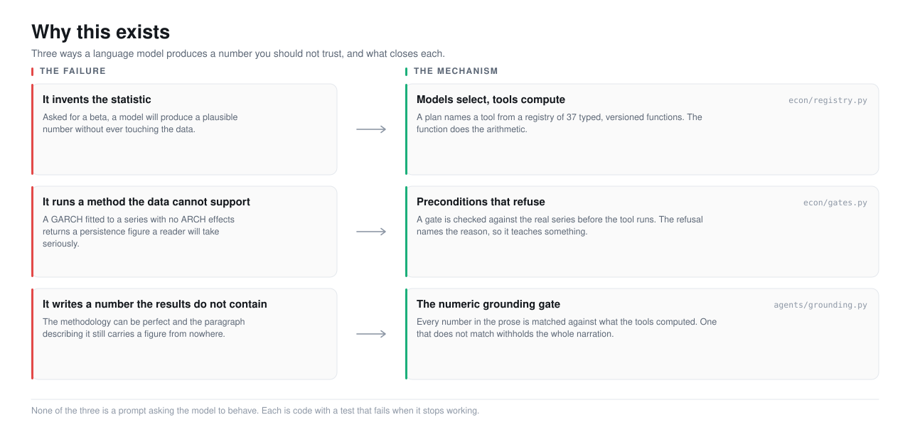
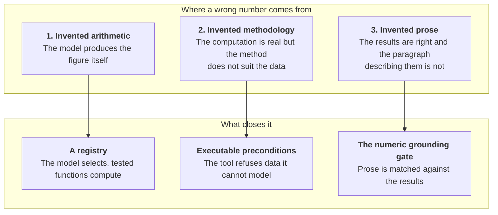

<picture>
  <source media="(prefers-color-scheme: dark)" srcset="../assets/doc-why-trust-gap-dark.svg">
  <source media="(prefers-color-scheme: light)" srcset="../assets/doc-why-trust-gap-light.svg">
  
</picture>

# 1. Why Econometrica exists

- **The point:** a model's number looks the same whether it is right or wrong,
  so the model must not be the thing that computes it.
- **Read time:** about 7 minutes
- **Do first:** read the three-row table under
  [The thing that is actually wrong](#the-thing-that-is-actually-wrong). It is
  the whole problem in three lines.

## The thing that is actually wrong

**A model's answer is right often enough to tempt you and wrong often enough
to hurt you. Nothing in the output tells you which one you got.**

Ask a good language model for the beta of Apple against the S&P 500 over the
last five years. You get a number that is:

- formatted like a beta
- in a plausible range
- delivered in the same tone as a correct answer
- sometimes even right

"Sometimes" is the problem.

| If the model were | Then |
|---|---|
| wrong all the time | nobody would use it, and there would be nothing to solve |
| right all the time | there would also be nothing to solve |
| right sometimes, with no signal | you check every number by hand |

Checking every number by hand means the model saved you nothing. It moved your
work from computing to auditing. That is worse: auditing is harder to do well
and much easier to do badly.

## The trap most people fall into

**The obvious fix is to let the model write code. It is better. It is not
enough.**

The fix goes: give the model pandas and statsmodels, run what it writes, show
the output. Now the number comes from a real computation, not from the model's
guess at what the answer looks like.

We ran a live probe on exactly this. A local model at temperature zero was
asked five times to compute a Gini coefficient.

| Runs | What happened |
|---|---|
| 4 of 5 | correct code, correct answer |
| 1 of 5 | reported a Gini coefficient of **-42.49** |

A Gini coefficient is bounded between 0 and 1.

On the failing run, every guardrail held:

- the code was syntactically fine and ran without an error
- it used only the libraries it was allowed
- it finished in milliseconds
- it satisfied every contract we had put around it
- the sandbox was not breached

None of those guardrails is about whether the arithmetic is correct. **A
sandbox tells you that code did not escape. It cannot tell you that code was
right.**

So code generation moves the failure. It does not remove it.

| Before | After |
|---|---|
| The model made up a number | The model made up a method |

The second failure is harder to spot. There is a computation behind it, and
computations look authoritative.

## The three failures, separately

**There are three failures. Each has a different fix.**

**1. Invented arithmetic is closed by never asking the model to do
arithmetic.**

- The model picks a tool by name from a registry of 37 typed, versioned
  functions.
- The function computes.
- For the questions the registry covers, which is most of them, this costs
  nothing in capability.

**2. Invented methodology is closed by making the preconditions executable,
not advisory.**

| Approach | What it is |
|---|---|
| Tell the model in its prompt that GARCH needs ARCH effects | a suggestion |
| Check the actual series for ARCH effects before the tool will run | a refusal |

A typical end to end run on this project: the model plans five steps, four
run, and GARCH is declined because the data has no ARCH effects to model.
Nobody had to notice.

**3. Invented prose is the one people forget, and the one that bites
hardest.**

You can compute everything correctly and still ship a paragraph containing a
figure that appears nowhere in the results. So:

1. Every number in the narration is extracted.
2. Each is matched against what the tools actually computed.
3. One unmatched number withholds the entire interpretation. The results are
   returned without it.

Withholding everything looks harsh. It is the right call.

| Option | What the reader gets |
|---|---|
| Strip the bad number, publish the rest | A paragraph with a hole cut in its argument, and no way to tell |
| Withhold the whole interpretation | The results, and silence |

Silence is honest. A quietly repaired sentence is not.

## Why the answer is a product and not a prompt

**Prompts fail silently. Code with a test behind it fails loudly.**

All three fixes could be attempted with prompt engineering: "Do not invent
numbers." "Check your assumptions." "Only cite figures from the results."

Prompts of this kind fail in a specific way:

- they work in testing
- they degrade in production
- they degrade silently: nobody gets an alert when a model stops honouring an
  instruction
- there is no test you can write that fails

Each of the three mechanisms here is code with a test behind it.

| Mechanism | What it is in the code |
|---|---|
| The registry | A Python module |
| The gate | A function that returns a refusal |
| The grounding check | A regular expression and a set membership test |

When someone loosens the grounding check too far, a test asserting that
`-15.066` still fails is the thing that tells them.

That is the difference between a property you hope for and a property you
have.

## Why econometrics specifically

**Three reasons this is the right domain to build this in.**

**1. The methods are settled.**

- Nobody needs a model to invent a new way to estimate a CAPM beta.
- The reference implementations exist in statsmodels, arch and linearmodels,
  and they have been correct for years.
- What people need help with is which of the 37 to reach for, in what order,
  on what window, at what frequency.
- That is a selection problem. Selection is what a language model is good at.

**2. The failure is expensive and invisible.**

- A wrong beta does not throw an exception.
- It gets put in a memo, and someone allocates against it.
- No runtime catches it. No compiler objects.
- The only thing that catches it is a person who already knows the answer,
  which defeats the point.

**3. The correctness is checkable.**

- A summary of a document has no definite answer. An econometric result does,
  given the inputs.
- So reproducibility is achievable: hash the input matrix, record the tool
  version, check a year later whether the same number comes back.
- If it does not come back, that is itself a finding. The data vendor quietly
  revised its history.

## What this buys you

**The claim is narrow and testable: every number this application shows you
traces to a tested function, and you can get it back.**

What the claim is not:

| Not claimed | Why not |
|---|---|
| "The analysis is correct" | A tool can be correctly applied to a badly chosen window |
| "The interpretation is right" | A validator can approve something a human would question |

The claim is about provenance. Provenance is what makes the other two
questions answerable at all.

The argument in one sentence:

> You cannot audit an analysis you cannot reproduce, and you cannot reproduce
> one whose numbers came from a model that has already forgotten how it got
> them.

## Read next

**Next, 2 minutes:** open [What goes wrong, in detail](what-goes-wrong.md) and
read Cluster 2, the Gini probe that shaped the design.

That page goes through the failure modes with the actual evidence from this
project's own history, including the ones we only found by looking at the
running application.

After that:

- **[What is in the box](../2-product/)**: what got built as a result.
- **[The central decision](../4-decisions/the-central-decision.md)**: the
  three-way choice this page argues for, written up as a decision record.

---

[Documentation](../README.md) · **1. Why** ·
[2. Product](../2-product/) · [3. Architecture](../3-architecture/) ·
[4. Decisions](../4-decisions/) · [5. Roadmap](../5-roadmap/) ·
[6. The art of the possible](../6-art-of-the-possible/)
