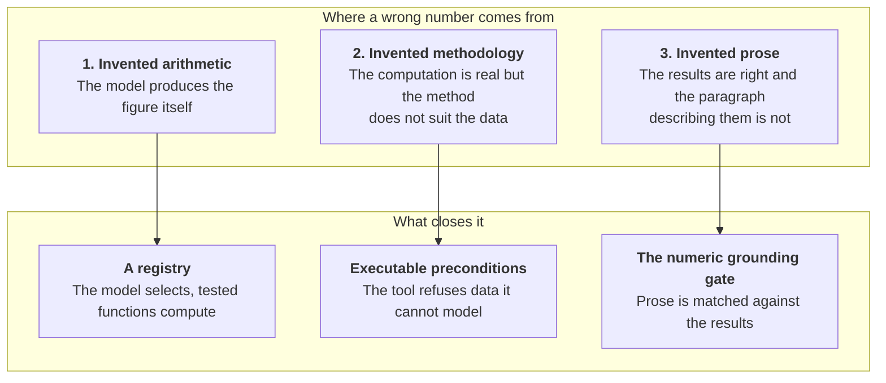

<picture>
  <source media="(prefers-color-scheme: dark)" srcset="../assets/doc-why-trust-gap-dark.svg">
  <source media="(prefers-color-scheme: light)" srcset="../assets/doc-why-trust-gap-light.svg">
  
</picture>

# 1. Why Econometrica exists

## The thing that is actually wrong

Ask a good language model for the beta of Apple against the S&P 500 over the
last five years. It will give you a number. It will be formatted like a beta,
it will be in a plausible range, and it will be delivered in the same tone as
a correct answer.

Sometimes it will even be right.

That is the problem, and it is worth being precise about why. If the model
were wrong all the time, nobody would use it, and there would be nothing to
solve. If it were right all the time, there would also be nothing to solve.
What makes it a real problem is that it is right often enough to be tempting
and wrong often enough to be dangerous, and there is nothing in the output
that tells you which kind of answer you got.

So you check it. And once you are checking every number by hand, the model has
not saved you anything. It has just moved your work from computing to
auditing, which is worse, because auditing is harder to do well and much
easier to do badly.

## The trap most people fall into

The obvious fix is to let the model write code. Give it pandas and
statsmodels, run what it writes, show the output. Now the numbers come from an
actual computation instead of from the model's guess about what the answer
looks like.

This is better. It is also not enough, and the reason is interesting.

We ran a live probe on this exact question. A local model was asked at
temperature zero to compute a Gini coefficient. It wrote correct code four
times out of five. On the fifth run the code was syntactically fine, ran
without an error, used only the libraries it was allowed, finished in
milliseconds, satisfied every contract we had put around it, and reported a
Gini coefficient of **-42.49**.

A Gini coefficient is bounded between 0 and 1.

Every guardrail we had built held perfectly. The sandbox was not breached. The
imports were legal. The runtime was fine. And the answer was nonsense, because
none of those guardrails is about whether the arithmetic is correct. A sandbox
tells you that code did not escape. It cannot tell you that code was right.

So code generation moves the failure from "the model made up a number" to "the
model made up a method," and the second failure is harder to spot, because now
there is a computation behind it and computations look authoritative.

## The three failures, separately

It helps to split the problem, because the three parts have genuinely
different fixes.

**Invented arithmetic** is closed by never asking the model to do arithmetic.
It picks a tool by name from a registry of 37 typed, versioned functions, and
the function computes. This costs you nothing in capability for the questions
the registry covers, which is most of them.

**Invented methodology** is closed by making the preconditions executable
rather than advisory. Telling a model in its prompt that GARCH needs ARCH
effects is a suggestion. Checking the actual series for ARCH effects before
the tool will run is a refusal. In a typical end to end run on this project, a
model plans five steps, four run, and GARCH is declined because the data has
no ARCH effects to model. Nobody had to notice.

**Invented prose** is the one people forget, and it is the one that bites
hardest. You can compute everything correctly and still ship a paragraph
containing a figure that appears nowhere in the results. So every number in
the narration is extracted and matched against what the tools actually
computed. An unmatched number does not get edited out. The entire
interpretation is withheld and the results are returned without it.

That last choice is worth defending, because it looks harsh. The alternative
is to strip the bad number and publish the rest, and the alternative is worse:
you would be shipping a paragraph whose argument has had a hole cut in it, and
the reader has no way to tell. Silence is honest. A quietly repaired sentence
is not.

## Why the answer is a product and not a prompt

Everything above could be attempted with prompt engineering. "Do not invent
numbers." "Check your assumptions." "Only cite figures from the results."

Prompts of this kind fail in a specific way: they work in testing and degrade
in production, and they degrade silently. Nobody gets an alert when a model
stops honouring an instruction. There is no test you can write that fails.

Each of the three mechanisms here is code with a test behind it. The registry
is a Python module. The gate is a function that returns a refusal. The
grounding check is a regular expression and a set membership test, and when
someone loosens it too far, a test that asserts `-15.066` still fails is the
thing that tells them.

The difference is not rhetorical. It is the difference between a property you
hope for and a property you have.

## Why econometrics specifically

Three reasons this domain is the right one to build this in.

**The methods are settled.** Nobody needs a language model to invent a new way
to estimate a CAPM beta. The reference implementations exist, they are in
statsmodels and arch and linearmodels, and they have been correct for years.
What people actually need help with is knowing which of the 37 to reach for,
in what order, on what window, at what frequency. That is a selection problem,
and selection is exactly what a language model is good at.

**The failure is expensive and invisible.** A wrong beta does not throw an
exception. It gets put in a memo and someone allocates against it. There is no
runtime that catches this and no compiler that objects. The only thing that
catches it is a person who already knows the answer, which defeats the point.

**The correctness is checkable.** Unlike, say, a summary of a document, an
econometric result has a definite answer given the inputs. That means
reproducibility is achievable, not aspirational. You can hash the input
matrix, record the tool version, and check a year later whether you get the
same number back. And if you do not, that is itself a finding: it means the
data vendor quietly revised its history.

## What this buys you

The claim is narrow and it is testable: **every number this application shows
you traces to a tested function, and you can get it back.**

Not "the analysis is correct." A tool can be correctly applied to a badly
chosen window. Not "the interpretation is right." A validator can approve
something a human would question. The claim is about provenance, and
provenance is the thing that makes the other questions answerable at all.

If you want the argument in one sentence: **you cannot audit an analysis you
cannot reproduce, and you cannot reproduce one whose numbers came from a model
that has already forgotten how it got them.**

## Read next

- **[What goes wrong, in detail](what-goes-wrong.md)** goes through the
  failure modes with the actual evidence from this project's own history,
  including the ones we only found by looking at the running application.
- **[What is in the box](../2-product/)** is what got built as a result.
- **[The central decision](../4-decisions/the-central-decision.md)** is the
  three-way choice this section has been circling, written up properly.

---

[Documentation](../README.md) · **1. Why** ·
[2. Product](../2-product/) · [3. Architecture](../3-architecture/) ·
[4. Decisions](../4-decisions/) · [5. Roadmap](../5-roadmap/) ·
[6. The art of the possible](../6-art-of-the-possible/)
