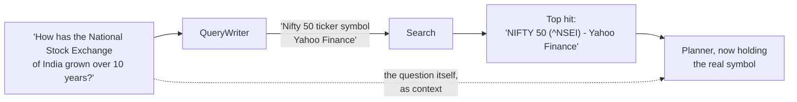

# What goes wrong, in detail

- **The point:** the failures cluster into four groups, and once you see the
  groups you can build against them.
- **Read time:** about 8 minutes
- **Do first:** skip to [the three rules](#what-all-of-this-adds-up-to) at the
  bottom, then come back for the evidence behind whichever one surprises you.

Everything on this page happened. The probe output, the model names and the
numbers come from this project's own history. Most are recorded in
[`CLAUDE.md`](../../CLAUDE.md) with the commit that closed them.

The point of collecting them here is not to be grim about language models.
It is that the failures cluster.

| Cluster | In one line |
|---|---|
| 1 | The model does not know what it does not know |
| 2 | The guardrail was real and the answer was still wrong |
| 3 | The thing nobody was looking at |
| 4 | The world is not what the docs say |

## Cluster 1: the model does not know what it does not know

### It invents a ticker

**A model asked to name a listed instrument, with nothing in front of it,
makes one up.**

| Question | Symbol the Planner named |
|---|---|
| "How has London's real estate moved over the last thirty years?" | `LON` |
| A question about the National Stock Exchange of India | `NSEI` |

The real symbol for the Nifty 50 is `^NSEI`, with a caret.

Both runs died in the Data Steward, which is the good outcome.

Neither was a reasoning failure. The model reasoned fine. Naming a ticker is a
recall task, and recall is where models are weakest and most confident.

**The fix was not a better prompt. It was giving the model something to look
at.** A small `QueryWriter` model turns the question into up to three
symbol-shaped lookups before planning:

This was measured, not assumed. Probed against live DuckDuckGo on 2026-07-30:

| Query | Symbols surfaced |
|---|---|
| "How has the National Stock Exchange of India grown over the last 10 years?" | none |
| "Nifty 50 Yahoo Finance ticker symbol" | **`^NSEI`**, top hit |
| "How has London's real estate moved over the last 30 years?" | none |

The verbatim question is a bad search query.

- A string transform cannot fix it. It has to pull "Nifty 50" out of "National
  Stock Exchange of India".
- A model can.
- So the model does the part that needs world knowledge, and the search engine
  does the part that needs to be current.

### It reaches for a field it was never told about

**A capability a model cannot use is a capability it should not be able to
see.**

What happened, in order:

1. The Planner has an escape hatch, `code_steps`, for projects that enable the
   code sandbox.
2. Early on, the field was in the schema all the time, and the Planner was told
   about it all the time.
3. On any sufficiently hard question, the model reached for it.
4. Every such plan was refused, **after the model call had already been paid
   for**.

The fix: the Planner is told the field exists only when the capability is on.

## Cluster 2: the guardrail was real and the answer was still wrong

**This is the Gini probe. It shaped the whole design.**

`ministral-3:8b`, temperature 0, asked for a Gini coefficient over a data
frame. Five runs.

| Run | Code valid | Imports legal | Ran clean | Answer |
|---|---|---|---|---|
| 1 | yes | yes | yes | correct |
| 2 | yes | yes | yes | correct |
| 3 | yes | yes | yes | correct |
| 4 | yes | yes | yes | correct |
| 5 | yes | yes | yes | **-42.49** |

A Gini coefficient lives in [0, 1].

Every security control held: numpy only, the frame only, milliseconds, no
network, no filesystem, contract satisfied. The answer was garbage.

> A sandbox is a security control, not a correctness control. Confusing the
> two is how you build something that feels safe and is not.

So a result from the escape hatch is marked in every place anything reads it:

| Where | The mark |
|---|---|
| `ResultSet.tool` | `sandbox:<method>`. A colon cannot appear in a registry tool name, so nothing in `econ/` can collide with it |
| The manifest's version | The literal string `unvalidated`. Not a number, because there is nothing to compare a number against |
| The run banner | Alerts on it exactly as it does on generated data |
| The print-only provenance block | Says it in words |

All four are derived from the result itself. A marker that travels separately
from the thing it marks can be lost.

The live test for this feature asserts that the code **runs and is marked**.
It does not assert the arithmetic is right. That would claim a property the
feature does not have, and the test would fail one run in five.

## Cluster 3: the thing nobody was looking at

**Two of the three most interesting defects in this project's history were
found by opening the application and looking at it. No test found them.**

### Confirming an upload never committed anything

**The route reported what it stored and stored nothing.**

- `get_session` does not commit.
- The upload confirmation route did not commit either.
- So the whole ingest was discarded at the end of the request, while the
  response reported what it would have stored.

Why the API test suite could not see it:

1. The test `client` fixture shares **one session across every request in a
   test**.
2. So the flush stayed visible to the next call inside the test.
3. The test read back what it had written, through the session that wrote it,
   and passed.

> A test that reads back through the same fixture cannot tell a flush from a
> write.

### Canvas panels stacked on top of each other

**Narrative, Diagnostics and Trace all rendered, stacked, under whichever
chart was open. Every unit test passed.**

The cause, in order:

1. The canvas tab panels are force-mounted, so printing gets all of them.
2. Radix sets `hidden` on a panel it unmounts. It does not set it on a
   force-mounted one.
3. The CSS keyed on `[hidden]`, so nothing was hidden.

The fix:

- The rule now keys on `[data-state="inactive"]`.
- Inactive panels are parked off-screen, not hidden. A Plotly chart inside a
  `display: none` container renders blank and would print empty.

### An info-severity flag reached nobody

**The flag was raised, stored, exported, and invisible. Nothing failed.**

- A run that draws on both an uploaded file and a market source raises a
  `mixed_sources` flag at **info** severity. It names every ticker under the
  source that served it.
- The canvas banner rendered `risk` and `warning` only.

The partition is explicit now:

| List | Drives |
|---|---|
| `riskFlags` | The red alert |
| `infoFlags` | A neutral note block |

A third severity added later needs a home in one of them, or it disappears
the same way.

## Cluster 4: the world is not what the docs say

**Half of a day's work on this project has gone into things that were not
true.**

| Belief | Reality |
|---|---|
| `pandas-datareader` can fetch Stooq | 0.11.1 implements six sources and Stooq is not one. The CSV endpoint now answers with a JavaScript proof-of-work browser challenge. Stooq was dropped from the project. |
| `yfinance` is 0.2.x with `Adj Close` | It is 1.5.2. `auto_adjust=True` is the default and it *removes* `Adj Close`. `end` is exclusive, so passing the requested end through loses the last trading day of every window. |
| Ken French factor values are decimals | They are percent. `Mkt-RF` of `-0.70` means -0.70%. Forgetting the conversion rescales every loading by 100. |
| Ollama reports its own capabilities in `/api/tags` | It does not. Context length and tool support come from `/api/show`, and guessing from the model name was wrong in both directions: 6 of 13 chat models on this machine cannot call tools, and real context windows run from 512 to 262144. |
| A vendor's adjusted close is a stable series | AAPL on 2020-08-25 closes at `124.82` split-adjusted and `121.08` dividend-adjusted. Same day, same source, 3.1% apart. Nothing in a result distinguishes them unless the source's label says which policy it used. |

**The last row changed the design.**

- `PriceSource.label` names its adjustment policy.
- The label travels into every data quality report.
- Reproducing a number means knowing which of two equally real series produced
  it.

## What all of this adds up to

**Three rules. Each follows from something on this page.**

1. **Do not ask a model for a fact you can look up.** Give it the lookup.
   (Cluster 1.)
2. **Do not confuse a control that stops harm with a control that ensures
   correctness.** Mark the difference where the reader will see it. (Cluster
   2.)
3. **Do not trust a test that shares a fixture with the thing it is testing,
   and open the application sometimes.** (Cluster 3.)

**Next, 2 minutes:** open [What is in the box](../2-product/) and read the
"what it will not do" table. The sandbox row there is Cluster 2 on this page,
turned into a refusal.

---

[Documentation](../README.md) · [1. Why](README.md) · **What goes wrong** ·
[2. Product](../2-product/) · [3. Architecture](../3-architecture/) ·
[4. Decisions](../4-decisions/) · [5. Roadmap](../5-roadmap/) ·
[6. The art of the possible](../6-art-of-the-possible/)
