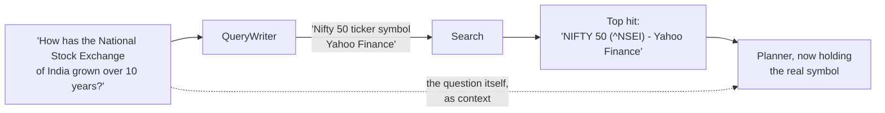

# What goes wrong, in detail

Everything in this page happened. The probe output, the model names and the
numbers are from this project's own history, and most of them are recorded in
[`CLAUDE.md`](../../CLAUDE.md) with the commit that closed them.

The point of collecting them here is not to be grim about language models.
It is that the failures cluster, and once you see the clusters you can build
against them.

## Cluster 1: the model does not know what it does not know

### It invents a ticker

A Planner asked "how has London's real estate moved over the last thirty
years?" produced a plan naming the symbol `LON`. Another asked about the
National Stock Exchange of India named `NSEI`. The real symbol for the Nifty
50 is `^NSEI`, with a caret.

Both runs died in the Data Steward, which is the good outcome. But neither was
a reasoning failure. The model reasoned fine. It was asked to name a listed
instrument with nothing in front of it, which is a recall task, and recall is
where models are weakest and most confident.

The fix was not a better prompt. It was to give the model something to look
at. A small `QueryWriter` model turns the question into up to three
symbol-shaped lookups before planning:

This was measured, not assumed. Probed against live DuckDuckGo on 2026-07-30:

| Query | Symbols surfaced |
|---|---|
| "How has the National Stock Exchange of India grown over the last 10 years?" | none |
| "Nifty 50 Yahoo Finance ticker symbol" | **`^NSEI`**, top hit |
| "How has London's real estate moved over the last 30 years?" | none |

The verbatim question is simply a bad search query. Turning an analytical
question into a symbol-shaped one is not something a string transform can do,
because it requires pulling "Nifty 50" out of "National Stock Exchange of
India". A model can do it. That is a good division of labour: the model does
the part that needs world knowledge, and the search engine does the part that
needs to be current.

### It reaches for a field it was never told about

The Planner has an escape hatch available (`code_steps`) when the project
enables the code sandbox. Early on, the field existed in the schema all the
time and the Planner was told about it all the time.

The result: on any sufficiently hard question, the model reached for it, and
every such plan was then refused, **after the model call had already been
paid for**.

The fix is that the Planner is only told the field exists when the capability
is actually on. A capability a model cannot use is a capability it should not
be able to see.

## Cluster 2: the guardrail was real and the answer was still wrong

This is the Gini probe, and it deserves its own section because it is the one
that shaped the whole design.

`ministral-3:8b`, temperature 0, asked for a Gini coefficient over a data
frame. Five runs.

| Run | Code valid | Imports legal | Ran clean | Answer |
|---|---|---|---|---|
| 1 | yes | yes | yes | correct |
| 2 | yes | yes | yes | correct |
| 3 | yes | yes | yes | correct |
| 4 | yes | yes | yes | correct |
| 5 | yes | yes | yes | **-42.49** |

A Gini coefficient lives in [0, 1].

Every security control held. Numpy only, the frame only, milliseconds, no
network, no filesystem, contract satisfied. And the answer was garbage.

The conclusion we drew is the one worth carrying: **a sandbox is a security
control, not a correctness control, and confusing the two is how you build
something that feels safe and is not.**

So when the escape hatch produces a result, the result is marked, in every
place anything reads it:

- `ResultSet.tool` is `sandbox:<method>`, and a colon cannot appear in a
  registry tool name, so nothing in `econ/` can collide with it by accident
- the manifest's version is the literal string `unvalidated`, not a number,
  because there is nothing to compare a number against
- the run banner alerts on it exactly as it does on generated data
- the print-only provenance block says it in words

All of that is derived from the result itself. A marker that travels
separately from the thing it marks is a marker that can be lost.

The live test for this feature asserts that the code **runs and is marked**.
It does not assert the arithmetic is right. Asserting that would claim a
property the feature does not have, and it would fail one run in five.

## Cluster 3: the thing nobody was looking at

Two of the three most interesting defects in this project's history were found
by opening the application and looking at it, not by a test.

### Confirming an upload never committed anything

`get_session` does not commit, and the upload confirmation route did not
either. So the entire ingest was discarded at the end of the request, while
the response cheerfully reported what it would have stored.

The API test suite could not see this, and the reason is worth internalising:
the test `client` fixture shares **one session across every request in a
test**. So the flush stayed visible to the next call inside the test. The test
read back exactly what it had written, through the same session that had
written it, and passed.

**A test that reads back through the same fixture cannot tell a flush from a
write.**

### Canvas panels stacked on top of each other

The canvas tab panels are force-mounted, so that printing gets all of them.
Radix sets `hidden` on a panel it unmounts and does not set it on a
force-mounted one. The CSS keyed on `[hidden]`.

Result: Narrative, Diagnostics and Trace all rendered, stacked, underneath
whichever chart was open. Every unit test passed. The rule now keys on
`[data-state="inactive"]`, and inactive panels are parked off-screen rather
than hidden, because a Plotly chart inside a `display: none` container renders
blank and would print empty.

### An info-severity flag reached nobody

When a run draws on both an uploaded file and a market source, it raises a
`mixed_sources` flag at **info** severity, naming every ticker under the
source that served it. The canvas banner rendered `risk` and `warning` only.

So the flag was raised, stored, exported, and invisible. Nothing failed. The
partition is explicit now: `riskFlags` drives the red alert, `infoFlags`
drives a neutral note block. A third severity added later needs a home in one
of them, or it disappears the same way.

## Cluster 4: the world is not what the docs say

Half of a day's work on this project has gone into things that were simply not
true.

| Belief | Reality |
|---|---|
| `pandas-datareader` can fetch Stooq | 0.11.1 implements six sources and Stooq is not one. The CSV endpoint now answers with a JavaScript proof-of-work browser challenge. Stooq was dropped from the project. |
| `yfinance` is 0.2.x with `Adj Close` | It is 1.5.2. `auto_adjust=True` is the default and it *removes* `Adj Close`. `end` is exclusive, so passing the requested end through loses the last trading day of every window. |
| Ken French factor values are decimals | They are percent. `Mkt-RF` of `-0.70` means -0.70%. Forgetting the conversion rescales every loading by 100. |
| Ollama reports its own capabilities in `/api/tags` | It does not. Context length and tool support come from `/api/show`, and guessing from the model name was wrong in both directions: 6 of 13 chat models on this machine cannot call tools, and real context windows run from 512 to 262144. |
| A vendor's adjusted close is a stable series | AAPL on 2020-08-25 closes at `124.82` split-adjusted and `121.08` dividend-adjusted. Same day, same source, 3.1% apart. Nothing in a result distinguishes them unless the source's label says which policy it used. |

That last row is the one that changed the design. It is why
`PriceSource.label` names its adjustment policy and why the label travels into
every data quality report. Reproducing a number means knowing which of two
equally real series produced it.

## What all of this adds up to

Three rules, each of which is a direct consequence of something on this page.

1. **Do not ask a model for a fact you can look up.** Give it the lookup.
2. **Do not confuse a control that stops harm with a control that ensures
   correctness.** Mark the difference where the reader will see it.
3. **Do not trust a test that shares a fixture with the thing it is testing,
   and open the application sometimes.**

---

[Documentation](../README.md) · [1. Why](README.md) · **What goes wrong** ·
[2. Product](../2-product/) · [3. Architecture](../3-architecture/) ·
[4. Decisions](../4-decisions/) · [5. Roadmap](../5-roadmap/) ·
[6. The art of the possible](../6-art-of-the-possible/)
