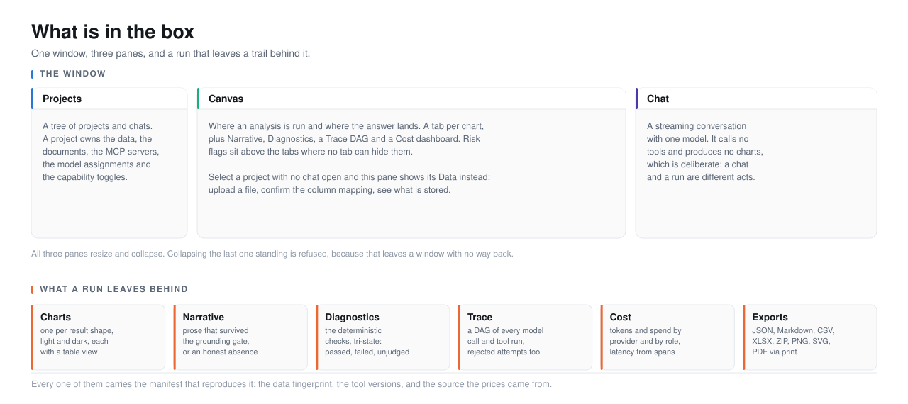
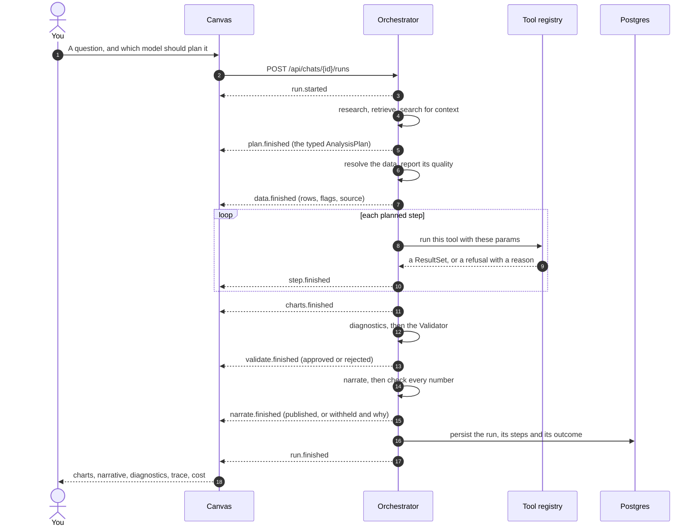
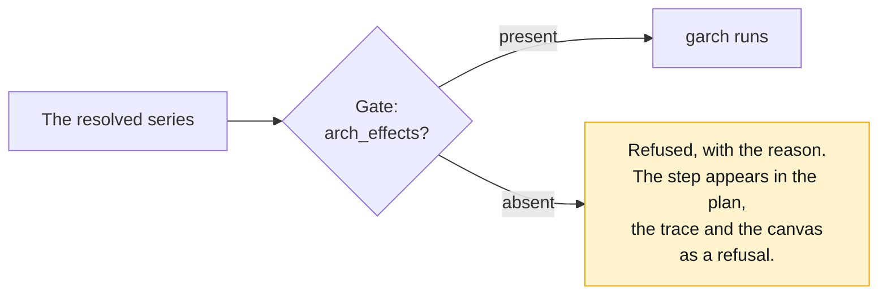

<picture>
  <source media="(prefers-color-scheme: dark)" srcset="../assets/doc-product-workbench-dark.svg">
  <source media="(prefers-color-scheme: light)" srcset="../assets/doc-product-workbench-light.svg">
  
</picture>

# 2. What is in the box

- **The point:** you ask a question in prose and get charts, an interpretation
  and a manifest. Tested functions do the arithmetic, never a model.
- **Read time:** about 7 minutes
- **Do first:** read the table under [What it will not do](#what-it-will-not-do).
  Eight rows, and the fastest way to know the product.

This is the product manager's view: what it does, who it is for, what it
refuses, and how you would know it is working.

| Page | What it covers |
|---|---|
| **This page** | The product in one sitting: the shape, the loop, the guarantees |
| **[Product Requirements Document](prd.md)** | The full PRD: goals, users, requirements, acceptance criteria, non-goals, metrics |
| **[Capability inventory](capabilities.md)** | Everything that exists, enumerated: 37 tools, 14 charts, 5 providers, 10 agent roles, every endpoint |
| **[User journeys](journeys.md)** | Four people, four sessions, what each of them actually does |

## The one-sentence version

**Econometrica is a local workbench where you ask an econometric question in
prose and get back charts, an interpretation and a reproducibility manifest,
with the arithmetic done by tested functions rather than by a language model.**

## The shape of it

**One window. Three panes. No login, no cloud, no account.**

```
┌────────────┬─────────────────────────────────┬──────────────┐
│ Projects   │   Artifact Canvas               │  Chat        │
│  └ Chats   │   charts, tables, findings,     │  streaming   │
│            │   trace, cost, exports          │  conversation│
│            │                                 │              │
│  260px     │   flexible                      │  420px       │
└────────────┴─────────────────────────────────┴──────────────┘
```

- All three panes resize and collapse.
- Collapsing the last one standing is refused. It would leave an empty window
  with no obvious way back.

**The chat pane and the canvas are different things, and users conflate
them.**

| | Chat pane | Canvas |
|---|---|---|
| What runs | One model streaming tokens | The whole pipeline |
| Calls tools | No | Yes |
| Can produce a chart | Never | Yes |
| Where a run starts | Not here | The canvas composer |

The first user of the application read the chat's empty state, asked for an
analysis there, and got prose and no charts. The empty state is different now.

The lesson for a designer: two adjacent text boxes that do different things
need to say so before the user finds out.

## The loop

**A run reports its progress back to the canvas as it happens.**



- Every arrow back to the canvas is a server-sent event. You watch the run. You
  do not watch a spinner.
- A run that dies halfway comes back describing itself: how far it got, what it
  produced before it stopped, and why it stopped.
- A run is never half-written.

## The four guarantees

**These are the product promises. Each is a mechanism, and each mechanism has
a test.**

| # | Guarantee | Mechanism |
|---|---|---|
| 1 | No number comes from a model | The tool registry |
| 2 | A tool refuses work the data cannot support | Executable gates |
| 3 | Prose is checked against the results | The grounding gate |
| 4 | Everything reproduces | The manifest and re-run |

### 1. No number comes from a model

**Models choose tools. Tools compute.**

- 37 tools across five families.
- Each is typed, versioned and unit-tested.
- Tests use known-answer fixtures and property-based invariants.

The invariants, concretely:

- the beta of an asset regressed on itself is 1
- VR(1) is 1
- simulated GARCH parameters are recovered inside their confidence interval
- Johansen rank is recovered on synthetic cointegrated systems

### 2. A tool refuses work the data cannot support

**Preconditions are executable, not advisory.** A `Gate` is checked against
the real series before the tool runs.



- A refusal is not an error. It is a result.
- It says the question you asked cannot be answered this way on this data.
  That is often the most useful thing anyone will tell you that day.
- Refusals show in the canvas beside the charts, not behind a tab.

### 3. Prose is checked against the results

**Every number the Narrator writes is extracted and matched against
`ResultSet.all_numeric_values()`. One that does not match withholds the whole
narration.**

Precision comes from the citation, not from a global tolerance:

| The prose says | It claims | It matches |
|---|---|---|
| "1.30" | two decimal places | any computed value that rounds to 1.30 at two places |
| "1.3" | one decimal place | any computed value that rounds to 1.3 at one place |

That is both stricter and more permissive than a fixed epsilon, in the right
directions.

Narrow, deliberate exemptions exist. Each has a test that it does not apply
outside its context:

| Exemption | Example |
|---|---|
| Reference words | "figure 2", "step 3" |
| Citations of step ids the plan actually contains | `(s3)` passes, `(s7)` does not |
| `YYYY-YYYY` year ranges | "(2020-2024)" |

The year-range exemption was found by running a real narration. A model titled
its answer "(2020-2024)" and the gate read both years as fabrications.

The tolerance itself has never moved. A test asserts that a `-15.066` case
still fails. It sits directly beside the exemptions, so nobody loosens one
without seeing it.

### 4. Everything reproduces

**Every result carries a manifest:**

- a SHA-256 fingerprint of the exact aligned input matrix
- the tool name and version
- a parameters hash
- library versions
- any RNG seed

`POST /api/runs/{id}/rerun` re-executes the recorded plan against freshly
resolved data and reports, per step, whether the numbers came back the same.

**It consults no model.** Re-planning would test whether a model repeats
itself. That is a different question, and a manifest promises nothing about
it.

A re-run that disagrees is a finding about the data, not a bug. The report
names the step and the reason:

1. The fingerprint changed, so the source is not serving the same history.
2. The tool moved version.
3. The parameters hash differently.
4. The numbers differ.

## What it will not do

**A product is defined as much by its refusals. These are deliberate.**

| It will not | Because |
|---|---|
| Invent data when no source is configured | A run refuses with an explanation. Generating something plausible is the failure this project exists to prevent. |
| Let a chat produce charts | A chat is one model streaming tokens. A run is a pipeline. Conflating them is how the first user got prose instead of analysis. |
| Publish an interpretation containing an unmatched number | The whole narration is withheld. A quietly repaired paragraph is worse than none. |
| Let a model's column mapping be ingested without a person confirming it | `confirm_mapping` is the only thing that produces a mapping the ingest will act on. The model may only reorder candidates the deterministic profiler already found admissible. |
| Draw a second y-axis | The union has no field for it anywhere, and a test asserts the absence across every chart type. Two measures on two scales share a crossing point that is an artifact of the scaling, and readers reliably read causation into it. Two measures become a stacked panel chart. |
| Let a sandbox result look like a registry result | It is marked in the tool name, the manifest, the run banner and the printout. |
| Let anything read from the web, a document or an MCP tool become a number | The grounding gate admits only what a registry tool computed. There is a test proving a figure quoted verbatim out of a search snippet is still blocked. |
| Serve a stale cache entry when the source is unreachable | It raises instead. There is no channel to disclose staleness, because the source label is read before the fetch. |

## Status

**All six build phases are complete.**

| Phase | What it delivered | State |
|---|---|---|
| 0 | Scaffold | done |
| 1 | Database, API, three-pane shell | done |
| 2 | Econometrics core: 37 tools, 5 families | done, 97% coverage |
| 3 | Five LLM providers, streaming chat | done |
| 4 | Multi-agent orchestration, diagnostics, grounding gate | done |
| 5 | Charts and the artifact canvas | done |
| 6 | Real data, uploads, telemetry, MCP, retrieval, sandbox | done |

**1,492 backend tests, 326 frontend tests, 6 Playwright end to end.** `ruff`
and `mypy --strict` clean on `src`. `alembic check` reports no drift.

The end to end suite drives the whole application from a cold start, against a
live local model and real market data:

1. Create a project.
2. Upload a file, profile it, and confirm it into a Timescale hypertable.
3. Run an analysis on a real ticker.
4. Read the charts, the trace DAG and the cost dashboard back in the browser.
5. Export a ZIP, then re-run and reproduce the numbers from the manifest.

## Read next

**Next, 2 minutes:** open [User journeys](journeys.md) and read Journey 2,
where the product refuses and the refusal is the useful answer.

After that, pick by what you need:

- **[The full PRD](prd.md)**: requirements with acceptance criteria.
- **[The capability inventory](capabilities.md)**: the complete list of what
  exists.
- **[The architect's view](../3-architecture/)**: how it is built.

---

[Documentation](../README.md) · [1. Why](../1-why/) · **2. Product** ·
[3. Architecture](../3-architecture/) · [4. Decisions](../4-decisions/) ·
[5. Roadmap](../5-roadmap/) · [6. The art of the possible](../6-art-of-the-possible/)
