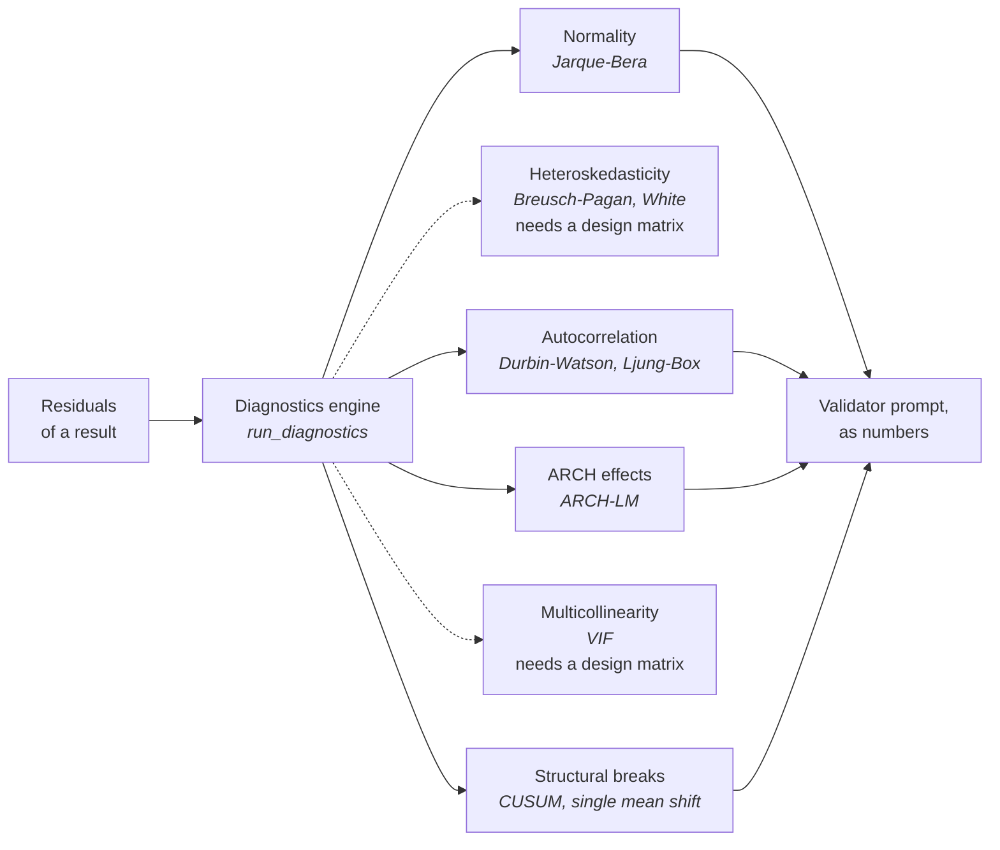

# Capability inventory

- **The point:** everything that exists, enumerated. A reference, not an
  argument.
- **Read time:** about 11 minutes end to end. Do not read it end to end.
  Search it.
- **Do first:** press Ctrl+F and type the name of the thing you are looking
  for.

| Section | Count |
|---|---|
| [Tools](#the-37-tools) | 37, in five families |
| [Diagnostics](#the-diagnostics-engine) | 9 checks |
| [Chart types](#the-14-chart-types) | 14 |
| [Agent roles](#the-10-agent-roles) | 10 |
| [LLM providers](#the-5-llm-providers) | 5 |
| [Data sources](#data-sources) | 6 |
| [API endpoints](#the-api) | 32, across 11 routers |
| [Export formats](#exports) | 5 data formats, plus PNG, SVG and PDF |

**Where these lists come from:**

- They are read off the code, not maintained by hand.
- The catalogue a model sees is rendered straight from `get_registry()`, for
  the same reason. A hand-kept list drifts the first time a tool is added.
- A phase-gate test asserts that all five families are registered, so the
  shape of this page cannot go stale silently.
- The individual counts are not themselves asserted by a test.

---

## The 37 tools

**Five families. Every tool is:**

- typed
- versioned
- unit-tested against known-answer fixtures
- registered as an import side-effect of its family package

| Family | Tools |
|---|---|
| Asset pricing | 7 |
| Market efficiency | 10 |
| Volatility and risk | 11 |
| Multivariate | 8 |
| Event study | 1 |

### Asset pricing (7)

| Tool | What it does |
|---|---|
| `capm` | CAPM alpha and beta by OLS of excess asset returns on excess market returns |
| `ff3` | Fama-French three-factor regression: `mkt_rf`, `smb`, `hml` |
| `ff5` | Fama-French five-factor: adds `rmw`, `cma` |
| `carhart4` | Carhart four-factor: adds momentum. Monthly only, because pandas-datareader 0.11.1 raises on the daily momentum file at every date range |
| `fama_macbeth` | Two-pass regression: per-period cross-sections, then time-series averages of the coefficients |
| `grs_test` | Gibbons-Ross-Shanken exact F test that all portfolio alphas are jointly zero |
| `rolling_beta` | Rolling-window OLS market beta with a confidence band |

Robust standard errors (Newey-West, White) are available on the regression
tools rather than as separate entries.

### Market efficiency (10)

| Tool | What it does |
|---|---|
| `adf` | Augmented Dickey-Fuller unit root test. H0 is a unit root |
| `kpss` | KPSS stationarity test. H0 is stationarity, which is the **reverse** of ADF |
| `phillips_perron` | Phillips-Perron unit root test with a non-parametric correction |
| `variance_ratio` | Lo-MacKinlay variance ratio test of the random walk hypothesis |
| `acf` | Autocorrelation and partial autocorrelation with Bartlett bands |
| `ljung_box` | Joint test that all autocorrelations up to each lag are zero |
| `runs_test` | Wald-Wolfowitz runs test on the signs of returns |
| `bds` | BDS test of the i.i.d. null against any dependence, including nonlinear |
| `hurst` | Rescaled-range Hurst exponent with the Anis-Lloyd-Peters correction |
| `weak_form_efficiency_score` | Composite 0-100 score over a price series |

### Volatility and risk (11)

| Tool | What it does |
|---|---|
| `garch` | GARCH(p, q) conditional volatility by maximum likelihood |
| `egarch` | EGARCH(p, o, q) on log conditional variance, allowing asymmetry |
| `gjr_garch` | GJR-GARCH(p, o, q), whose gamma terms let negative shocks move variance more |
| `realized_vol` | Rolling realized volatility |
| `ewma_vol` | RiskMetrics EWMA volatility |
| `historical_var` | Empirical-quantile Value at Risk |
| `parametric_var` | VaR from a fitted normal or Student-t |
| `cvar` | Conditional VaR, the expected shortfall in the tail |
| `drawdown` | Running-maximum drawdown analysis |
| `kupiec_test` | Unconditional coverage backtest of a VaR series |
| `christoffersen_test` | Independence backtest: are VaR violations clustered in time? |

The three GARCH variants take normal, Student-t and skew-t innovations.

### Multivariate (8)

| Tool | What it does |
|---|---|
| `var_model` | Vector autoregression with information-criterion lag selection |
| `irf` | Impulse response functions, one series per impulse-response pair |
| `fevd` | Forecast-error variance decomposition |
| `johansen` | Johansen cointegration: trace and max-eigenvalue statistics |
| `engle_granger` | Two-step cointegration test |
| `vecm` | Vector error correction model: adjustment coefficients and the cointegrating relations |
| `granger_causality` | Pairwise predictive causality at every lag up to the requested maximum |
| `markov_switching` | Markov regime-switching model with per-regime means and transition probabilities |

`var_model` and `vecm` are the same gate with opposite expectations:

| Tool | Stationarity must be |
|---|---|
| `var_model` | present |
| `vecm` | absent |

### Event study (1)

| Tool | What it does |
|---|---|
| `event_study` | Market-model event study: per-event abnormal returns, CAR and CAAR with significance tests |

---

## The diagnostics engine

**Deterministic, and it runs before the Validator.** The Validator is handed
facts. It is not asked to infer them.

**What a run reaches.** The engine runs on a result that carries a `residuals`
series, and it is handed the residuals alone. So the checks that need a design
matrix (Breusch-Pagan, White, VIF) are skipped. They are drawn dotted.
A tool's own diagnostics go to the Validator in the same list.

**Every `Diagnostic` is tri-state.**

| `passed` | Means |
|---|---|
| `True` | passed |
| `False` | failed |
| `None` | not judged. Never rendered as a failure |

This is enforced from the type through to the UI. The alternative is telling
a user their model failed a check nobody ran.

---

## The 14 chart types

**Charts are proposed deterministically from the shape of a result. No model
picks them.**

- A GARCH fit has a conditional volatility path and standardized residuals.
- An IRF has one series per impulse-response pair.
- Asking a model to rediscover that per run buys nothing and can get it wrong.

| Type | Used for |
|---|---|
| `line` | A measure over time or an ordered index |
| `band` | An estimate with a confidence ribbon: rolling beta, CAAR |
| `stem` | Discrete lags against a symmetric significance band: ACF, PACF |
| `panels` | Several measures stacked on one x-axis. **This is what a two-scale overlay becomes** |
| `scatter` | Points with an optional fitted line: the security market line |
| `bar` | Categorical comparison |
| `forest` | Coefficient estimates with confidence intervals |
| `heatmap` | Correlation and cointegration matrices |
| `qq` | Quantile-quantile plots of residuals |
| `histogram` | Distributions |
| `area_stack` | Composition over time: variance decomposition |
| `underwater` | Drawdown from the running maximum |
| `stat_tile` | A single number with its context |
| `table` | When the shape is a table and pretending otherwise would mislead |

Three constraints on the union that look like style rules and are not:

1. **No spec can express a second y-axis.** There is no field for it anywhere,
   and a test asserts the absence across every member so a type added later
   cannot reintroduce it.
2. **The series caps are measured.** Eight palette slots clear the
   adjacent-pair colour-blindness floors. Only the first three clear them when
   every pair is compared at once, and a scatter compares every pair at once,
   so it takes the lower cap.
3. **A heatmap's scale must match its data's polarity.** Correlations run
   through a meaningful zero and need a diverging scale with a neutral
   midpoint. A one-hue ramp hides the sign, which is the entire reading.

**Diagnostics have no chart type and are rendered directly.**

- A pure hypothesis test's finding is a statistic and a p-value. That binds to
  nothing in the chart union.
- `propose_charts` returns nothing for `adf`. The Diagnostics tab shows it.
- The old fallback emitted stat tiles from whatever scalars existed. For `adf`
  that meant a canvas led by "Nobs: 5,080.0000".

---

## The 10 agent roles

**Ten roles. Two are deterministic and have no model assigned at all.**

Six come from the design. Four appeared as uploads and the context channels
landed.

| Role | Model? | What it does |
|---|---|---|
| **Planner** | yes | Turns intent, context and the tool catalogue into a typed `AnalysisPlan` |
| **Data Steward** | **no** | Resolves tickers, aligns calendars, converts frequency, constructs returns, reports quality. Deterministic on purpose: each of those has exactly one right answer, and a manifest means nothing if the data under it depended on a model's mood |
| **Econometrician** | **no** | Binds plan steps to registry tools, enforces gates, executes |
| **Validator** | yes | Reviews the plan, each step's status, estimates and scalars, the code behind a generated result, the refusals, the unjudged checks and the diagnostics. It is not shown a result's tables or series. Should run on a different vendor |
| **Narrator** | yes | Writes the interpretation, constrained to cite step ids |
| **Visualizer** | yes | Reorders, drops and retitles the charts `propose_charts` already chose. It cannot add one. Not a stage of a run: the pipeline calls `propose_charts` directly |
| **Quant Coder** | yes | The escape hatch. The only agent that produces numbers, and its results are marked |
| **Query Writer** | yes | Turns an analytical question into symbol-shaped search queries |
| **Researcher** | yes | Runs a bounded tool-calling loop over the project's allowlisted MCP tools |
| **Column Mapper** | yes | Chooses among the roles an uploaded column could play, and only among candidates the profiler already scored as admissible. It is skipped when there is nothing to decide, and what it returns is a proposal a person must confirm |

**Eight of the ten appear in the trace vocabulary as `run_steps.agent`:**
`planner`, `data_steward`, `econometrician`, `validator`, `narrator`,
`quant_coder`, `query_writer`, `researcher`.

Adding one is a CHECK-constraint migration, and it has caught us out:

1. `ck_run_steps_agent_known` has existed since phase 4.
2. `quant_coder` was added to the Python tuple.
3. The tests stayed green.
4. A fresh database rejected every sandbox step.

---

## The 5 LLM providers

| Provider | Key needed | Transport | Notes |
|---|---|---|---|
| **Ollama** | no | httpx | Local. Requiring a key would break the zero-configuration path the application is designed around |
| **Anthropic** | yes | official `anthropic` SDK | Opus 5, Fable 5, Sonnet 5 and Opus 4.8/4.7 reject `temperature` with a 400, so the adapter drops it for those models |
| **OpenAI** | yes | httpx | |
| **Google Gemini** | yes | httpx | |
| **NVIDIA NIM** | yes | httpx | |

**Capability flags per model:** tool calling, JSON mode, streaming, context
window.

**Ollama capabilities come from `/api/show`, not `/api/tags`.** Tags reports
neither context length nor tool support. Guessing from the model name was
wrong in both directions.

**Keys are encrypted at rest.**

**Per-role assignment is a first-class feature.** For example:

| For | Assign it | What that buys |
|---|---|---|
| Planner | A frontier model | |
| Validator | A different vendor | Genuine independence |
| Routine classification | Local Ollama | Zero cost |

---

## Data sources

| Source | What it serves | Cached |
|---|---|---|
| `yahoo` | Dividend-adjusted daily closes through yfinance | yes |
| `fred` | Seventeen rate series as risk-free rates, and a cross-check on prices | yes |
| Ken French library | `ff3`, `ff5`, `carhart4` factor sets | via the same layer |
| Uploads | CSV, XLSX, Parquet, ingested into a Timescale hypertable | n/a |
| `synthetic` | Reproducible random walks, seeded by a hash of the ticker | no |
| `none` | Refuses, with an explanation. **The default** | no |

**Upload-first resolution.** `build_project_source` wraps the configured
market source with the project's uploads.

1. A symbol any of the project's datasets carries is served from the upload.
2. Everything else falls through to the market source.

That ordering exists so one run can mix a file with fetched tickers.

A project with no uploads gets the market source back unwrapped, not a wrapper
that always delegates.

**Stooq was dropped from the project.**

- `pandas-datareader` 0.11.1 does not implement it.
- Its CSV endpoint now answers with a JavaScript proof-of-work browser
  challenge. An adapter whose job includes defeating that is not something to
  ship.

**FRED is the independent cross-check instead.** No API key, a genuinely
separate pipeline, and it agreed with yfinance to the cent on `SP500` against
`^GSPC`.

---

## The API

**Thirty-two endpoints across eleven routers.** The list is collapsed. Open it
when you need a path.

<b>Full endpoint list</b>

**Health**
- `GET /api/health`

**Projects**
- `POST /api/projects`
- `GET /api/projects`
- `GET /api/projects/{id}`
- `PATCH /api/projects/{id}`
- `DELETE /api/projects/{id}`

**Chats**
- `POST /api/projects/{id}/chats`
- `GET /api/projects/{id}/chats`
- `GET /api/chats/{id}`
- `PATCH /api/chats/{id}`
- `GET /api/chats/{id}/capabilities`
- `DELETE /api/chats/{id}`

**Messages** (streaming chat)
- `GET /api/chats/{id}/messages`
- `POST /api/chats/{id}/messages`

**Runs** (the multi-agent pipeline)
- `POST /api/chats/{id}/runs` (server-sent events)
- `GET /api/chats/{id}/runs`
- `GET /api/runs/{id}`
- `POST /api/runs/{id}/rerun`

**Exports**
- `GET /api/runs/{id}/export?format=json|markdown|csv|xlsx|zip`

**Providers**
- `GET /api/providers`
- `GET /api/providers/{name}/models`
- `PUT /api/providers/{name}/key`
- `DELETE /api/providers/{name}/key`

**Uploads and datasets**
- `POST /api/projects/{id}/uploads`
- `GET /api/uploads/{id}`
- `POST /api/uploads/{id}/confirm`
- `GET /api/projects/{id}/datasets`

**Documents**
- `POST /api/projects/{id}/documents`
- `GET /api/projects/{id}/documents`
- `DELETE /api/documents/{id}`

**MCP**
- `GET /api/projects/{id}/mcp/tools`

**Metrics**
- `GET /api/metrics`

**Two response shapes to know:**

| Shape | Carries `outcome` | Used for |
|---|---|---|
| `RunRead` | no, deliberately | Listing runs |
| `RunDetail` | yes | One run |

A result's series live in `outcome`, so listing runs with it would drag every
series along. Steps say what a run *did*. The outcome says what it
*produced*.

---

## Exports

| Format | Where the manifest goes |
|---|---|
| JSON | A field |
| Markdown | A section |
| CSV | Comment lines, because CSV has no metadata channel |
| XLSX | A sheet |
| ZIP | All of the above, plus the manifest as its own file |
| PNG, SVG | From the live Plotly graph in the browser, so the image is the one you looked at |
| PDF | The browser's print pipeline, driven by `styles/print.css` |

**PDF is a stylesheet, not a dependency in either stack.** The print
stylesheet:

- forces light surfaces, whatever theme you were reading in
- drops the application chrome
- keeps a chart card whole across a fold
- always prints the `Provenance` block, which is print-only and always present

**kaleido was ruled out, not deferred.** The backend holds no Plotly JSON. So
server-side chart export would mean reimplementing all fourteen TypeScript
renderers in Python, to export a picture nobody had looked at.

**Next, 2 minutes:** open [User journeys](journeys.md) and read Journey 1 to
see these pieces used in one forty-second run.

---

[Documentation](../README.md) · [1. Why](../1-why/) ·
[2. Product](README.md) · [PRD](prd.md) · **Capabilities** ·
[Journeys](journeys.md) · [3. Architecture](../3-architecture/) ·
[4. Decisions](../4-decisions/) · [5. Roadmap](../5-roadmap/) ·
[6. The art of the possible](../6-art-of-the-possible/)
