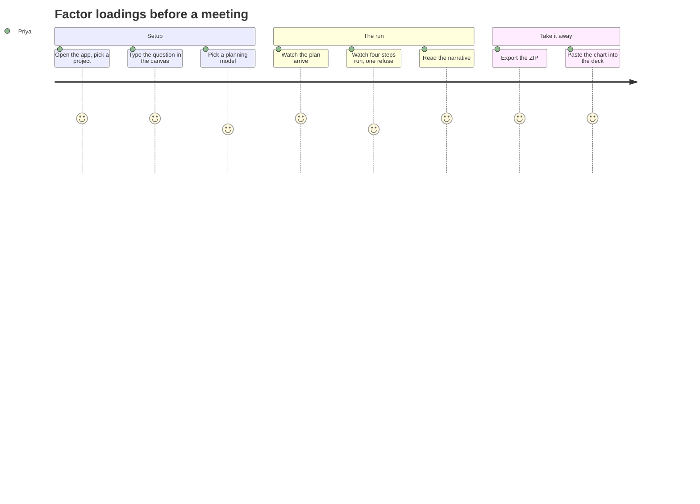
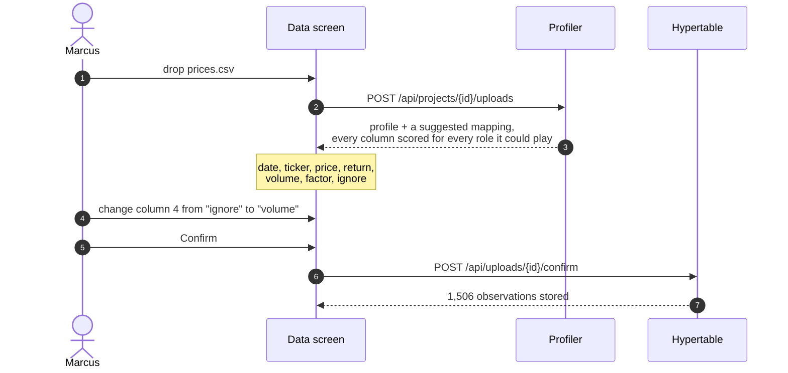
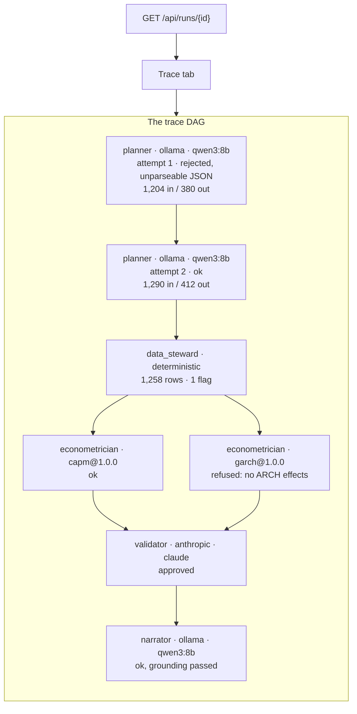

# User journeys

- **The point:** four people, four sessions, four different endings. The
  refusal is the most important of the four.
- **Read time:** about 8 minutes
- **Do first:** read [Journey 2](#journey-2-the-researcher-gets-a-refusal-and-it-is-the-useful-answer).
  It is the one that shows what this product is for.

Each journey is a real path through the application.

| # | Who | Ends with |
|---|---|---|
| 1 | Priya, quantitative analyst | an answer |
| 2 | Marcus, researcher | a refusal |
| 3 | Dev, risk officer | an audit trail |
| 4 | Sam, learner | an education |

Calling a refusal the most important outcome is a strange thing to say about
a product. It is the whole point of this one.

---

## Journey 1: the quantitative analyst gets an answer

**Priya has a meeting in an hour and needs to know whether a stock's factor
loadings are what she thinks they are.**

What she does:

1. Types: *"Run a Fama-French three-factor regression on AAPL against the 2018
   to 2023 monthly window, and tell me whether the alpha is real."*
2. Picks a planning model in the canvas composer.
3. Presses Run analysis.

What she watches, for about forty seconds:

1. The plan arrives as typed JSON.
2. The data resolves: 72 monthly rows, source named as "Yahoo Finance,
   dividend-adjusted".
3. Four steps run. One is refused.

What she gets:

- **A market loading of 1.30**, with negative size and value loadings. That is
  what a large-cap growth stock should look like.
- **The alpha is not significant.** The narrative says so in prose, and every
  number in it is one the regression produced.
- **One refusal.** She also asked for a GARCH on the residuals, and the series
  has no ARCH effects to model. The refusal sits beside the charts with its
  reason. She does not have to wonder what happened to it.

What she takes away:

- The ZIP export. It carries the manifest: the data fingerprint, the tool
  version, the parameters hash, and the source label including the adjustment
  policy.
- The coefficient forest plot as an SVG, dropped into her deck.

**What made this fast:** she never wrote code, never checked a number, and
never wondered whether the model had made something up. The forty seconds
were mostly the model thinking.

---

## Journey 2: the researcher gets a refusal, and it is the useful answer

**Marcus is testing whether an emerging market index is weak-form efficient.
He uploads his own price history because his source is not on Yahoo.**

He selects the project with no chat open. The centre pane shows the Data
screen. He drags in a CSV.

**Who may choose what:**

| Who | May choose |
|---|---|
| The profiler | Scores every column for every role it could plausibly play |
| A model | Only reorders candidates the profiler already found admissible |
| Marcus | Any role, including one the profiler never suggested. He knows what is in his own file and the profiler does not |

**Nothing is ingested until he presses Confirm.** `confirm_mapping` is the
only thing in the codebase that produces a mapping the ingest will act on. So
a model's suggestion cannot be acted on, by construction.

Then he asks the question. The plan comes back with five steps:

1. a variance ratio test
2. a runs test
3. a Ljung-Box
4. a Hurst exponent
5. the composite weak-form efficiency score

**Three of the five run. Two are refused.** His window has 1,506 observations,
and two of the tests need more to say anything at the requested lag. The
refusals name the reason and the requirement.

**This is the good outcome.**

| Product | What Marcus gets |
|---|---|
| The alternative | All five run, a number for each, and an underpowered Hurst exponent in his paper |
| This one | Exactly which two claims his data cannot support. He can get more data or narrow the claim |

One more thing he notes: the run raised a `mixed_sources` info flag.

- His uploaded index was served from the hypertable.
- The comparison ticker came from Yahoo.
- The flag names every ticker under the source that served it.
- That distinction matters to a referee, and it is in the export.

---

## Journey 3: the risk officer audits someone else's work

**Dev has been handed a memo with a beta in it and one job: find out where the
number came from.**

He opens the run. Not the chat, the run. It has an id, and the id is enough.

**What the trace shows him:**

- Every node names the agent, the provider, the model, the tokens, the cost
  and the latency.
- **The rejected first attempt is a node in its own right, because it was
  billed.** A trace that hides failed attempts understates what a run cost and
  hides why it took as long as it did.
- Retries nest under their parent. A second attempt reads as a second attempt,
  not as new work.
- A step whose parent is missing shows at the root. `parent_id` is
  `ON DELETE SET NULL`, and a trace with a hole in it is better than a trace
  that refuses to render.

He clicks through to the step's prompt and response. Both are there, both
truncated at a limit. §8 of the design asked for them from the start, and
nothing captured them until phase 6. Until then a trace could name the model
but not the decision.

**Then he does what he came to do. He presses Re-run.**

The recorded plan re-executes against freshly resolved data. No model is
consulted. The report comes back per step:

| Step | Tool | Reproduced | Detail |
|---|---|---|---|
| s1 | `capm` | yes | |
| s2 | `garch` | yes | refused before, refused now |

Had it not reproduced, the report would name why:

1. The data fingerprint changed, so the source is not serving the same
   history.
2. The tool moved version.
3. The parameters hash differently.
4. The numbers differ.

Each is a different finding, and Dev needs to tell them apart.

Last, he prints the run to PDF. The print stylesheet:

- forces light surfaces, whatever theme he was reading in
- keeps each chart card whole across page breaks
- prints the provenance block, which is print-only and always present

**What made this possible:** none of it required the original analyst. The
run is a row in a database with structured artifacts, not a conversation
someone would have to reconstruct.

---

## Journey 4: the learner finds out why

**Sam knows finance and is learning econometrics. Sam asks for a GARCH on a
series that does not need one.**

The plan runs. The GARCH step is refused:

> **Refused.** `garch` requires ARCH effects in the series. The ARCH-LM test
> on the residuals gives a statistic of 4.21 with a p-value of 0.52, so the
> null of no ARCH effects is not rejected. Fitting a GARCH here would return a
> persistence figure with nothing behind it.

Sam clicks the Diagnostics tab.

- The deterministic checks are all there.
- Three are marked **not judged**, not failed, because no tool made a call on
  them.
- That distinction is enforced from the type through to the UI.
- A learner told a check "failed" when nobody ran it learns something false.

The narrative interprets what did run, in prose, citing the step ids. Sam can
follow each citation back to the number.

**This is the education loop.**

| Product | What Sam learns |
|---|---|
| One that silently ran the GARCH | That you can always fit a GARCH. The wrong lesson, and one that surfaces years later in a risk report |
| This one | Why this series does not need one |

A refusal that names its reason teaches more than a result that does not.

---

## What the four have in common

**Each of them got something they could not have got from a chat interface.**

| | What they needed | What made it possible |
|---|---|---|
| Priya | Speed without a checking step | Tools compute, so there was nothing to check |
| Marcus | To be told what his data cannot support | Gates that refuse rather than advise |
| Dev | To reconstruct a decision he was not present for | A trace DAG and a manifest, recorded by default |
| Sam | To understand why | Refusals that carry reasons, and tri-state diagnostics |

None of those is a feature you could add later to a system that let a model
compute the numbers. All four follow from the one decision.

**Next, 2 minutes:** open [The central decision](../4-decisions/the-central-decision.md#d1)
and read the Decision paragraph under D1. It is the one decision all four
journeys follow from.

---

[Documentation](../README.md) · [1. Why](../1-why/) ·
[2. Product](README.md) · [PRD](prd.md) · [Capabilities](capabilities.md) ·
**Journeys** · [3. Architecture](../3-architecture/) ·
[4. Decisions](../4-decisions/) · [5. Roadmap](../5-roadmap/) ·
[6. The art of the possible](../6-art-of-the-possible/)
