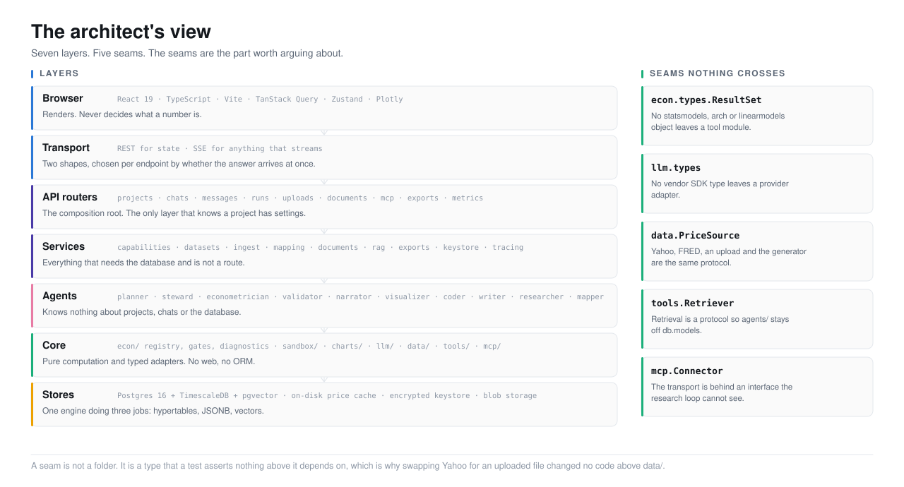
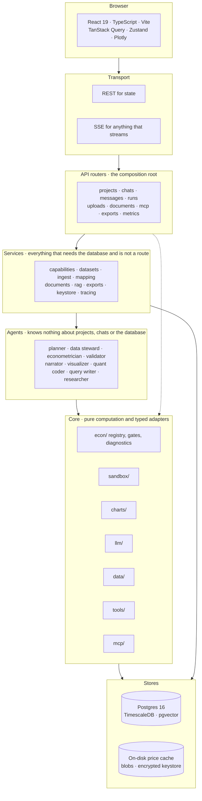
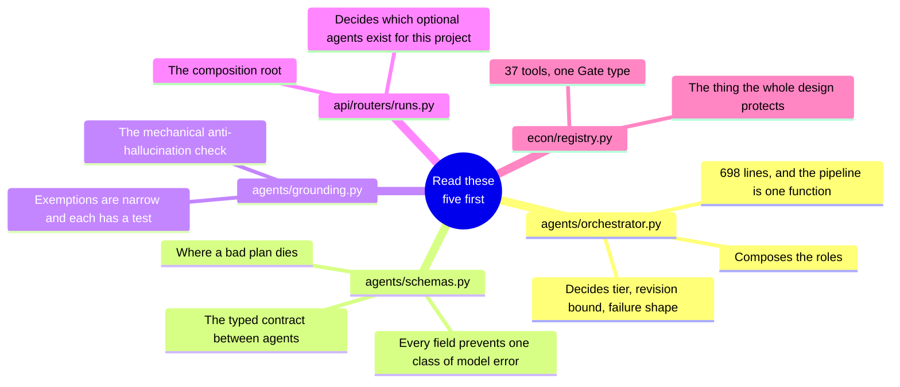

<picture>
  <source media="(prefers-color-scheme: dark)" srcset="../assets/doc-architecture-layers-dark.svg">
  <source media="(prefers-color-scheme: light)" srcset="../assets/doc-architecture-layers-light.svg">
  
</picture>

# 3. The architect's view

- **The point:** one sentence, "LLMs never compute statistics", forces seven
  layers and five typed seams. Nothing here is layering for its own sake.
- **Read time:** about 5 minutes
- **Do first:** open `backend/src/econometrica/agents/orchestrator.py`. It
  composes the roles, and it comes first in the reading order below.

| Page | What it covers |
|---|---|
| **This page** | The orientation: layers, seams, and the rule that generates all of them |
| **[High-level design](high-level-design.md)** | The system in the large: components, the agent pipeline, data flow, deployment |
| **[Low-level design](low-level-design.md)** | Module by module: the types, the contracts, the algorithms, the constraints |
| **[Technical blueprints](blueprints.md)** | The reference drawings: data model, request lifecycles, state machines, the sandbox |
| **[Integration patterns](integration-patterns.md)** | The five ways this system talks to something outside it, and the pattern each uses |

---

## The rule that generates the architecture

**Every structural decision in this codebase comes from one sentence:**

> **LLMs never compute statistics. They select from a registry of typed,
> versioned tools; the tools compute.**

That sounds like a policy. It is a type constraint. Take it seriously and it
forces a specific shape on everything above it:

| If | Then | So there is |
|---|---|---|
| A number must trace to a tested function | The thing that carries a number needs an identity and a provenance | `ResultSet` with a `Manifest` |
| Nothing above the tool boundary may see a statsmodels object | statsmodels cannot appear in an agent's imports | `agents/` speaking `econ.types` only |
| A model's output must be checkable against the results | The output must be a schema, not prose | `AnalysisPlan` |
| A leaked vendor SDK type would make swapping providers a rewrite | Vendor types must stop at the adapter | `llm/` with its own types |

The architecture is layered because that sentence leaves no other option. It
is not layered because layering is good practice.

## Seven layers

**Browser, transport, API, services, agents, core, stores, top to bottom.**

**The dotted line matters.**

- The API layer reaches straight into the core when it composes a run.
- That is because **the API layer is the composition root**.
- It is the only place that knows a project has settings.
- So it is the only place that can decide which optional agents to build.

## Five seams

**A seam is not a folder. It is a type, and a test asserts nothing above it
depends on what sits behind it.**

| Seam | The rule | What it bought |
|---|---|---|
| `econ.types.ResultSet` | No statsmodels, arch or linearmodels object leaves a tool module | Agents, API, charts and exports all consume one type. Adding a tool changes nothing above it |
| `llm.types` | No vendor SDK type leaves a provider adapter | Five providers behind one interface. Adding a sixth means one `ProviderSpec` and one factory |
| `data.base.PriceSource` | Yahoo, FRED, an upload and the generator are all the same protocol | Uploads became analysable without touching a line above `data/`. This is the seam that paid off most obviously |
| `tools.retrieval.Retriever` | Retrieval is a protocol, so `agents/` stays off `db.models` | The concrete retriever holds a session and a project; the agent holds neither |
| `mcp.connect.Connector` | The transport is behind an interface the research loop cannot see | stdio and streamable-HTTP are the same thing to the agent |

`tests/data/test_layering.py` enforces the third seam, `PriceSource`.

- It includes a subprocess check of **both import orders**.
- In-process, both modules are already in `sys.modules` by collection time. So
  an in-process test proves nothing about a cycle.

## Where the interesting complexity is

**It is not evenly distributed. New to the codebase? Read these five files
first, in this order:**

1. `agents/orchestrator.py`
2. `agents/schemas.py`
3. `agents/grounding.py`
4. `api/routers/runs.py`
5. `econ/registry.py`

## What the architecture refuses

**Four refusals. Each is a place where a reasonable engineer would add
something and quietly break the invariant.**

| The architecture refuses | Because | How it is held |
|---|---|---|
| **Anything under `tools/` becoming a source of numbers** | `tools/` is context: web search, retrieval. `econ/` is computation. The grounding gate admits only what a registry tool computed | Both channels have a test proving a figure quoted verbatim out of their text is still blocked |
| **A token or cost column on `spans`** | Telemetry and the run trace measure different things. A cost summed from both would look entirely plausible and be entirely wrong | The separation is structural, and a test asserts the columns do not exist |
| **`data/` importing from `agents/`** | `data/` is the lower layer. Importing upward is a cycle the moment the steward needs to call down | The protocol lives in `data/base.py`. `agents/data_steward` only re-exports it |
| **Registering the tracer provider globally** | That can only happen once per process, which would make a batch exporter impossible to shut down | The provider is deliberately never registered |

## Read next

**Next, 2 minutes:** open [the high-level design](high-level-design.md) and
look at the pipeline diagram in section 3.

After that, pick by what you are doing:

| You are | Read |
|---|---|
| About to change something | **[The low-level design](low-level-design.md)** |
| Looking for a reference drawing | **[The blueprints](blueprints.md)** |
| Connecting this to something else | **[Integration patterns](integration-patterns.md)** |

---

[Documentation](../README.md) · [1. Why](../1-why/) · [2. Product](../2-product/) ·
**3. Architecture** · [4. Decisions](../4-decisions/) ·
[5. Roadmap](../5-roadmap/) · [6. The art of the possible](../6-art-of-the-possible/)
