# Technical blueprints

- **The point:** twelve reference drawings, B1 to B12. Nothing here argues for
  anything.
- **Read time:** about 7 minutes end to end. Do not read it end to end. Keep
  it open on a second monitor.
- **Do first:** pick the drawing for what you are working on from the list
  below.

| You are working on | Open |
|---|---|
| Imports and layering | B1 |
| The database | B2 |
| A run, its states, its events | B3, B4, B5, B11 |
| Uploads, re-run, capabilities | B6, B7, B10 |
| The sandbox, MCP, ports | B8, B9, B12 |

- [B1. Module dependency map](#b1-module-dependency-map)
- [B2. The data model](#b2-the-data-model)
- [B3. Run lifecycle](#b3-run-lifecycle)
- [B4. Run state machine](#b4-run-state-machine)
- [B5. Step state machine](#b5-step-state-machine)
- [B6. Upload lifecycle](#b6-upload-lifecycle)
- [B7. Re-run and reproduction](#b7-re-run-and-reproduction)
- [B8. The sandbox process](#b8-the-sandbox-process)
- [B9. MCP research loop](#b9-mcp-research-loop)
- [B10. Capability resolution](#b10-capability-resolution)
- [B11. Streaming event vocabulary](#b11-streaming-event-vocabulary)
- [B12. Deployment topology](#b12-deployment-topology)

---

## B1. Module dependency map

**The arrows are the allowed directions. An arrow that does not appear here is
a layering violation.**

- Four forbidden edges are drawn in red. They are the ones somebody would
  plausibly add.
- Two of the four are caught by a test.
- Two are caught by the structure itself.

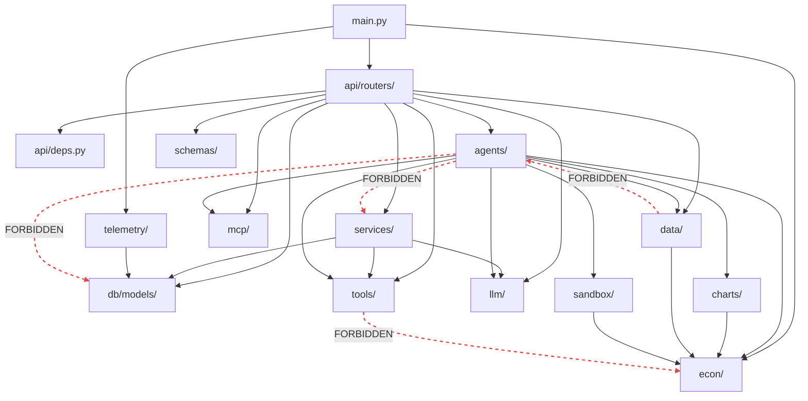

| Forbidden edge | Enforced by | Why |
|---|---|---|
| `agents/` to `db.models` | Review plus the protocol split (`tools/retrieval.py`) | An agent that knows about projects cannot be tested without a database |
| `agents/` to `services/` | Same | Capabilities are resolved by the router and passed in |
| `data/` to `agents/` | `tests/data/test_layering.py`, including a **subprocess** check of both import orders | It is the lower layer, and importing upward is a cycle the moment the steward calls down |
| `tools/` producing numbers | The grounding gate, with a test per channel | `tools/` is context, `econ/` is computation |

**The subprocess check is not paranoia.** In-process, both modules are already
in `sys.modules` by collection time, so an in-process test proves nothing.

---

## B2. The data model

**Ten tables. Everything hangs off `PROJECTS` except `SPANS`.**

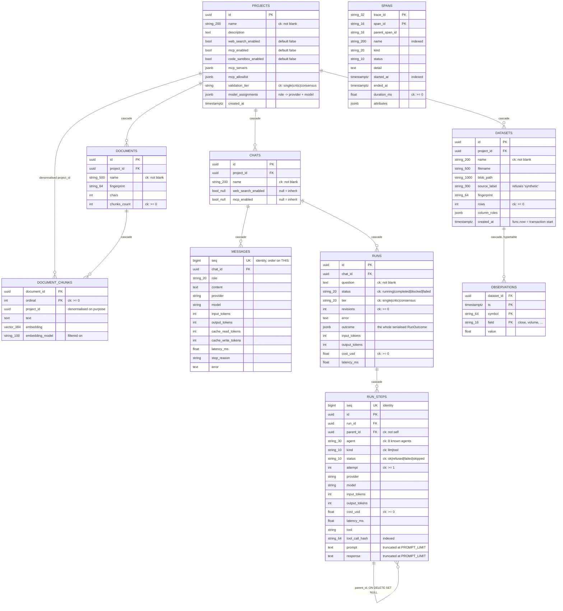

### Invariants that are not visible in the schema

| Invariant | Where it lives |
|---|---|
| `observations` is a **hypertable** | Hand-written `create_hypertable` in the migration, asserted against Timescale's catalogue in a test. Autogenerate cannot see it |
| `create_default_indexes => FALSE` | Otherwise Timescale creates `observations_ts_idx` and `alembic check` wants to drop an index on every run. We declare `ix_observations_ts` ourselves |
| `spans` has **no token or cost columns** | A test asserts they do not exist. This is what makes double-counting structurally impossible |
| Ordering is on `seq`, never `created_at` | `created_at` is `func.now()`, the transaction timestamp, so rows written together tie exactly |
| Every NOT NULL column pairs a Python `default` with a `server_default` | So non-ORM inserts land valid rows |

### Alembic's blind spot

**Tests are the only gate on CHECK constraints. `alembic check` verifies
nothing about them.**

| Case | What autogenerate does |
|---|---|
| A CHECK on a table it **creates** | Emits it. The `runs` and `run_steps` revision carries all thirteen |
| A CHECK added to or changed on a table that already **exists** | Sees nothing. The revision comes out empty and has to be hand-written |

**Asserting the constraint *names* is not enough.**

1. `ck_run_steps_agent_known` has been in the initial revision since phase 4.
2. `quant_coder` was added to `STEP_AGENTS`.
3. The name test stayed green.
4. A fresh database rejected every sandbox step.

`tests/db/test_migrations.py` now asserts every *value* of each vocabulary
reaches a migration too.

---

## B3. Run lifecycle

**The full sequence, from the click to the persisted row.**

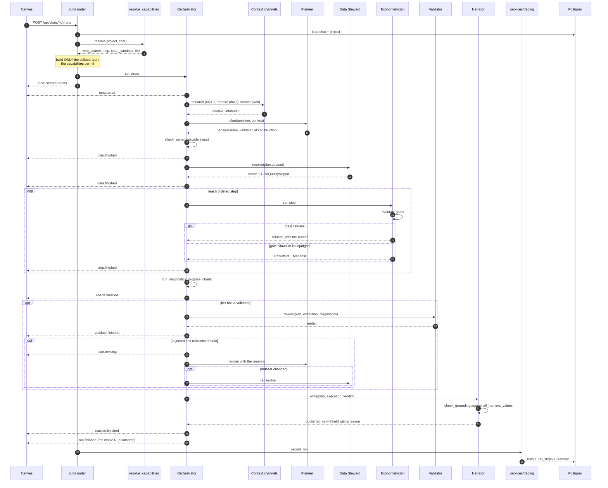

---

## B4. Run state machine

**A run ends `completed`, `blocked` or `failed`. Blocked is not an error.**

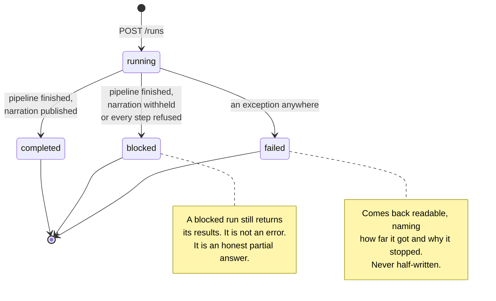

---

## B5. Step state machine

**A refused step is a result in its own right, not a failure.**

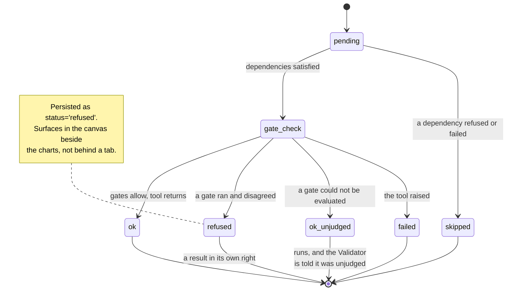

For model calls the same status vocabulary applies. A rejected attempt is a
**step in its own right**, with `attempt = 2` and a parent link, because it
was billed.

---

## B6. Upload lifecycle

**Nothing is ingested until a person confirms the mapping.**

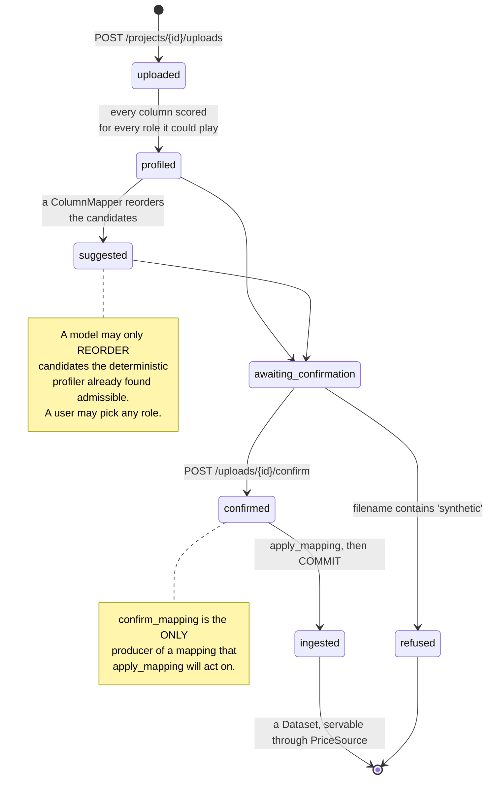

---

## B7. Re-run and reproduction

**Re-run executes the recorded plan and compares six things per step.**

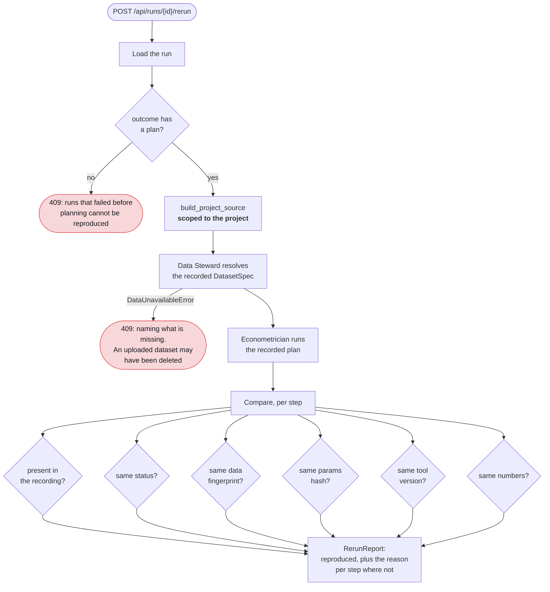

**Two facts about re-run are load-bearing.**

1. **It consults no model.** Re-planning would test whether a model repeats
   itself. That is a different question, and the manifest promises nothing
   about it. A test asserts the model call count is unchanged.
2. **The fingerprints agreeing is necessary, not sufficient.** The numbers are
   the thing being reproduced, so they are compared directly with
   `all_numeric_values()`.

An empty run reproduces nothing. Saying `True` for it would be the most
misleading answer available. So `reproduced` is `bool(steps) and all(...)`.

---

## B8. The sandbox process

**The parent owns the wall clock. The child does nothing until it is inside
the job.**

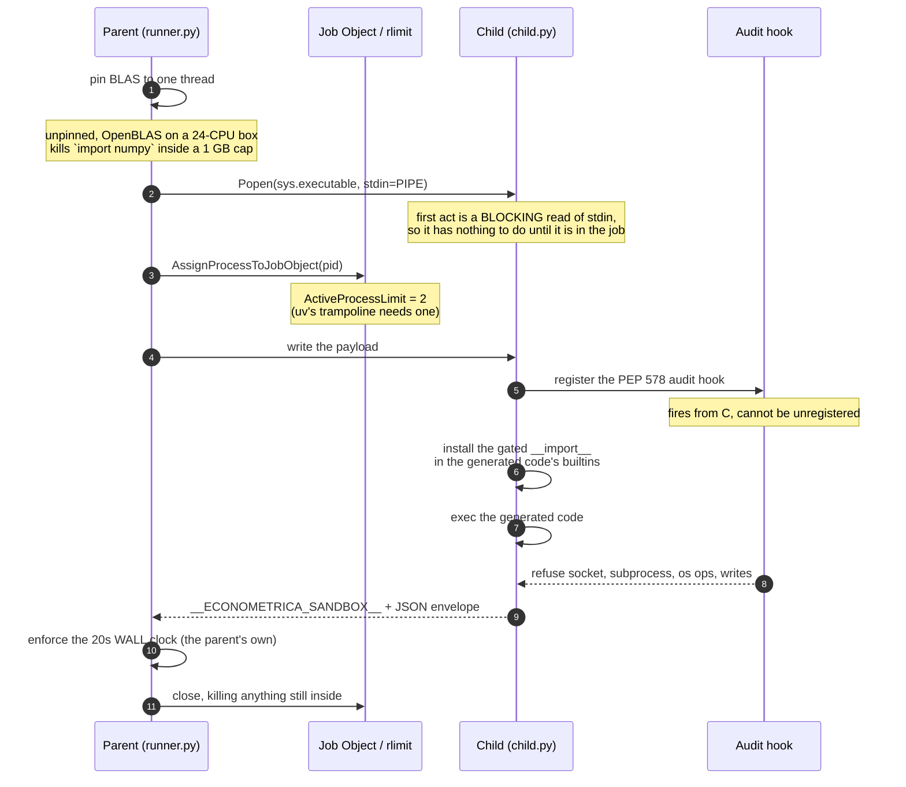

| Cap | Value | Note |
|---|---|---|
| Memory | 512 MB | Roughly double what the stack needs with BLAS pinned |
| Wall clock | 20 s | **The real timeout**, and it is the parent's |
| CPU | 60 s | A backstop only. A 1 s Job Object cap was measured firing at 5.9, 7.4 and 8.1 s |
| Max output | 4 MB | A result is a handful of estimates; anything near this is a mistake |
| Processes | 2 | Not 1. `uv`'s `sys.executable` is a trampoline |

---

## B9. MCP research loop

**Five conditions gate the loop. Any "no" skips the research phase.**

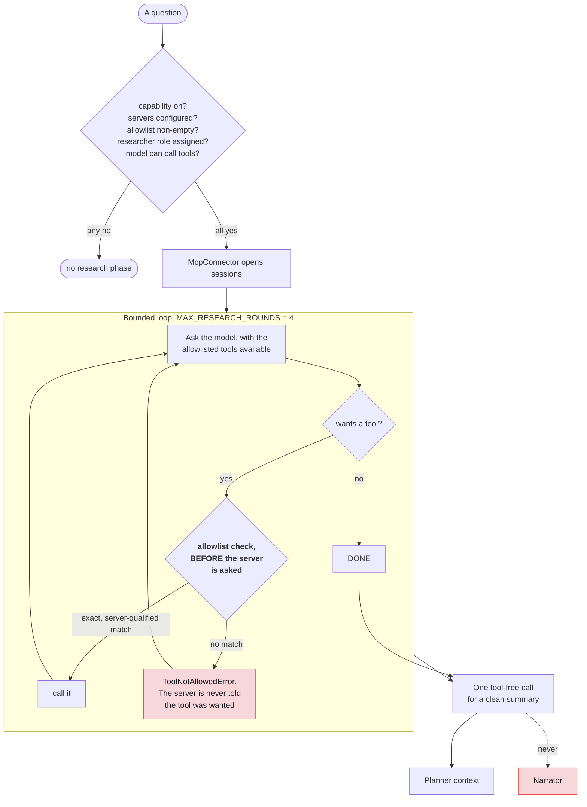

---

## B10. Capability resolution

**A chat may override web search and MCP. Nothing overrides the sandbox
toggle.**

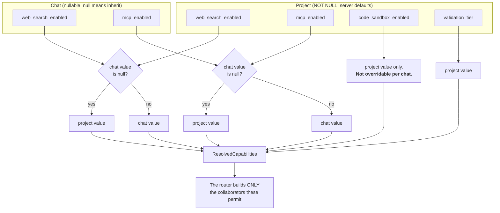

**The sandbox is deliberately not chat-overridable.** It is the most
security-sensitive toggle in the system, so it stays at project scope.

**The `None` handling:**

- Project toggles are NOT NULL in the database.
- So `None` is only ever seen on an instance that has not been flushed yet.
- Falling back to the column default keeps the resolver's answer identical
  before and after a flush. It does not leak `None` into a bool field.

---

## B11. Streaming event vocabulary

**Twelve events with dotted names, not a discriminated union.** A client
renders a timeline, and a new phase must not break a client that has not been
updated.

| Event | Payload | Fired |
|---|---|---|
| `run.started` | the question | always, first |
| `run.warning` | prose | zero or more, early. Includes the validator-independence warning |
| `plan.finished` | the whole `AnalysisPlan` | once per plan, including revisions |
| `plan.disagreement` | prose | consensus tier only, where planners differed |
| `data.finished` | `DataQualityReport` | once per resolve, so twice if a revision changed the spec |
| `step.finished` | `StepOutcome` | once per plan step |
| `charts.finished` | the `ChartSpec` list | once per execution pass |
| `validate.finished` | `ValidationVerdict` | once per review |
| `plan.revising` | "revision N of M" | once per revision |
| `narrate.finished` | `Narration` | once |
| `run.failed` | the error | at most once |
| `run.finished` | the whole `RunOutcome` | **always, last**, even after a failure |

`run.finished` firing after `run.failed` is the contract that makes a partial
run readable.

---

## B12. Deployment topology

**One Windows machine: Postgres in Docker on 5433, the API on 8001, Vite on
5173, Ollama on 11434.**

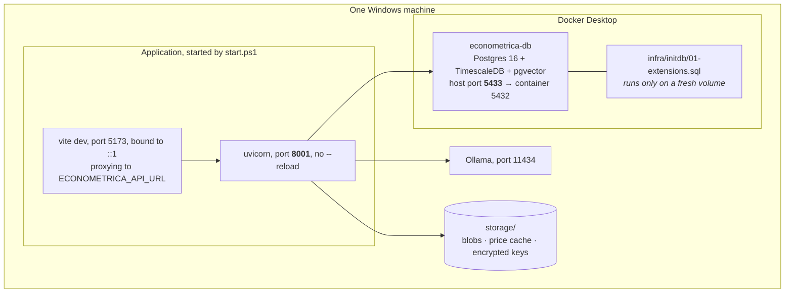

### Ports, and why they are what they are

| Port | Used by | Note |
|---|---|---|
| 5433 | Postgres on the host | Container port is still 5432 |
| **8001** | The API under `start.ps1` | Not 8000. See below |
| 5173 | Vite dev server | Bound to `::1` by default, so open `localhost:5173`, not `127.0.0.1:5173` |
| 8100 | e2e backend, synthetic prices | |
| 8101 | e2e backend, Yahoo prices | Shares one Postgres with 8100 |
| 11434 | Ollama | |

**Port 8000 is not safely ours.**

- A container holding the wildcard address on 8000 answers `127.0.0.1:8000`
  traffic too.
- It wins often enough that uvicorn's own successful bind proves nothing.
- Measured: 25 consecutive health polls returned 404 with `Server: SurrealDB`
  while uvicorn sat bound to `127.0.0.1:8000`.
- The same URL answered 200 from uvicorn minutes later.

**Docker Desktop does not autostart** on this machine. A fresh boot means no
Postgres and roughly 40 test errors.

**Docker Model Runner is disabled** (`"EnableInference": false`). It was
crash-looping Docker Desktop through an orphaned socket.

**Next, 2 minutes:** open [integration patterns](integration-patterns.md) and
read its checklist for adding the next integration.

---

[Documentation](../README.md) · [3. Architecture](README.md) ·
[High-level design](high-level-design.md) · [Low-level design](low-level-design.md) ·
**Blueprints** · [Integration patterns](integration-patterns.md)
