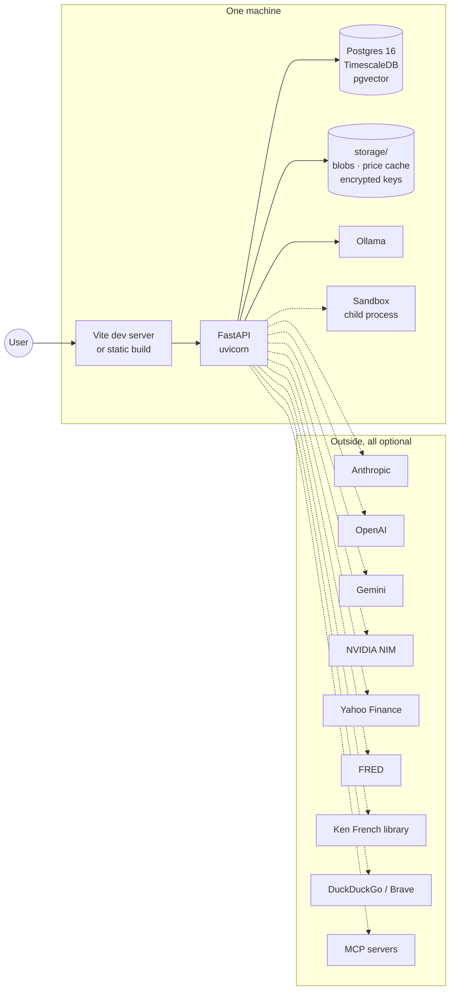
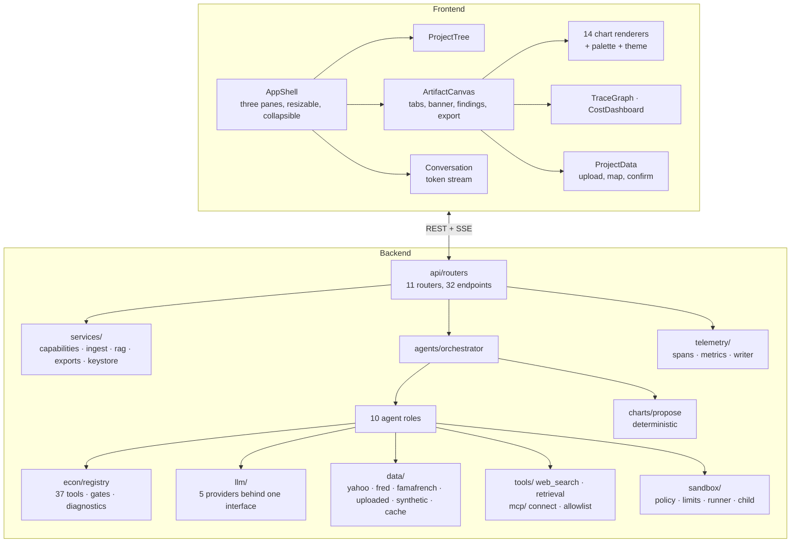
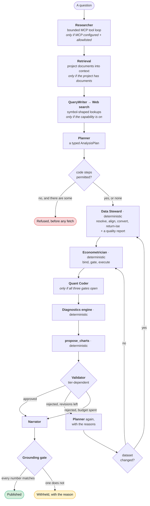
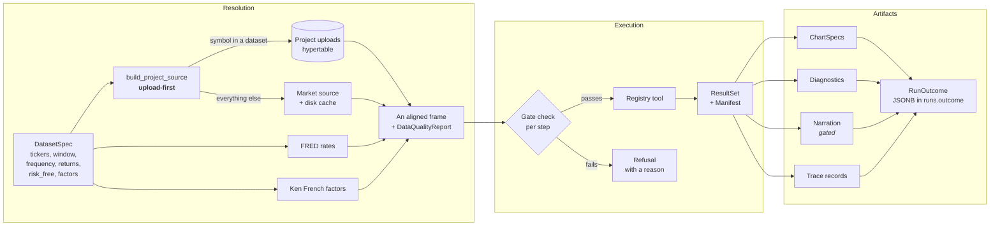
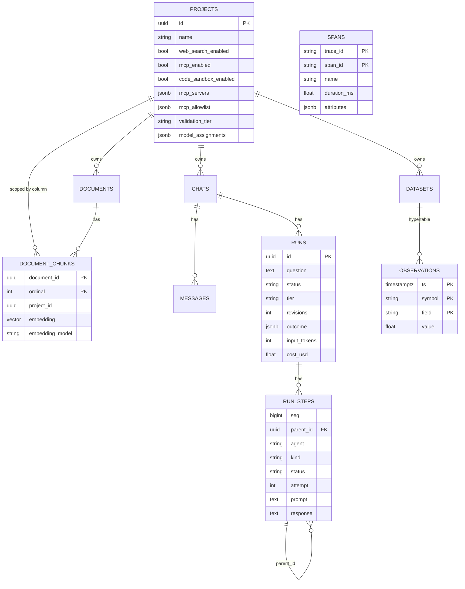
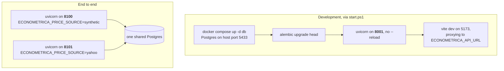

# High-level design

- **The point:** one backend process, one single-page frontend, one Postgres,
  all on one machine. Everything outside the machine is optional.
- **Read time:** about 8 minutes
- **Do first:** look at the pipeline diagram in
  [section 3](#3-the-agent-pipeline). It is the system on one screen.

| Section | Answers |
|---|---|
| 1. Context | What is inside the machine and what is outside |
| 2. Components | What each package owns and must not do |
| 3. The agent pipeline | How a question becomes a published answer |
| 4. Data flow through a run | Where the frame comes from |
| 5. Storage | One engine, three jobs |
| 6. Transport | REST or SSE, per endpoint |
| 7. Deployment | Which process runs on which port |
| 8. Quality gates | The commands, and two traps in the test suite |

---

## 1. Context

**Econometrica is a single-process backend and a single-page frontend, on one
machine.** It talks to a local Postgres and to whatever model providers and
data sources you have configured.

**Everything dotted is optional.** With `ECONOMETRICA_PRICE_SOURCE=synthetic`
and a local Ollama, nothing leaves the machine, and the whole pipeline still
runs end to end.

**Single user, no authentication.** A deliberate scope decision, not an
oversight.

- It keeps the local Ollama instance reachable without a proxy.
- It removes an entire tier of the product.
- It is the first thing the
  [medium-term roadmap](../5-roadmap/medium-term.md) revisits.

## 2. Components

**A React frontend and a FastAPI backend, joined by REST and SSE.**

### What each backend package is responsible for

**Read the "Must not" column first. It is the architecture.**

| Package | Owns | Must not |
|---|---|---|
| `api/routers/` | HTTP shape, composition of a run from a project's settings | Contain analysis logic |
| `services/` | Anything needing a database session that is not a route | Be imported by `agents/` |
| `agents/` | Role behaviour, the pipeline, the typed contracts | Know about projects, chats, or `db.models` |
| `econ/` | All computation, the registry, gates, diagnostics | Leak a library result object |
| `charts/` | Which chart a result shape implies | Ask a model anything |
| `llm/` | Five adapters, one interface, capability flags | Leak a vendor SDK type |
| `data/` | Price, rate and factor sources; the on-disk cache | Import from `agents/` |
| `tools/` | Context channels: web search, the retrieval protocol | Ever become a source of numbers |
| `mcp/` | Server config, transports, the allowlist | Let an unlisted tool reach a server |
| `sandbox/` | The policy, the OS caps, the child, the runner | Be mistaken for a correctness check |
| `telemetry/` | Spans, the writer, the metrics query | Carry tokens or cost |

## 3. The agent pipeline

**Ten roles. Two are deterministic and have no model at all.** That is the
part people find surprising.

Two of the ten are absent from the diagram below. The Column Mapper sits on
the upload path, not in a run. The Visualizer is a role but not a stage of a
run: the pipeline calls `propose_charts` directly.

### Three decisions the orchestrator makes that no single role can

**1. Which tier.**

| Tier | What it does |
|---|---|
| `single` | Cheap. Skips the Validator |
| `critic` | The default. Consults the Validator |
| `consensus` | Plans on several providers and reports what they disagree about |

The deterministic gates run in **every** tier. Cheap must not mean unguarded.

**2. When to stop.** A rejection buys exactly one revision.

- Left unbounded, a Validator and a Planner trade drafts until the budget runs
  out.
- A second rejection is far more likely to mean "this question cannot be
  answered with this data" than "try once more".

**3. What a failure leaves behind.** A run that dies mid-pipeline comes back
readable. It says how far it got and why it stopped. It is never
half-written.

### Why the Data Steward has no model

**Nothing it does needs one.**

- The design lists it as one of the six agent roles.
- Aligning calendars, converting frequency and constructing returns each have
  exactly one right answer.
- **A reproducibility manifest means nothing if the data under it depended on
  what a model felt like that morning.**

The one model-shaped part of data handling is mapping the columns of an
uploaded file to roles. That is a separate role, and a person confirms its
output before anything is ingested.

## 4. Data flow through a run

**Three stages: resolve a frame, execute gated tools, collect the artifacts
into one `RunOutcome`.**

### Provenance travels on two channels, and that is not redundancy

| Channel | Read when | Says |
|---|---|---|
| `DataQualityReport.source`, from the source's `label` | **Before anything is fetched** | What was *available*. It cannot describe a mixed run |
| The `mixed_sources` **info** flag | After the fetch | What was *used*. It names every ticker under the source that served it |

The flag is the authoritative record.

It is info, not warning, because mixing is the feature. An uploaded index
against a listed stock is not answerable any other way, and that question is
what exposed the gap.

## 5. Storage

**One engine doing three jobs.**

| Job | Mechanism |
|---|---|
| Time series at volume | TimescaleDB hypertable on `observations` |
| Semi-structured artifacts | JSONB: `runs.outcome`, `model_assignments`, `mcp_servers`, span attributes |
| Semantic retrieval | pgvector on `document_chunks.embedding` |

**Three facts about the hypertable that Alembic cannot see.** Each cost time
to discover:

1. **The conversion is invisible to autogenerate.** `create_hypertable` is
   hand-written in the migration and asserted against Timescale's catalogue in
   a test.
2. **It creates its own index**, which made `alembic check` want to drop one
   on every run. So `create_default_indexes => FALSE` and we declare
   `ix_observations_ts` ourselves.
3. **`field` is part of the primary key.** A wide file mapping both a close
   and a volume has two rows per `(ts, symbol)`.

### Ordering

**Transcripts never order on `created_at`. It is the transaction timestamp,
so rows written together tie exactly.**

| Table | Order on | Note |
|---|---|---|
| Transcripts | `Message.seq`, a Postgres identity column | Never `created_at` |
| Datasets | `created_at`, which is `func.now()`, transaction start | The "newest upload wins" rule is well ordered in use, because two confirmations are two requests |

The trap is in tests. A test writing two datasets at once must set the column
itself, or it asserts a coin flip.

## 6. Transport

**Two shapes, chosen per endpoint by whether the answer arrives at once.**

| Shape | Used by | Why |
|---|---|---|
| REST + JSON | Everything with a definite answer | |
| Server-sent events | `POST /api/chats/{id}/messages`, `POST /api/chats/{id}/runs` | The answer arrives over time and the user should be able to watch it |

**Runs are a separate route from messages, not a mode flag.** The two differ
in every way that matters to a client:

- **A different event vocabulary.** Phases, not tokens.
- **A different failure model.** A refused run still returns results.
- **A different duration.** A run's turn can take minutes.

Folding them together would make one route's response shape depend on a
request field. Neither the frontend's stream reader nor its tests could
narrow on that.

**Run events use dotted names** (`plan.finished`, `step.finished`), not a
discriminated union. A client renders a timeline, and a new phase must not
break a client that has not been updated.

## 7. Deployment

**Development runs the API on 8001. End to end runs two more, on 8100 and
8101, sharing one Postgres.**

**Port 8000 is avoided on purpose, and naming `127.0.0.1` does not save
you.**

- Another container on this machine holds the wildcard address on 8000.
- A wildcard socket answers `127.0.0.1` traffic too.
- Measured: with uvicorn bound to `127.0.0.1:8000` and the OS naming it as the
  listener, 25 consecutive health polls came back 404 with
  `Server: SurrealDB`.
- The same URL answered 200 from uvicorn minutes later.

It is a race, not a rule. That is why it reads as "the fix did not work".

**Two e2e backends, not one flag.**

| Port | Price source | The `synthetic_data` flag is asserted |
|---|---|---|
| 8100 | `synthetic` | present. `analysis.spec.ts` and `canvas.spec.ts` assert that generated prices *say so* |
| 8101 | `yahoo` | **absent** |

The first assertion only means something while the generator is what those
specs get. The second is the other half of the same seam: a flag that cried
wolf would be worse than no flag.

**`uvicorn --reload` cannot be stopped by port.**

1. The reloader binds the socket in the parent and hands it to the child.
2. Killing either leaves an orphan holding the socket.
3. The next start fails to bind.
4. Every request reaches the old code, which looks exactly like a fix not
   working.

So `start.ps1` runs without `--reload` and records the window pids, and
`-Stop` kills the whole tree.

## 8. Quality gates

| Gate | Command |
|---|---|
| Backend tests | `uv run pytest -q` |
| Lint | `uv run ruff check src tests alembic` |
| Types | `uv run mypy src` |
| Migrations | `uv run alembic upgrade head` then `alembic check` |
| Frontend tests | `npx vitest run` |
| Frontend types | `npx tsc --noEmit` |
| End to end | `npm run test:e2e` |

**Two facts about the test suite are load-bearing.**

**1. A test asserting the registry is populated must run in a subprocess.**

- Every module under `tests/econ` imports the family it exercises.
- So by collection time the in-process registry is full, whatever the
  application does.
- That is how the registry stayed empty in a live server until phase 4.

**2. The test database is built by `Base.metadata.create_all`, not from the
migrations.**

- So a constraint test passing against Postgres says nothing about whether a
  revision exists for it.
- `tests/db/test_migrations.py` asserts every constraint, and every *value* of
  each vocabulary, reaches some migration.
- Asserting the constraint names alone was not enough.
  `ck_run_steps_agent_known` had been in the initial revision since phase 4.
  Adding `quant_coder` to the Python tuple left the test green while a fresh
  database rejected every sandbox step.

**Next, 2 minutes:** open [the low-level design](low-level-design.md) and read
section 6, the numeric grounding gate. It is the check that withholds a
narration.

---

[Documentation](../README.md) · [3. Architecture](README.md) ·
**High-level design** · [Low-level design](low-level-design.md) ·
[Blueprints](blueprints.md) · [Integration patterns](integration-patterns.md)
