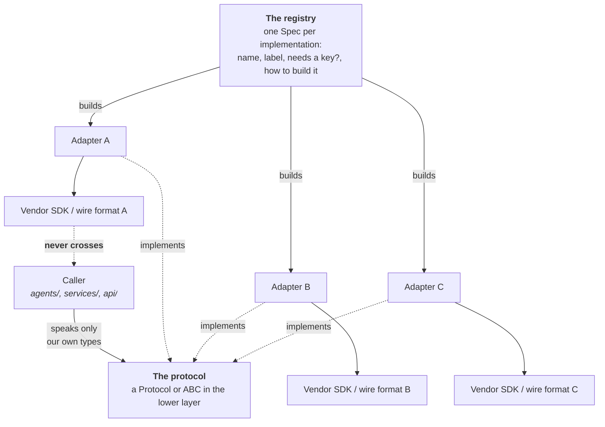
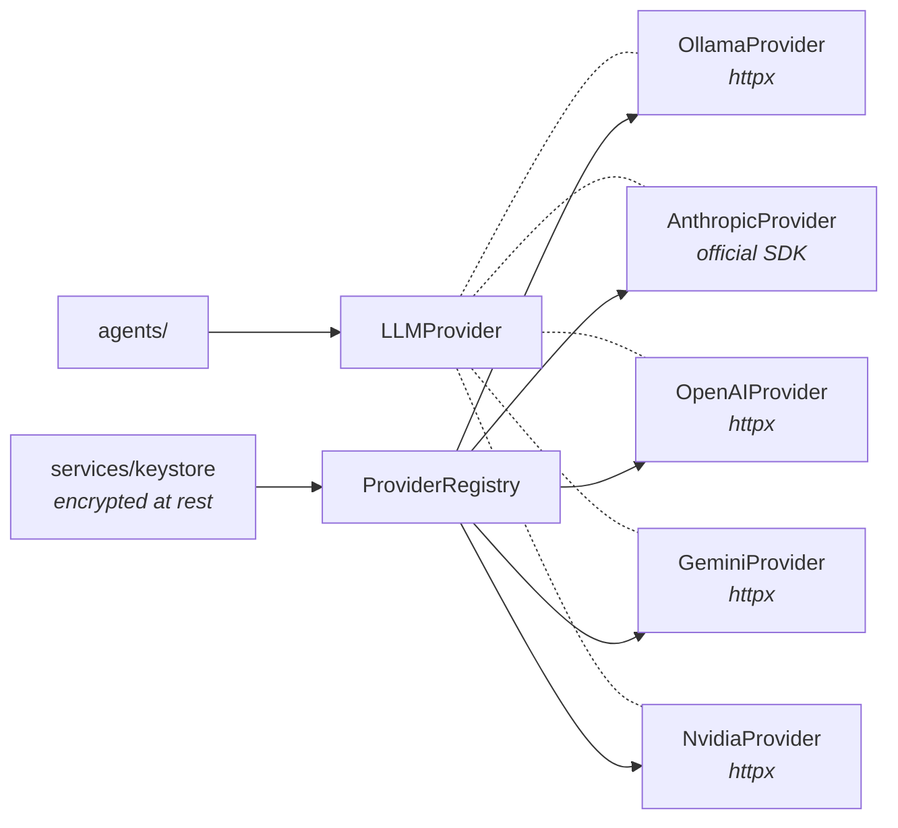
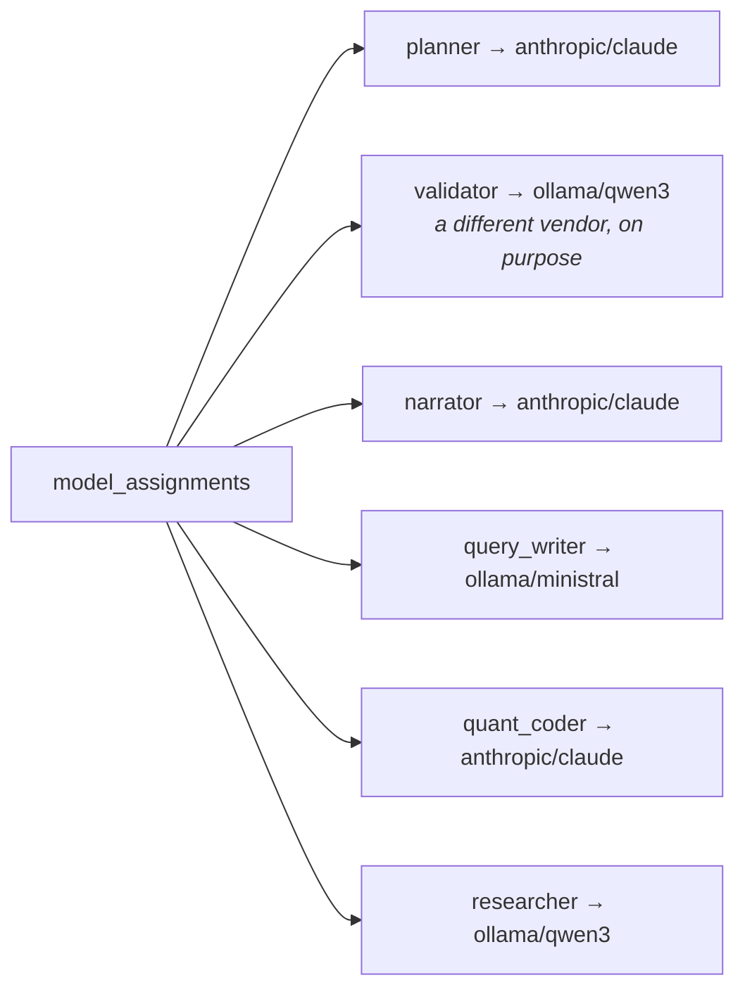
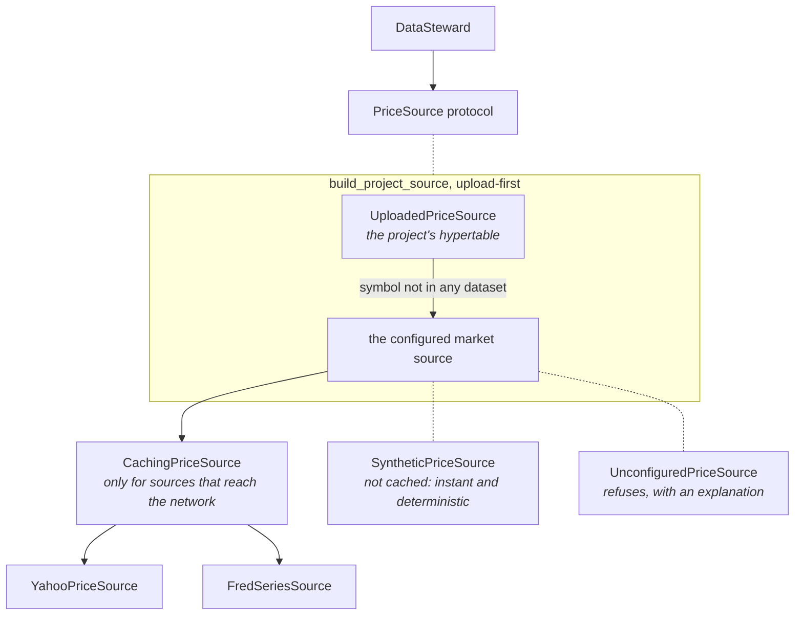
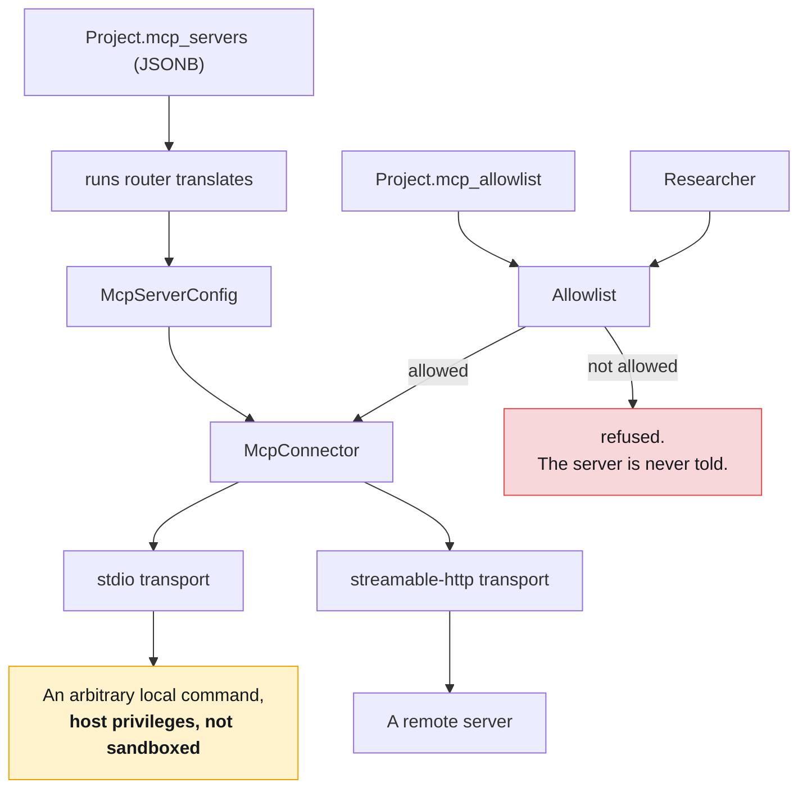
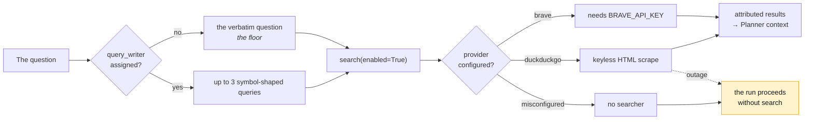
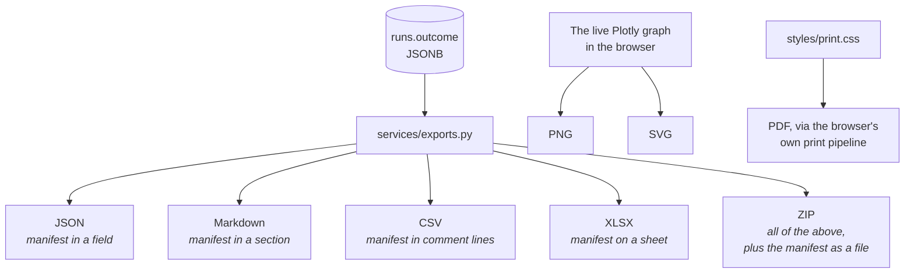

# Integration patterns

- **The point:** every boundary with the outside uses one shape: a protocol, a
  registry, a factory per implementation, and no vendor type crossing the
  seam.
- **Read time:** about 10 minutes
- **Do first:** adding an integration? Jump to
  [the checklist](#adding-a-sixth-integration-the-checklist). Eight boxes.

**This system talks to five kinds of thing outside itself:** model providers,
data vendors, MCP servers, a browser, and whatever you export to.

**Each uses a pattern. This page has five, each with a rule in one line:**

| # | Pattern | Its rule, in one line |
|---|---|---|
| 1 | LLM providers | Vendor types stop at the adapter. Capabilities are discovered, not assumed |
| 2 | Market data | Refuse. Never return something plausible |
| 3 | MCP servers | Untrusted by default. Default-deny allowlist |
| 4 | Web search | Degrade, never fail |
| 5 | Whatever you export to | The manifest travels with the export |

The pattern is the same shape every time, because the same constraint
produced all of them.

**The shape: a protocol in the lower layer, a registry that knows every
implementation, a factory per implementation, and a rule that no vendor type
crosses the seam.**

---

## The generic pattern

**Four properties. Each one earns its keep:**

| Property | What it buys |
|---|---|
| One protocol | The caller is written once and does not change when you add an implementation |
| One registry | Adding an implementation is one entry, not a search for every place that switches on a name |
| Vendor types stop at the adapter | Swapping a vendor is a file, not a rewrite |
| A settings enum that must agree with the registry | A value that passes settings validation but has no factory would surface as a 500 on the first run rather than as a startup failure. There is a test asserting they agree |

---

## Pattern 1: LLM providers

| Piece | Where |
|---|---|
| Protocol | `llm/base.py` `LLMProvider` |
| Registry | `llm/registry.py` |
| Types | `llm/types.py` (`Message`, `Completion`, capability flags) |
| Adapters | `llm/providers/` (ollama, anthropic, openai, gemini, nvidia) |

### Adding a provider

1. Write the adapter in `llm/providers/`. It takes an API key (or an empty
   string) and speaks `llm.types` outward.
2. Add a `ProviderSpec` to `SPECS` in `llm/registry.py`: name, label,
   `requires_key`, and a `key_url` for the settings UI.
3. Add the factory.

That is the whole list. Nothing else in the codebase switches on a provider
name.

### Two things that will bite you

**1. Capabilities must be discovered, not assumed. Read `/api/show`.**

- Ollama's `/api/tags` reports neither context length nor tool support.
- Guessing them from the model name was wrong in both directions.
- On this machine, 6 of 13 chat models cannot call tools.
- Real context windows run from 512 to 262144, not the 8192 the adapter used
  to claim for everything.

The context key is architecture-prefixed, so read `general.architecture` to
name it. Matching `*.context_length` alone also catches
`mistral3.rope.scaling.original_context_length`, which is a smaller number.

**2. Sampling parameters are not universal.** Opus 5, Fable 5, Sonnet 5 and
Opus 4.8/4.7 reject `temperature` with a 400. The adapter drops it for those
models (`NO_SAMPLING_PARAMS`).

### Per-role binding

**The registry is what makes per-role model assignment cheap.**

- `Project.model_assignments` is a map from role to provider and model.
- The run router resolves each role independently.

**A Validator sharing a vendor with the Econometrician shares its blind
spots.** So `independence_warning` exists, and the orchestrator surfaces it as
a run warning. It does not silently allow it.

---

## Pattern 2: market data

| Piece | Where |
|---|---|
| Protocol | `data/base.py` `PriceSource`, plus `DataUnavailableError` |
| Registry | `data/registry.py` |
| Adapters | `data/` (yahoo, fred, synthetic, unconfigured, uploaded) |
| Decorator | `data/cache.py` `CachingPriceSource` |

### The decorator, not a flag

**Caching is a wrapper the registry applies, and only to sources that reach
the network.**

| Source | Cached | Why |
|---|---|---|
| Yahoo, FRED | yes | They reach the network |
| Synthetic | no | Instant and deterministic. Caching it would add disk churn to buy nothing |
| Unconfigured | no | Nothing to cache |

### Composition, not configuration

**`build_project_source` is the other decorator. It wraps the market source
with the project's uploads.**

- Reach for this pattern when two sources need to be one source.
- It is why an uploaded index and a listed ticker can end up in the same
  frame, with no code above `data/` knowing.

**A project with no uploads gets the market source back unwrapped**, not a
wrapper that always delegates. A wrapper that always delegates is a layer of
indirection that shows up in every stack trace forever.

### The three rules any new source must follow

1. **Its `label` names its adjustment policy.** AAPL on 2020-08-25 closes at
   `124.82` split-adjusted and `121.08` dividend-adjusted. A number without
   its policy is not reproducible even in principle.
2. **Its label must not contain the word "synthetic".** The `synthetic_data`
   risk flag fires on a substring match, so a label containing it would tell
   every reader their market data was generated. There is a test per source.
3. **It raises `DataUnavailableError` rather than returning something
   plausible.** Import it from `data/base.py`, never from
   `agents/data_steward`, which only re-exports it.

### What a dead integration looks like

**Stooq is the cautionary tale. It was dropped, not worked around.**

- `pandas-datareader` resolved to 0.11.1, which implements six sources and not
  that one. `DataReader(..., "stooq")` raises `NotImplementedError`.
- The CSV endpoint it used to call now answers with a JavaScript proof-of-work
  browser-verification challenge.

> An adapter whose job includes defeating a bot check is not an adapter, it is
> a liability.

**FRED replaced it as the independent cross-check.** No API key, a genuinely
separate pipeline, and it agreed with yfinance to the cent on `SP500` against
`^GSPC`.

---

## Pattern 3: MCP servers

**This is the only integration where the thing on the other end is untrusted
by default.** The pattern reflects that.

| Piece | Where |
|---|---|
| Config | `mcp/config.py` |
| Transports | `mcp/connect.py` |
| Gate | `mcp/allowlist.py` |
| Consumer | `agents/researcher.py` |

### Three properties of the allowlist

**1. Default deny.**

- An empty allowlist allows nothing.
- Turning the capability on is not consent to whatever a server happens to
  offer.
- A project that has listed nothing has agreed to nothing.

**2. Explicit, not patterned.**

- There are no wildcards.
- `files:*` is a literal tool name that matches a tool actually called `*`.
- A pattern would silently re-admit whatever a server added next. That is the
  failure this exists to prevent.

**3. Exact matching, server-qualified.**

- A server chooses its own tool names.
- Case-folding or trimming would make the gate depend on a normalisation the
  server never agreed to.
- `files:read` and `shell:read` are different tools.
- Matching on the tool name alone would let a second server impersonate a
  trusted one.

### Discovery is not permission

**Listing is never permitting.**

- `GET /api/projects/{id}/mcp/tools` connects live and lists every tool each
  server offers, with an `allowed` flag on each.
- That is how a user builds the list.
- Listing and permitting are separate operations on purpose. The flag on a
  discovery result is a report, not a grant.

### The trust boundary, stated plainly

**If you do not fully trust the server, use HTTP.**

- A stdio MCP server is an arbitrary local command spawned with host
  privileges.
- It is **not** sandboxed like the quant coder.
- The allowlist gates which *tools* run, not what the spawned process can do
  once it is running.

This is documented, not mitigated. The alternative would be sandboxing
arbitrary third-party servers, which is a different product.

### Testing an integration you do not control

**Drive a real server, not a mock, whenever the integration offers a way.**

- `mcp==1.28.1` ships an in-memory transport,
  `create_connected_server_and_client_session`.
- The tests drive a **real** MCP server through it.
- So the proof that an unlisted tool never ran is the server's own execution
  log.

A mock only ever proves the adapter matches what we *believe* the wire format
is.

---

## Pattern 4: web search

**The simplest integration, with the most interesting failure policy.**

### Degrade, never fail

**Every failure mode here degrades. None refuses.**

| Failure | Result |
|---|---|
| No query writer assigned | Search the verbatim question. The floor the feature never does worse than |
| A misconfigured query writer (unknown provider, no key) | Degrades to that same floor rather than a 503 |
| A misconfigured search provider | No searcher, and the run proceeds |
| The search itself fails | The run proceeds without the context |

**Search is context, and losing the analysis to a search outage would be the
worse trade.**

This is the opposite policy from data resolution:

| Integration | A failure | Because |
|---|---|---|
| Search | Degrades the run | Context improves an answer |
| Data | Refuses the run. A missing risk-free rate is one example | Data determines an answer |

### `search()` takes a bool, not a capabilities object

**A function that needs one boolean should take one boolean.** Taking the
object it came from drags the object's dependencies along.

- Reading one flag off a services type put `db.models` on the import path of
  everything touching a search. That now includes `agents/`.
- The tests still resolve through `resolve_capabilities` and pass
  `.web_search`. The point of the disabled-search tests is that
  project-and-chat resolution decides.

### The key does not go in the keystore

**`BRAVE_API_KEY` is a settings field, not a keystore entry.**

- The keystore is reached through a route that validates names against the
  **LLM** provider registry.
- A search key could not go there without teaching that route about a second
  kind of provider.

---

## Pattern 5: outbound, to whatever you export to

**The one integration where the other side is a person or a file, not a
service.**

### The rule

**The manifest travels with the export.**

| The format has | The manifest goes |
|---|---|
| A metadata channel | In it |
| None (CSV) | In comment lines |
| Neither fits | Beside the data, in the same archive |

A number on someone's disk outlives the application that produced it. One
that cannot be traced back is what this project exists not to produce.

### Exports replay nothing

**An export runs no analysis and asks no model anything.**

- Everything is built from the persisted `Run.outcome`.
- Exporting a run from last week costs one SELECT.

### Chart images come from the browser, deliberately

**The fourteen renderers are TypeScript.**

- The only way a server could produce a faithful PNG would be to reimplement
  them in Python.
- It would then be exporting a picture nobody had looked at.
- kaleido was ruled out, not deferred, for this reason. The backend holds no
  Plotly JSON.

### PDF is a stylesheet, not a dependency

**No new dependency in either stack.** `styles/print.css`:

- forces light surfaces, whatever theme the reader used
- drops the chrome
- keeps a chart card whole across a fold
- always prints the `Provenance` block

---

## Adding a sixth integration: the checklist

**Eight questions. Answer all eight before writing the adapter.**

- [ ] Is there a protocol for it in the **lower** layer, so the caller never
      imports the adapter?
- [ ] Is there one registry entry per implementation, with a factory?
- [ ] Does the settings enum, if there is one, have a test asserting it agrees
      with the registry?
- [ ] Do vendor types stop at the adapter?
- [ ] What is the failure policy: refuse, or degrade? State it, and be able to
      say why.
- [ ] If it produces provenance-bearing data, does its label say what kind?
- [ ] If it is untrusted, where is the gate, and does it run **before** the
      other side is asked?
- [ ] Is there a live test that talks to the real thing, and does it skip
      rather than fail when the thing is absent?

The last box is a project convention with a record behind it. Live probes
against real services have caught several wrong beliefs that mocks confirmed
happily.

**Next, 2 minutes:** open [Key decisions](../4-decisions/) and scan the
"Reversible?" column in the full index.

---

[Documentation](../README.md) · [3. Architecture](README.md) ·
[High-level design](high-level-design.md) · [Low-level design](low-level-design.md) ·
[Blueprints](blueprints.md) · **Integration patterns**
