# Low-level design

- **The point:** module by module, the types, the contracts, the algorithms,
  and the constraints that are not obvious from reading the code.
- **Read time:** about 21 minutes end to end. Read one section at a time, the
  one for the module you are about to change.
- **Do first:** find your module in the Contents below and jump to it.

Before you change a module:

1. Read its section here.
2. Read the module's own docstring. The constraint is recorded there, next to
   the code it constrains.

---

## Contents

- [1. The result type, and why everything depends on it](#1-the-result-type-and-why-everything-depends-on-it)
- [2. The tool registry and gates](#2-the-tool-registry-and-gates)
- [3. The typed contract between agents](#3-the-typed-contract-between-agents)
- [4. The agent base: retries and what they cost](#4-the-agent-base-retries-and-what-they-cost)
- [5. The orchestrator](#5-the-orchestrator)
- [6. The numeric grounding gate](#6-the-numeric-grounding-gate)
- [7. The Data Steward](#7-the-data-steward)
- [8. Data sources and the cache](#8-data-sources-and-the-cache)
- [9. Uploads: profile, map, confirm, ingest](#9-uploads-profile-map-confirm-ingest)
- [10. Chart proposal](#10-chart-proposal)
- [11. Context channels](#11-context-channels)
- [12. The sandbox](#12-the-sandbox)
- [13. Telemetry](#13-telemetry)
- [14. Frontend](#14-frontend)

---

## 1. The result type, and why everything depends on it

**`econ/types.py` is under 100 lines and is the most important file in the
backend.**

```python
class ResultSet(BaseModel):
    tool: str
    version: str
    params: dict[str, Any]
    estimates: list[Estimate]
    diagnostics: list[Diagnostic]
    scalars: dict[str, float]
    tables: dict[str, Table]
    series: dict[str, Series]
    manifest: Manifest
```

- Every downstream consumer depends only on this type: agents, API, charts,
  exports.
- Library result objects from statsmodels, arch and linearmodels **must never
  leak past the tool boundary**.
- That is what makes 37 tools cost nothing above `econ/`.

Three members deserve attention: `Manifest`, `Diagnostic.passed` and
`all_numeric_values()`.

### `Manifest`

```python
class Manifest(BaseModel):
    data_fingerprint: str      # SHA-256 of the exact aligned input matrix
    tool: str
    tool_version: str
    params_hash: str
    library_versions: dict[str, str]
    seed: int | None
    created_at: datetime
```

**This is what makes the re-run possible.**

- The fingerprint is of the aligned matrix, not of the request.
- So a source that quietly revised its history produces a different
  fingerprint, and the re-run says so.

### `Diagnostic.passed` is tri-state

```python
passed: bool | None = None    # None means "not judged", never "failed"
```

**This invariant reaches every layer.**

- `PreconditionVerdict` carries it upward as two booleans, `allowed` and
  `judged`, not one.
- The canvas renders "not judged" distinctly.
- A user told a check failed when nobody ran it learns something false.

### `all_numeric_values()`

```python
def all_numeric_values(self) -> set[float]:
    """Every number a narrator is permitted to cite."""
```

**This is the allowlist the grounding gate checks against.** It gathers:

- scalars
- every field of every estimate
- every diagnostic statistic, p-value and critical value

Nothing else in the system is a legitimate source of a figure in prose.

---

## 2. The tool registry and gates

`econ/registry.py`.

```python
@dataclass(frozen=True)
class RegisteredTool:
    name: str
    version: str
    family: str
    summary: str
    params_model: type[BaseModel]
    fn: ToolFn                          # (DataFrame, BaseModel) -> ResultSet
    preconditions: tuple[str, ...]      # prose, for the model to read
    gates: tuple[Gate, ...]             # enforcement, which cannot be argued with
```

**`preconditions` and `gates` are both there on purpose. They do different
jobs.**

| Field | Job | Who it is for |
|---|---|---|
| `preconditions` | Guidance | A model reads the prose while it plans |
| `gates` | Enforcement | The gate refuses |

```python
GateCheck = Literal["arch_effects", "stationarity"]

@dataclass(frozen=True)
class Gate:
    check: GateCheck
    expect: bool = True
    because: str = ""    # shown on refusal, so a refusal teaches something
```

**The vocabulary is deliberately tiny: two checks.** Every entry needs an
implementation in `econ/gates.py`. A vocabulary nobody can enumerate is one
nobody can enforce.

**`expect` carries real weight.** A VAR needs stationarity present and a VECM
needs it absent. So the two are the same gate with opposite expectations.

### Gate evaluation is three-valued

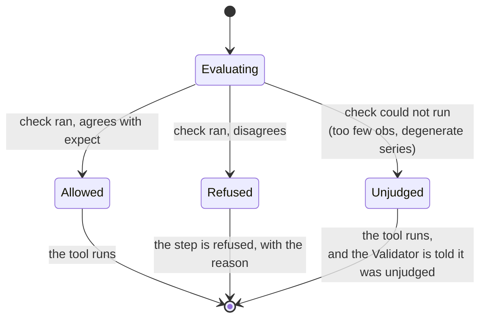

**`PreconditionVerdict.refused` is `judged and not allowed`.**

- Unjudged must not silently become a refusal.
- Unjudged must not silently become an approval either.
- It travels to the Validator as an unjudged verdict, and the Narrator has to
  disclose it.

**All named columns must satisfy a gate.** A VAR is not fit on "mostly
stationary" data. One non-stationary series is enough to make the whole
system's dynamics spurious.

### Registration is an import side-effect

**Anything resolving a tool by name must call `econ.load_tools()` first.**

1. Tools register when their family package is imported.
2. `econ.load_tools()` is the one place that imports all five.
3. `main.py` calls it.

Forgetting this is how the registry stayed empty in a live server until
phase 4.

---

## 3. The typed contract between agents

**`agents/schemas.py`. Every field here exists to make one class of model
error impossible to pass downstream.**

### Recovering JSON from a model reply

**Three strategies, tried in order of how much they assume.**

Models wrap JSON in prose, in fences, or in both. The ones with a JSON mode
still do it when the mode is unavailable.

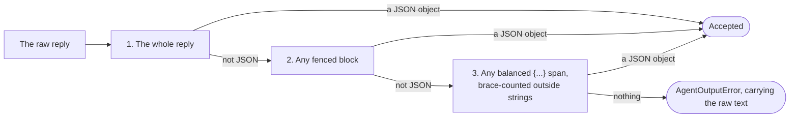

**A regex cannot do step 3.** Model prose routinely contains braces inside
strings, and a non-greedy match stops at the first one.

**A JSON array is not accepted.**

- Every agent contract is an object.
- So a list is a misread of the question, not a formatting quirk.
- Silently taking its first element would hide that.

**`AgentOutputError` carries the raw text.** A retry has to show the model
what it actually sent. A retry that only says "that was not valid JSON" tends
to get the same invalid JSON back.

### `PlanStep` binds to the registry at construction

```python
@model_validator(mode="after")
def tool_and_params_must_satisfy_the_registry(self) -> Self:
    tool = get_registry().get(self.tool)          # unknown tool: rejected
    unknown = set(self.params) - declared_names   # invented param: rejected
    tool.params_model.model_validate(self.params) # wrong type: rejected
```

**Unknown keys are rejected, not ignored.** Ignoring is the dangerous
direction:

1. Pydantic ignores unknown keys by default.
2. An invented `confidence: 0.99` would vanish silently.
3. The user would believe the level had been honoured.

### `AnalysisPlan` must form a DAG

**The checks run in order. Any one rejects the plan.**

Both step kinds share one id namespace. A narration cites `s3` whether `s3`
ran a tool or ran code, so a collision would make a citation ambiguous.

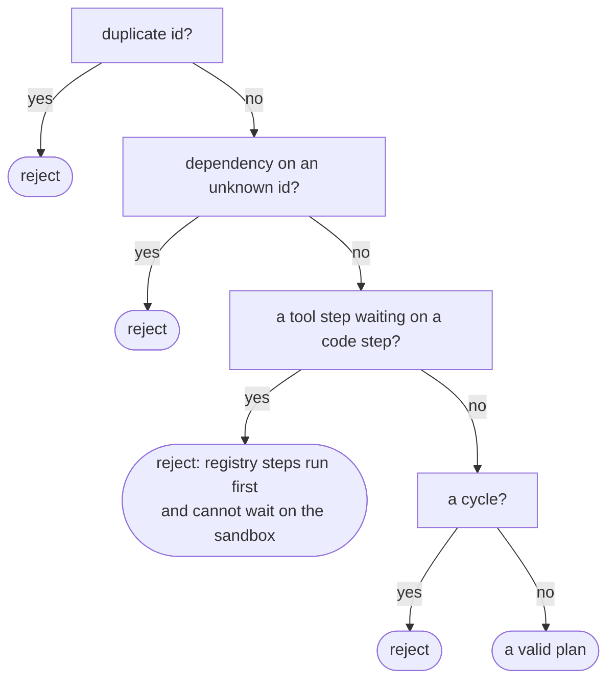

**Why the third check exists:**

- The Econometrician runs the registry steps and knows nothing about generated
  code.
- So a tool step waiting on a code step would wait for ever.
- It is refused at the boundary, not discovered as a hang.

**Ties in the topological sort break on declared order.** Two runs of the
same plan execute identically. Reproducibility has to reach the schedule, not
only the arithmetic.

### Return-method synonyms

```python
_RETURN_METHOD_SYNONYMS = {"log_diff": "log", "log_return": "log", "pct_change": "simple"}
```

**Three synonyms are accepted. Rejecting `log_diff` burned a retry every
time.**

- The catalogue a Planner reads uses the tool-level transform vocabulary.
- So a real local model reached for `log_diff` here on its first attempt,
  every time.
- A log difference is a log return. Recognising that is not leniency about
  meaning.

**`diff` is deliberately absent.** A price difference is not a simple
return.

---

## 4. The agent base: retries and what they cost

`agents/base.py`.

```python
class Agent[OutputT: BaseModel](ABC):
    def __init__(self, provider, model, *, max_attempts: int = 2): ...
```

`AgentResult` keeps **every** completion, including rejected ones, and pairs
each with the prompt that produced it:

```python
@dataclass
class AgentResult[OutputT: BaseModel]:
    output: OutputT
    completions: tuple[Completion, ...]   # including the rejected ones
    prompts: tuple[str, ...]              # one per attempt
```

- **One prompt per attempt**, because a retry is a different conversation.
- **Both are truncated at `PROMPT_LIMIT = 20_000`**, since the Planner's prompt
  carries the whole tool catalogue.

**`AgentAttemptsExhaustedError` keeps all the failures, not only the last.**
Which *way* a model failed twice is the difference between a bad prompt and a
model that cannot do the job. Only the caller has the context to tell them
apart.

---

## 5. The orchestrator

**`agents/orchestrator.py`, 698 lines. The pipeline is essentially one async
generator.**

### Construction

**Thirteen parameters. The optional ones are optional for a reason. Absent
means something specific each time.**

```python
Orchestrator(
    planners=[...],           # several in the consensus tier
    steward=...,              # deterministic
    validator=None,           # absent in the single tier
    narrator=...,
    coder=None,               # the escape hatch
    code_sandbox=False,       # the resolved capability
    searcher=None,            # a provider may be absent on this deployment
    web_search=False,         # ... which is not the same as search being off
    query_writer=None,        # absent means the verbatim question is searched
    retriever=None,           # absent means the project has no documents
    researcher=None,          # absent means MCP is not configured
    tier="critic",
    max_revisions=1,
)
```

**Three parameters for search, not one.**

| Parameter | Absent or false means |
|---|---|
| `searcher=None` | No provider is configured on this deployment |
| `web_search=False` | Search is off for this project |
| `query_writer=None` | The verbatim question is searched |

Those are different facts. The same reasoning gives `coder` and
`code_sandbox` as a pair.

**`agents/` knows nothing about projects or chats.**

- The resolved capabilities are passed in.
- `api/routers/runs.py` decides.
- It builds each optional collaborator **only** when the capability is on. A
  project with search off never constructs a searcher.
- The test asserts on construction, not on the trace.

### Failure containment

```python
try:
    async for event in self._pipeline(question, context, outcome):
        yield event
except Exception as exc:
    # Deliberately broad. Whatever failed, the run has to come back
    # describing itself.
    outcome.status = "failed"
    outcome.error = f"{type(exc).__name__}: {exc}"
    yield RunEvent(name="run.failed", detail=outcome.error)

yield RunEvent(name="run.finished", payload=outcome.model_dump(mode="json"))
```

**`run.finished` fires either way.** A traceback on the wire tells a user
nothing and loses the work that did succeed.

### The revision loop and the re-resolve

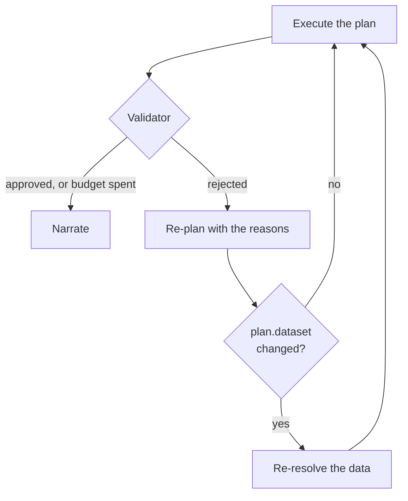

**A revision that changes the dataset re-resolves the data.** The bug this
fixes:

1. The data was resolved once, before the loop.
2. A revised plan ran on the *previous* plan's frame.
3. `plan.dataset` named one window while the results came from another.
4. Re-running such a plan from its manifest disagreed, and rightly so.

**Re-run is what found this.** Unchanged specs are not re-fetched, because
most revisions change the method, not the data.

---

## 6. The numeric grounding gate

**`agents/grounding.py`. The one anti-hallucination check that is mechanical,
not persuasive.**

### Precision comes from the citation

```
"1.30"  claims two decimal places  →  matches any computed value
                                       that rounds to 1.30 at two places
"1.3"   claims one                 →  matches anything rounding to 1.3 at one
```

That is both stricter and more permissive than a fixed epsilon, in the right
directions. A model that writes more digits is held to more of them.

### The exemptions, and why each is narrow

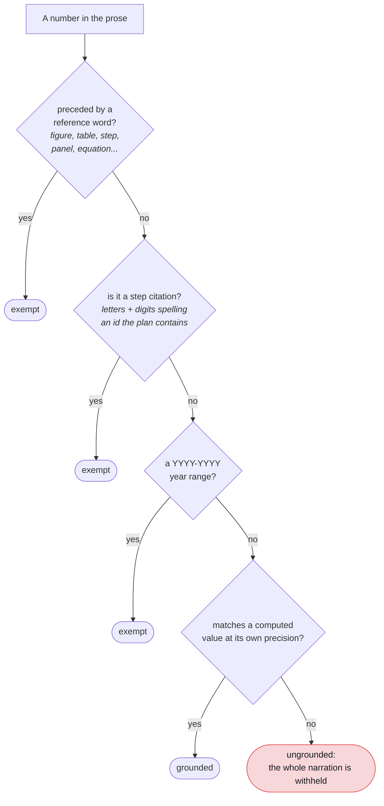

**The step-citation exemption.** It takes `step_ids` and exempts a number
only when the letters before it plus its digits spell an id the plan actually
contains. So `(s3)` passes and `(s7)` does not.

**The year-range exemption.** Found by running a real narration. A model
titled its answer "(2020-2024)" and the gate read both years as fabrications.

**The tolerance has never moved.** A test asserting the `-15.066` case still
fails sits directly beside the exemptions, so nobody loosens one without
seeing it.

### Two reasons a narration is withheld, and they are different

**`Narration.withheld_reason` is a closed set of three values.**

| Value | Means |
|---|---|
| `""` | Published |
| `ungrounded` | A number in the prose matched no computed value |
| `unusable_draft` | An invented citation or an unparseable reply |

The spec used to assert only one withheld reason. What that hid:

1. `check` rejects an invented citation or an unparseable reply **before**
   `check_grounding` runs.
2. So in that case the grounding report is empty.
3. The canvas told users their model "cited numbers no result supports".
4. The model had in fact returned prose where JSON was asked for.

The fix was to model the third path, not to loosen the assertion.

---

## 7. The Data Steward

**`agents/data_steward.py`, 523 lines, and no model call anywhere in it.**

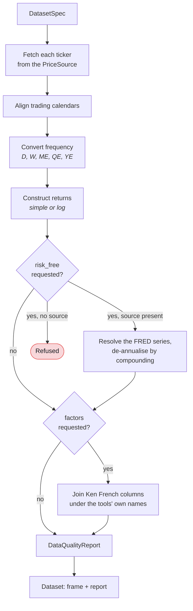

### The quality report is not decoration

**Survivorship and look-ahead are the two ways a study of returns flatters
itself. Neither shows up in a p-value.** The report carries three kinds of
flag:

| Flag kind | Examples |
|---|---|
| `risk` | `synthetic_data`, insufficient observations, a suspiciously late start |
| `warning` | `mixed_risk_free`, gaps, calendar misalignment |
| `info` | `mixed_sources`, naming every ticker under the source that served it |

**A run asked for a risk-free rate with no rate source refuses. It does not
run without one.** Same principle as the gates: running on raw instead of
excess returns answers a different question, and nothing downstream could
tell.

### The pandas 3 alias trap

**pandas 3.0.5 rejects the `M`, `Q`, `A` resample aliases outright.**
`resample("M")` raises `ValueError`. It does not warn.

- `DatasetSpec.frequency` and `econ.returns.PERIODS_PER_YEAR` still speak
  `M`, `Q`, `A`.
- The mapping to `ME`, `QE`, `YE` happens at this boundary. It is the one
  place it can be done once.

---

## 8. Data sources and the cache

**`data/registry.py` is the one place that knows every source.** Same shape as
`llm/registry.py`, for the same reason.

```python
@dataclass(frozen=True)
class SourceSpec:
    name: str
    label: str      # human-facing, and it names the adjustment policy
    cached: bool    # only sources that reach the network benefit
```

### `PriceSource.label` names the adjustment policy

**The same close on the same day differs by 3.1% depending on the policy.**

| AAPL, 2020-08-25 | Close |
|---|---|
| Split-adjusted | `124.82` |
| Dividend-adjusted | `121.08` |

Same day, same source. Nothing in a `ResultSet` distinguishes them. So the
label says which, and the label reaches `DataQualityReport.source`.

**No real adapter's label may contain the word "synthetic".**

- The `synthetic_data` risk flag fires on a substring match in
  `DataSteward.resolve`.
- A label containing the word would tell every reader their market data was
  generated.
- There is a test per source.

### The cache is a correctness property, not housekeeping

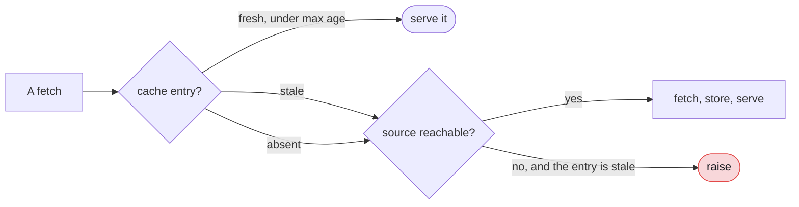

**A stale entry is a different series.**

- A vendor recomputes adjusted closes on every split and dividend.
- A re-run that "reproduced" from a stale entry would be reporting on the
  cache.
- Default max age is one day.

**Stale entry plus unreachable source raises. It does not serve.**

- There is no channel to disclose staleness, because
  `DataQualityReport.source` is read from the label before the fetch.
- Offline-friendliness comes from consulting the cache *before* the source,
  not from standing in for it.

### Rates are not prices

**`data/rates.py` declares a convention per series id. It never infers a scale
from magnitude.**

| Rule | Detail |
|---|---|
| De-annualise by **compounding** | `(1+r)^(1/n)-1`, not `r/n`, to match Ken French's own definition of `RF` |
| An unlisted series | Raises instead of guessing |
| The rate goes into the data fingerprint | A CAPM on excess returns and one on raw returns are different analyses |

### Ken French values are percent, and the index is a Period

**Both are silently wrong if missed.**

- `data/famafrench.py` converts at the boundary.
- Both conversions have their own test.
- Factors are reindexed onto the price calendar, **never forward-filled**. A
  factor return belongs to its own period.

### Upload-first composition

```python
build_project_source(session, project_id, market=source)
```

1. A symbol any of the project's datasets carries is served from the
   hypertable.
2. Everything else falls through to the market source.
3. A project with **no** uploads gets the market source back unwrapped, not a
   wrapper that always delegates.

**`shadowed_symbol` was designed and deliberately not built.**

- Knowing the market source *also* carries a symbol an upload served needs a
  counterfactual fetch.
- That is a network call whose only product is a warning.
- It would make an upload-only run require the network it was meant to avoid.
- `mixed_sources` already names the source of every ticker.

---

## 9. Uploads: profile, map, confirm, ingest

**Four steps. Only a person's confirmation produces a mapping the ingest will
act on.**

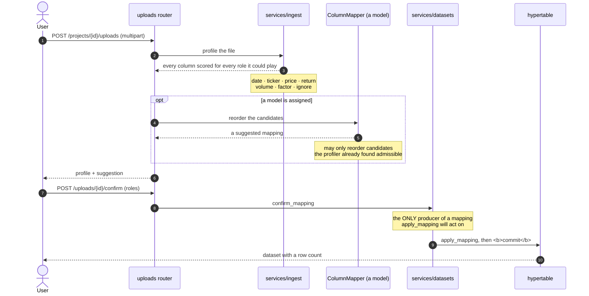

### Two constraints worth keeping

**1. The user and the model are constrained differently on purpose.**

| Who | May choose |
|---|---|
| A user | Any role, including one the profiler never suggested. They know what is in their own file |
| A model | Only among the candidates the profiler found admissible |

**2. `services/ingest.py` profiles and never decides.** Deterministic, like
the Data Steward and `charts/propose.py`.

### Never use `read_csv(sep=None)`

**It delegates to `csv.Sniffer`, which picks a delimiter from the whole
alphabet.**

- On a one-column file holding `price`, it split on the `r` and returned
  columns `p` and `ice`.
- The delimiter comes from a closed set now.

That also settles the comma question. `1,200` is ambiguous in isolation, but a
file using commas for decimals cannot also use them as separators. So:

| Delimiter | A comma inside a number means |
|---|---|
| Comma | Thousands |
| Anything else | Decimals are admitted |

### The commit

**The confirm route reported what it stored and stored nothing.**

- `get_session` does not commit, and the confirm route did not either.
- So the whole ingest was discarded while the response reported what it would
  have stored.
- The API suite could not see it. The `client` fixture shares one session
  across every request in a test.

> A test that reads back through the same fixture cannot tell a flush from a
> write.

### The source label guard

**A filename containing "synthetic" is refused at confirm time.**

- A user's filename can reach the `synthetic_data` substring check.
- So `services/datasets.source_label` refuses one containing the word.
- Refused, not rewritten. The label is provenance, and quietly editing where a
  number came from is invisible.
- The guard lives in `datasets.py`, not `ingest.py`, because `ingest.py`
  profiles and never builds a label.

---

## 10. Chart proposal

**`charts/propose.py`. Deterministic, and deliberately so.**

Two invariants hold for everything returned. Both are tested:

1. **Every proposed chart binds.** `unresolved_references` comes back empty
   against the result it was proposed for. A chart of data that does not exist
   is an ungrounded number with a line through it.
2. **Rules key on shape before name.** A tool that starts emitting `residuals`
   gets a QQ plot without this module being edited, which is what keeps 37
   tools from needing 37 entries.

**A pure hypothesis test proposes no chart.** The Diagnostics tab renders it
directly.

- The fallback used to emit stat tiles from whatever scalars existed.
- For `adf` that produced a canvas led by "Nobs: 5,080.0000".

### The chart card is `bg-surface-1`

**`#fafafa` light, `#121416` dark. Re-run the validator if either token
moves.**

- Those are the surfaces the palette was validated against.
- A card on `surface-0` would make the recorded contrast a number about a
  different screen.

**`--series-1` through `--series-8` are hex, while every neighbouring token is
oklch. Leave them as hex.**

- They are the exact steps the validator was run on.
- Converting them rounds the values the colour-blindness separations were
  measured from.
- `palette.test.ts` asserts the CSS and the TypeScript fallback agree.

---

## 11. Context channels

**Three channels: MCP, retrieval, search. All feed the Planner. None of them
may become a number.**

That is enforced by the grounding gate, not by good intentions:

- `allowed_values` reads `ResultSet`s only.
- Web search and retrieval each have a test asserting a figure quoted
  verbatim from their text is still blocked.

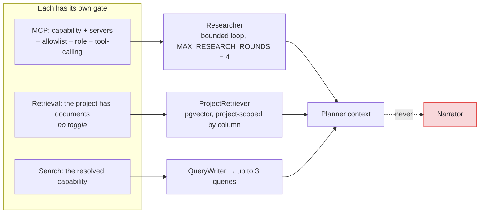

### Why the Narrator is deliberately excluded

**Giving the Narrator web snippets would get its narrations withheld.**

1. The Narrator's output is what the grounding gate judges.
2. The gate withholds an *entire* narration over one number it cannot match.
3. Web snippets are dense with numbers.

A reader left with no interpretation is worse off than one left with an
uninformed interpretation. Giving the Narrator these channels needs a design
that answers that trade-off first, not a toggle.

### Search

**`search()` takes `enabled: bool`, not `ResolvedCapabilities`.**

- Reading one flag off a services type put `db.models` on the import path of
  everything touching a search. That now includes `agents/`.
- The tests still resolve through `resolve_capabilities` and pass
  `.web_search`. The point of the disabled-search tests is that
  project-and-chat resolution decides.

**`MAX_SEARCH_QUERIES = 3`, searched sequentially**, to be gentle on the
keyless DuckDuckGo endpoint.

**The DuckDuckGo provider is the fragile part.**

- It scrapes an HTML page with no API contract.
- Its markup uses **single** quotes (`class='result-link'`). That is how the
  parser was wrong the first time.
- It has a live test for exactly this reason.

**Trace labels:**

| What | `agent` |
|---|---|
| The billed query-writer turn | `query_writer` |
| The searches | `planner`, because they feed the planner |

### Retrieval

**The seam is split in two, because the concrete retriever touches the
database:**

| Where | What |
|---|---|
| `tools/retrieval.py` | The `Retriever` protocol and `RetrievalOutcome`. Database-free, so `agents/` stays off `db.models` |
| `services/rag.py` | `ProjectRetriever`, which holds the session and the project |

**Chunks:** 1,200 characters, 200 of overlap, embedded at 384 dimensions.

**`document_chunks.project_id` is denormalised**, so a query filters on the
row it ranks. A join can be forgotten. A `WHERE` on the row cannot.

**Chunks record their embedding model, and retrieval filters on it.**

- 384 dimensions from `all-minilm` mean nothing against 1024 from `bge-m3`.
- A wider model is refused, not truncated.

### MCP

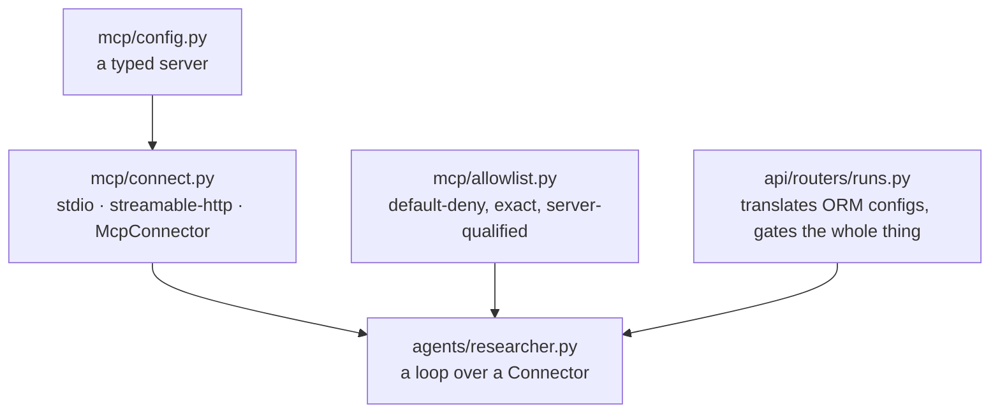

**The gate runs before the session is asked.**

- A refused tool is never named to the server.
- The allowlist is read per call, so a change needs no restart.

**No wildcards.**

- `files:*` is a literal tool name, not a pattern.
- A pattern would re-admit whatever a server added next. That is the failure
  this exists to prevent.
- Matching is exact and server-qualified. `files:read` and `shell:read` are
  different tools.

**The loop caps at `MAX_RESEARCH_ROUNDS = 4`**, then makes one tool-free call
for a clean summary.

**`mcp==1.28.1` is a dependency.**

- Its in-memory transport (`create_connected_server_and_client_session`) lets
  the tests drive a **real** server, not a mock.
- The proof an unlisted tool never ran is the server's own execution log.

**stdio is trust-the-command.**

- A stdio MCP server is an arbitrary local command spawned with host
  privileges.
- It is **not** sandboxed like the quant coder.
- The allowlist gates which tools run, not what the spawned process can do.
- HTTP is the choice for a server you do not fully trust.

---

## 12. The sandbox

**Before touching anything under `sandbox/`, read
[`docs/plans/2026-07-27-econometrica-sandbox-design.md`](../plans/2026-07-27-econometrica-sandbox-design.md).**
Every constant there comes from a recorded probe.

### Three layers, and only two are security controls

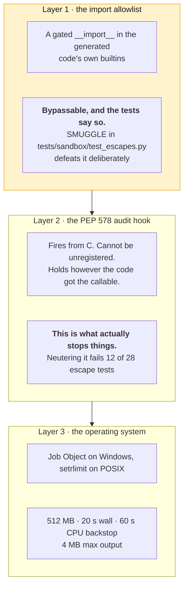

| Layer | What it is | Security control? |
|---|---|---|
| 1 | The import allowlist | No. Bypassable, and the tests say so |
| 2 | The PEP 578 audit hook | Yes. This is what actually stops things |
| 3 | The operating system caps | Yes. A Job Object on Windows, `setrlimit` on POSIX |

Every test under the allowlist proves the hook holds **after the weak layer
has fallen**. That is the right way to test a defence in depth: assume the
outer layer is gone.

### Why the import event cannot enforce an allowlist

**The `import` audit event does not fire on a cache hit.**

1. The event is raised by `_find_and_load`.
2. `_find_and_load` never runs on a `sys.modules` cache hit.
3. So `import socket`, after pandas has already loaded it, fires nothing.

The allowlist therefore has to be a gated `__import__` in the generated code's
own builtins.

### Why `open` is not blocked outright

**Blocking it breaks `arch`**, which imports `pyarrow.pandas_compat` at
**fit** time.

| Operation | Rule |
|---|---|
| Writes | Denied |
| Reads | Permitted only under `sys.prefix` and `sys.base_prefix`. Both exclude `storage/` |

### Windows facts that each cost a probe

| Fact | Consequence |
|---|---|
| `resource` does not exist on Windows | Caps come from a Job Object via ctypes, not `pywin32`, which would be ~10 MB of bindings for four calls |
| A Job Object's CPU limit is **not a timeout** | A 1 s cap was measured firing at 5.9 s, 7.4 s and 8.1 s. The wall clock is the parent's |
| `AssignProcessToJobObject` needs a process to exist first | The window is closed by making the child's first act a blocking read of stdin: the parent assigns the job, *then* writes the payload |
| `ActiveProcessLimit` must be **2** | Under `uv`, `sys.executable` is a 45 KB trampoline that spawns the real interpreter. A limit of 1 refuses the sandbox its own Python, measured with `os error 1816` |
| OpenBLAS blows a 1 GB cap on a 24-CPU machine | The runner pins BLAS to one thread. The whole stack then fits in 256 MB |

### The marking

```python
SANDBOX_TOOL_PREFIX = "sandbox:"    # a colon cannot appear in a registry tool name
manifest.tool_version = "unvalidated"  # not a number, deliberately
```

**All of it is derived from the result itself.** A marker that travels
separately from the thing it marks can be lost.

`is_sandbox_result` is what the canvas, the exports and the print stylesheet
key off.

---

## 13. Telemetry

**Two records. They measure different things, and nothing is summed from
both.**

| | `run_steps` | `spans` |
|---|---|---|
| Records | Every model call and tool invocation | HTTP handlers, database timings, transport |
| Carries | agent, provider, model, tokens, cost, latency, prompt, response, parent | name, kind, status, duration, attributes |
| Tokens or cost columns | yes | **no columns at all** |

`GET /api/metrics` reads latencies from spans and tokens from steps.

A cost that counted each model call twice would look entirely plausible and
be entirely wrong. So the separation is structural: a test asserts the
columns do not exist.

**Three properties of `span()`:**

- **Inert until configured.** Telemetry may never break what it measures.
- **Swallows sink failures.** Same reason.
- **The tracer provider is deliberately not registered globally.** That can
  only happen once per process, which would make a batch exporter impossible
  to shut down.

**The `SpanWriter` owns its own sessions. It does not borrow a request's.**

- A span outlives the request that produced it.
- Writing it inside that request's transaction would make telemetry able to
  roll a user's work back.

---

## 14. Frontend

| Concern | Choice |
|---|---|
| Framework and build | React 19, TypeScript, Vite |
| Server state | TanStack Query |
| Layout and selection | Zustand |
| Styling and primitives | Tailwind with Radix |
| Charts | Plotly |

### Structure

| Directory | Holds |
|---|---|
| `components/layout/` | The three-pane shell, pane headers, toggles |
| `components/canvas/` | The artifact canvas: run panel, banner, findings, narrative, diagnostics, provenance, export |
| `components/charts/` | One renderer per spec type, plus the palette, theme and figure builder |
| `components/data/` | The Data screen: dataset list, upload, mapping, confirm |
| `components/telemetry/` | The trace DAG and the cost dashboard |
| `lib/` | The API client, the two stream readers, the store, the types |

### Restated rules

**`components/canvas/artifacts.ts` restates on the client what the backend
knows as Python properties.**

- `ExecutionReport.results`, `.refusals` and `PreconditionVerdict.refused`
  never cross the wire.
- So the rules are stated once in this file, not reimplemented per component.

**That file also partitions the quality flags:**

| List | Drives |
|---|---|
| `riskFlags` | The red alert |
| `infoFlags` | A neutral `role="note"` block |

The banner used to render `risk` and `warning` only. So a `mixed_sources` info
flag was raised, stored, exported and invisible.

**A third severity added later needs a home in one of the two lists, or it
disappears the same way.**

### Plotly needs `global`

**Without `global` defined, the charts throw on first import.**

- Plotly's CommonJS build reaches for the Node global.
- So `vite.config.ts` defines it as `globalThis`.
- The bundle is `lib/core` plus four traces, not the ~3 MB whole.

### The trace is a DAG, not a table

- `TraceGraph` nests children under `parent_id`. A retry reads as a second
  attempt, not as new work.
- A step whose parent is missing shows at the root, since `parent_id` is
  `ON DELETE SET NULL`.

### Printing is a stylesheet

**`styles/print.css`:**

- forces light surfaces, whatever theme the reader used
- drops the chrome
- keeps a chart card whole across a fold

**`Provenance` is print-only and always present.** A printed artifact that
cannot be traced back is what this project exists not to produce.

**Canvas tab panels are force-mounted**, so paper gets all of them.

- An inactive panel is parked *off-screen*, not hidden. A Plotly chart in a
  `display: none` container renders blank and would print empty.
- Radix sets `hidden` on a panel it unmounts and not on a force-mounted one.
  So the CSS keys on `[data-state="inactive"]`.

**Verifying print means applying the parsed rules to a live DOM.**

1. `@media print` never engages on screen.
2. Read the rules from `document.styleSheets`.
3. Do not fetch the `.css`. In dev, Vite serves it as a JS module, so the text
   comes back escaped and every rule parses empty.

### Testing traps

- **Vitest runs with `css: false`**, which stubs stylesheets *including* `?raw`
  to `""`. A test needing the stylesheet's text reads it off disk.
- **`getByLabel` and `getByRole` match on substring.** The canvas's "Analysis
  model" picker silently broke a `getByLabel("Model")`, and a chat named
  `canvas` inside a project named `E2E canvas ...` matched both. Short names in
  e2e locators need `{ exact: true }`.

**Next, 2 minutes:** open [the blueprints](blueprints.md) and look at B1, the
module dependency map, to see where the module you just read sits.

---

[Documentation](../README.md) · [3. Architecture](README.md) ·
[High-level design](high-level-design.md) · **Low-level design** ·
[Blueprints](blueprints.md) · [Integration patterns](integration-patterns.md)
