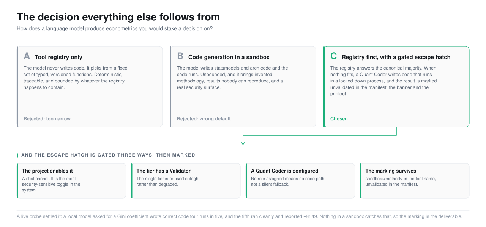
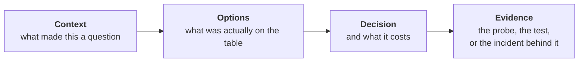

<picture>
  <source media="(prefers-color-scheme: dark)" srcset="../assets/doc-decision-central-dark.svg">
  <source media="(prefers-color-scheme: light)" srcset="../assets/doc-decision-central-light.svg">
  
</picture>

# 4. Key decisions

Every decision here was made for a reason, and the reason is more useful than
the decision. A decision you inherit without its reason is a decision you
cannot safely revisit.

Four pages, grouped by what they are about.

| Page | Covers |
|---|---|
| **[The central decision](the-central-decision.md)** | The three-way choice about how a language model produces econometrics, and everything that follows from it |
| **[Trust mechanisms](trust-mechanisms.md)** | The decisions about how the system avoids lying: the gate, the manifest, tri-state diagnostics, the marking |
| **[Platform choices](platform-choices.md)** | Stack, database, ports, versions, charts, and the ones that look boring and are not |
| **[What we reversed](reversals.md)** | The things we were wrong about, the things we designed and did not build, and why |

---

## The full index

Every decision in one table, most consequential first. The **Reversible**
column is the honest one: it says what it would cost to change our minds now.

| # | Decision | Reversible? | Where |
|---|---|---|---|
| D1 | **LLMs never compute statistics.** They select from a registry; tools compute | No. This is the product | [Central](the-central-decision.md#d1) |
| D2 | Registry first, with a **gated code escape hatch**, rather than registry-only or code-generation-only | Hard. The gates are load-bearing | [Central](the-central-decision.md#d2) |
| D3 | The escape hatch is **off by default** and its results are marked `unvalidated` everywhere | No | [Central](the-central-decision.md#d3) |
| D4 | The **numeric grounding gate** withholds a whole narration rather than editing it | Cheap to change, and we would be wrong to | [Trust](trust-mechanisms.md#d4) |
| D5 | Tool preconditions are **executable gates**, not prompt guidance | Hard | [Trust](trust-mechanisms.md#d5) |
| D6 | `Diagnostic.passed` is **tri-state**. `None` means "not judged", never "failed" | Would require touching every layer | [Trust](trust-mechanisms.md#d6) |
| D7 | Every result carries a **reproducibility manifest**, and re-run consults no model | No | [Trust](trust-mechanisms.md#d7) |
| D8 | The **Data Steward and Econometrician are deterministic**, with no model at all | Easy to change, and it would destroy D7 | [Trust](trust-mechanisms.md#d8) |
| D9 | The **Validator runs on a different vendor**, and the run warns when it does not | Already soft: it warns rather than refuses | [Trust](trust-mechanisms.md#d9) |
| D10 | **Context channels never reach the Narrator** | Open. It needs a design, not a toggle | [Trust](trust-mechanisms.md#d10) |
| D11 | A **person confirms every column mapping** before ingest | No | [Trust](trust-mechanisms.md#d11) |
| D12 | **Single user, no authentication** | Yes, and the roadmap does | [Platform](platform-choices.md#d12) |
| D13 | **Postgres + TimescaleDB + pgvector**: one engine, three jobs | Hard. It is in the migrations | [Platform](platform-choices.md#d13) |
| D14 | **Python pinned to 3.12** | Automatic, when the wheels land | [Platform](platform-choices.md#d14) |
| D15 | **Plotly**, as a trimmed partial bundle | Moderate. Fourteen renderers | [Platform](platform-choices.md#d15) |
| D16 | **No chart type can express a second y-axis** | Cheap, and we would be wrong to | [Platform](platform-choices.md#d16) |
| D17 | **Runs and chat messages are separate routes**, not a mode flag | Moderate | [Platform](platform-choices.md#d17) |
| D18 | **asyncio and a process pool**, not Redis or Celery | Easy, and the roadmap revisits it | [Platform](platform-choices.md#d18) |
| D19 | **Port 8001, not 8000** | Trivial, and it cost a day to learn | [Platform](platform-choices.md#d19) |
| D20 | **PDF from a print stylesheet**, not a rendering dependency | Easy | [Platform](platform-choices.md#d20) |
| D21 | **Telemetry and the run trace are separate**, and no number is summed from both | Structural | [Platform](platform-choices.md#d21) |
| R1 | **Stooq dropped** from the project | Done | [Reversals](reversals.md#r1) |
| R2 | **kaleido ruled out**, not deferred | Done | [Reversals](reversals.md#r2) |
| R3 | **`shadowed_symbol` designed and not built** | Open, and deliberately | [Reversals](reversals.md#r3) |
| R4 | **`read_csv(sep=None)` abandoned** | Done | [Reversals](reversals.md#r4) |
| R5 | The **e2e gate was model-dependent**, and was fixed by modelling the third path rather than loosening the assertion | Done | [Reversals](reversals.md#r5) |
| R6 | The version floors in the original design were **two years stale**, and four of five assumptions about market data were wrong | Done | [Reversals](reversals.md#r6) |

---

## How to read a decision

Each entry follows the same four beats, because that is what makes a decision
revisitable:

The fourth beat is the one most decision records skip, and it is the one that
matters. "We chose X because it seemed better" is not a record. "We chose X
because a live probe against `ministral-3:8b` at temperature 0 produced a
clean run reporting a Gini coefficient of -42.49" is a record, and it tells
you what would have to change for the decision to change.

---

## The one that generates the rest

If you read one page in this section, read
**[the central decision](the-central-decision.md)**. Almost every other entry
in the table above is downstream of it. The layering is downstream of it, the
result type is downstream of it, the grounding gate is downstream of it, and
so is the fact that two of the agent roles have no model at all.

---

[Documentation](../README.md) · [1. Why](../1-why/) · [2. Product](../2-product/) ·
[3. Architecture](../3-architecture/) · **4. Decisions** ·
[5. Roadmap](../5-roadmap/) · [6. The art of the possible](../6-art-of-the-possible/)
