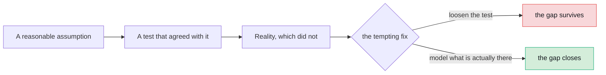

# What we reversed

The things we were wrong about, the things we designed and deliberately did
not build, and the things the world changed underneath us.

This page exists because a decision log with no reversals in it is a decision
log nobody is being honest in.

---

## R1. Stooq, dropped from the project

### What we planned

The original design named four data sources: yfinance, Stooq, FRED and the Ken
French library. Stooq was the independent cross-check, the second opinion on
whether a price series was right.

### What we found

Two separate problems, either of which would have been enough.

**`pandas-datareader` resolved to 0.11.1**, which implements exactly six
sources: `bankofcanada`, `econdb`, `eurostat`, `famafrench`, `fred`, `oecd`.
`DataReader(..., "stooq")` raises `NotImplementedError`. This is not a wiring
problem.

**The CSV endpoint it used to call now answers with a JavaScript
proof-of-work browser-verification challenge.**

### The decision

Dropped, not worked around.

**An adapter whose job includes defeating a bot check is not an adapter, it is
a liability.** It would break silently, it would break at the worst moment,
and maintaining it would mean tracking someone else's anti-automation
measures forever.

### What replaced it

FRED. No API key, a genuinely separate pipeline, and it agreed with yfinance
**to the cent** on `SP500` against `^GSPC`. That is a better cross-check than
Stooq would have been, because the independence is real rather than nominal.

---

## R2. kaleido, ruled out rather than deferred

### What we planned

PDF export of charts, server-side, using kaleido to rasterise Plotly figures.

### Why it does not work here

**The backend holds no Plotly JSON.** The fourteen renderers are TypeScript,
and they are where the chart actually gets decided: which trace type, which
palette slot, which axis treatment, which annotations.

Server-side rendering would mean reimplementing all fourteen in Python. And
the thing you would get for that work is an export of a picture **nobody had
looked at**, which is different from the one on screen in ways nobody would
notice until it mattered.

### The decision

Ruled out, not deferred. Deferring implies it is a matter of time, and it is
not: it is a matter of where the rendering logic lives, and it lives in the
right place already.

PDF comes from the browser's own print pipeline, driven by `styles/print.css`.
No new dependency in either stack. Chart images (PNG, SVG) come from the live
Plotly graph, so the image **is** the one you looked at.

---

## R3. `shadowed_symbol`, designed and deliberately not built

### The idea

When a run draws on both an uploaded file and a market source, the upload
wins for any symbol it carries. It would be useful to know when the market
source **also** carries that symbol, because then the user is making a choice
they might not realise they are making.

We designed a `shadowed_symbol` warning for exactly this.

### Why it was not built

Knowing the market source also carries the symbol requires **fetching it**. A
counterfactual fetch, whose only product is a warning.

Worse: it would make an upload-only run require the network it was
specifically meant to avoid. Someone working offline with their own data would
find that the application reached for Yahoo anyway, to tell them something
they already knew.

### What we have instead

`mixed_sources`, an **info**-severity flag naming every ticker under the
source that served it. It is the authoritative record of what was actually
used, it costs nothing, and it needs no extra fetch.

### The general lesson

A diagnostic that costs a network call is not free, and "it would be nice to
warn about X" is not sufficient reason to make a system reach outside itself.

---

## R4. `read_csv(sep=None)`, abandoned

### What we did

Let pandas sniff the delimiter of an uploaded file. It seemed obviously right:
users upload files with tabs, semicolons, pipes, and you cannot make them tell
you which.

### What happened

`sep=None` delegates to `csv.Sniffer`, which picks from the **whole
alphabet**.

On a one-column file holding the header `price`, it split on the `r` and
returned two columns: `p` and `ice`.

### The fix

The delimiter comes from a closed set now.

### The bonus

That also settled a question we had been going round on. `1,200` is ambiguous
in isolation: is it one thousand two hundred, or is it 1.2?

But a file using commas for decimals **cannot also use them as separators**.
So a comma-delimited file means thousands, and any other delimiter admits
decimals. The ambiguity dissolves once you know the delimiter, which is
another argument for knowing it rather than sniffing it.

---

## R5. The e2e gate was model-dependent

### The problem

`analysis.spec.ts` asserted that when a narration is withheld, the canvas
explains it as ungrounded. It passed on some models and failed on others,
which made the gate useless: a red build told you nothing about whether the
code was broken.

### The wrong fix, which we nearly made

Loosen the assertion. Accept either message. Move on.

### The right fix

**Model the third path.**

A narration is withheld for two reasons and the spec asserted only one.
`check` rejects an invented citation or an unparseable reply **before**
`check_grounding` runs, so in that case the grounding report is empty.

The canvas was therefore telling users their model "cited numbers no result
supports" when it had in fact returned prose where JSON was asked for. Two
genuinely different failures, one message, and one of them was a lie.

`Narration.withheld_reason` is now a closed set: `""`, `ungrounded`,
`unusable_draft`. The spec asserts the reason and annotates which happened,
and the canvas tells the truth.

### The lesson

**A flaky test is often a modelling gap wearing a costume.** When a test
passes on some inputs and fails on others, ask whether the system has two
behaviours you had collapsed into one, before you loosen the assertion.

---

## R6. Four of five assumptions about market data were wrong

The original design's version floors were two years stale by the time we got
to phase 6. Everything below was verified against the real services.

### yfinance

| We assumed | It is |
|---|---|
| Version 0.2.x | **1.5.2** |
| `Adj Close` is present | `auto_adjust=True` is the default and **removes** it |
| An unknown ticker raises | It returns an empty `(0, 6)` frame and logs |
| Columns are flat for one ticker | They are a `MultiIndex` even then |
| `end` is inclusive | It is **exclusive**, so passing the requested end through loses the last trading day of every window |

### The one that moves numbers

Not the vendor. **The adjustment policy.**

AAPL on 2020-08-25 closes at `124.82` split-adjusted and `121.08`
dividend-adjusted. Same day, same source, **3.1% apart**, and nothing in a
`ResultSet` distinguishes them.

So `PriceSource.label` names its policy, and `DataQualityReport.source`
carries it. Reproducing a number means knowing which of two equally real
series produced it.

### Ken French

Values are **percent**. `Mkt-RF` of `-0.70` means -0.70%. Forgetting the
conversion rescales every loading by 100.

The index is a `period[D]`, not a datetime.

Both are silently wrong if missed, so `data/famafrench.py` converts at the
boundary and both have their own test.

### Ollama

Capabilities come from `/api/show`, **not** `/api/tags`. Tags reports neither
context length nor tool support.

Guessing from the model name was wrong in both directions: on this machine 6
of 13 chat models cannot call tools, and real context windows run from 512 to
262144, not the 8192 the adapter used to claim for everything.

And the context key is architecture-prefixed, so you have to read
`general.architecture` to name it. Matching `*.context_length` alone also
catches `mistral3.rope.scaling.original_context_length`, which is a **smaller**
number and would silently truncate prompts.

---

## R7. Asserting constraint names was not enough

### What we had

`tests/db/test_migrations.py` asserted that every CHECK constraint in the
models reached some migration. It passed.

### What broke

`ck_run_steps_agent_known` has been in the initial revision since phase 4. Its
name never changed. But its **contents** did: adding `quant_coder` to
`STEP_AGENTS` in Python left the test green while **a fresh database rejected
every sandbox step**.

The developer machine's database already had the column and the old
constraint, and the old constraint happened to be permissive enough for
everything being tested at the time.

### The fix

The test now asserts every **value** of each vocabulary reaches a migration
too, not just every constraint name.

### The compounding factor

**The test database is built by `Base.metadata.create_all`, not from the
migrations.** So a constraint test passing against Postgres says nothing about
whether a revision exists for it.

Two independent blind spots that happened to line up. That is usually how this
kind of bug survives.

---

## R8. Things that were built and tested but not reachable

A shape of gap worth naming, because we found it three times.

`UploadedPriceSource` satisfied the `PriceSource` protocol from phase 6, was
fully tested, and **nothing ever constructed one**. The claim "uploads are
servable through the same protocol as Yahoo" was true of the class and false
of the application.

The same shape turned up in:

| Module | Wired on |
|---|---|
| `data/uploaded.py` | 2026-07-30, by `data/project_source.py` |
| `tools/web_search.py` | 2026-07-30 |
| `services/rag.py` | 2026-07-31 |
| `mcp/` | 2026-08-01 |

### How to find it

**Look for a module imported only by its own tests.**

Nothing in this tree is now in that state. But it is the check to run after
any phase that builds capability ahead of the feature that uses it, which is
most phases.

---

## The pattern

Six of these eight reversals share a shape:

The tempting fix is almost always available and almost always wrong. When a
test disagrees with reality, one of them is describing a system that does not
exist, and it is worth finding out which before changing either.

---

[Documentation](../README.md) · [4. Decisions](README.md) ·
[The central decision](the-central-decision.md) ·
[Trust mechanisms](trust-mechanisms.md) ·
[Platform choices](platform-choices.md) · **Reversals**
