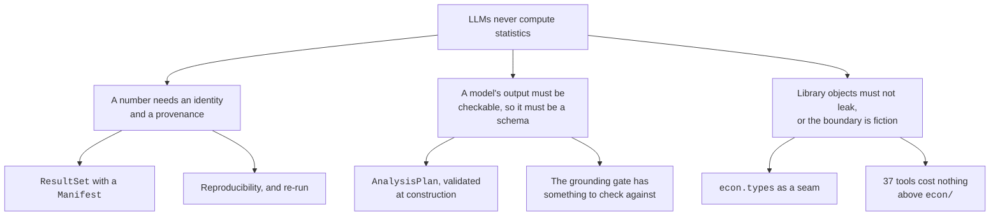
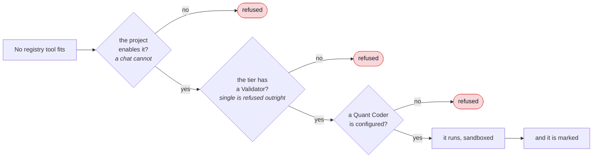

# The central decision

Everything else in this project is downstream of one question, asked on
2026-07-24 and answered the same day.

> **How does a language model produce econometrics you would stake a decision
> on?**

---

## D1. LLMs never compute statistics

### Context

You can put a language model in front of an econometrics problem in exactly
two positions: as the thing that computes, or as the thing that decides what
to compute. Almost everyone puts it in the first position, because that is
what the demo looks like.

### Decision

**They select from a registry of typed, versioned econometric tools. The tools
compute.**

### What it costs

You lose the ability to answer questions the registry does not cover. That is
a real cost and it is why [D2](#d2) exists.

You also lose the illusion of unlimited capability, which is a marketing cost
rather than an engineering one, and it is worth paying.

### What it buys

Everything else in this documentation. Once numbers can only come from tested
functions:

None of those is a feature anyone added. They are consequences.

### Consequences that keep coming up

- statsmodels, arch and linearmodels result objects never leave a tool module.
- Vendor SDK types never leave a provider adapter.
- Nothing under `tools/` may become a source of numbers. `tools/` is context.
  `econ/` is computation.

---

## D2. Registry first, with a gated code escape hatch

### Context

A registry is bounded and the questions are not. Sooner or later someone asks
for something none of the 37 tools does.

### Options

Three were on the table, and the first two are the ones most products pick.

**Option A: tool registry only.**
The model never writes code. Deterministic, fully traceable, and bounded by
whatever the registry happens to contain.
*Rejected: too narrow.* A workbench that cannot answer a question outside its
list is a workbench people stop opening.

**Option B: code generation in a sandbox.**
The model writes statsmodels and arch code and it runs. Unbounded.
*Rejected: wrong default.* It brings hallucinated methodology,
non-reproducible results, a real security surface, and nothing that can be
unit-tested ahead of time. Wrong default for a tool whose entire value is
trustworthy numbers.

**Option C: registry first, with a gated escape hatch. Chosen.**
The registry serves the canonical majority. When the planner finds no fitting
tool, a Quant Coder writes code that runs in a locked-down subprocess, the
Validator must sign off, and the result is marked as using an unvalidated
method.

### Decision

C, and it is the only one satisfying both "highly versatile" and "numbers
worth staking a decision on."

It is also the most security-sensitive component in the system, which is why
it was **built last**, once everything else was stable.

### Evidence

The probe that settled it is described under [D3](#d3). It is also what turned
the escape hatch from a feature into a feature-with-a-marking.

---

## D3. The escape hatch is off by default, and its results are marked

### Context

We built the sandbox and then asked the obvious question: is a sandboxed
result trustworthy?

### The probe

`ministral-3:8b`, temperature 0, asked for a Gini coefficient. Five runs.

Four produced correct code. The fifth produced code that:

- imported only numpy, which was allowed
- touched only the frame it was given
- ran in milliseconds, well inside every cap
- satisfied the output contract exactly
- reported a Gini coefficient of **-42.49**

A Gini coefficient is bounded in [0, 1].

### What that means

**Every restriction held. The answer was still wrong.**

A sandbox is a security control. It tells you code did not escape. It cannot
tell you code was right, and no sandbox can, because correctness is not a
property of execution.

### Decision

Three gates, and each **refuses rather than degrades**:

And **the marking is the deliverable.** A sandbox result must never look like a
registry result:

| Where | What it says |
|---|---|
| `ResultSet.tool` | `sandbox:<method>`. A colon cannot appear in a registry tool name, so nothing in `econ/` can collide with it by accident |
| `Manifest.tool_version` | The literal string `unvalidated`. Not a number, deliberately: there is nothing to compare a number against |
| The run banner | Alerts exactly as `synthetic_data` does |
| The print-only provenance block | Says it in words |

All four derived from the result itself. **A marker that travels separately
from the thing it marks is a marker that can be lost.**

### The test that proves it, and the test that does not exist

The live test asserts the code **runs and is marked**. It never asserts the
arithmetic is right.

Asserting that would claim a property this feature does not have, and it would
fail one run in five.

### One more consequence

`AnalysisPlan.code_steps` is default-empty, and **the Planner is only told the
field exists when the capability is on**. Otherwise it reaches for the escape
hatch on any hard question, and every such plan is refused *after* the model
call has already been paid for.

A capability a model cannot use is a capability it should not be able to see.

---

## The three layers of the sandbox, and why only two are security controls

Worth recording here because it is the sort of thing that gets flattened into
"we sandboxed it" and then misunderstood.

| Layer | Enforced by | Strength |
|---|---|---|
| Import allowlist | A gated `__import__` in the generated code's own builtins | **Bypassable**, via `().__class__.__base__.__subclasses__()` |
| Forbidden operations | A PEP 578 audit hook | **This is the real boundary.** It fires from C and cannot be unregistered |
| Resource caps | A Job Object on Windows, `setrlimit` on POSIX | The OS |

`SMUGGLE` in `tests/sandbox/test_escapes.py` **defeats the allowlist
deliberately**, so that every test under it proves the audit hook still holds
after the weak layer has fallen.

That is the correct way to test defence in depth: assume the outer layer is
gone, and check the inner one still bites. Neutering the hook fails 12 of 28
escape tests, which is how they were shown to be doing anything at all.

Two facts that explain why the allowlist has to be where it is:

**The `import` audit event cannot enforce an allowlist.** It is raised by
`_find_and_load`, which never runs on a `sys.modules` cache hit, so
`import socket` after pandas has loaded it fires nothing.

**Blocking `open` outright breaks `arch`**, which imports
`pyarrow.pandas_compat` at *fit* time. So writes are denied and reads are
permitted only under `sys.prefix` and `sys.base_prefix`, both of which exclude
`storage/`.

---

## What would change our minds

For **D1**: nothing available today. A model that could be shown to compute a
GARCH persistence correctly 100% of the time would still leave you unable to
reproduce it, because the model would not remember how.

For **D2**: if the registry grew to cover essentially every question people
actually ask, the escape hatch would become dead weight and worth removing.
That is a good problem and we are not close to it.

For **D3**: nothing. The marking costs almost nothing and the alternative is a
number that looks tested and is not.

---

[Documentation](../README.md) · [4. Decisions](README.md) ·
**The central decision** · [Trust mechanisms](trust-mechanisms.md) ·
[Platform choices](platform-choices.md) · [Reversals](reversals.md)
