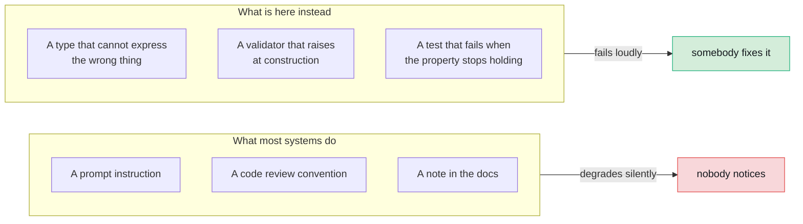

# Trust mechanisms

Eight decisions about how the system avoids lying to you. Each is a mechanism
rather than an instruction, which is the whole point: an instruction degrades
silently and a mechanism has a test.

---

<a id="d4"></a>

## D4. The grounding gate withholds a whole narration rather than editing it

### Context

You can compute everything correctly and still ship a paragraph containing a
figure that appears nowhere in the results. This is the failure people forget,
and it is the one that reaches the reader.

### Decision

Extract every number from the Narrator's prose. Match each against
`ResultSet.all_numeric_values()`. If any fails, **withhold the entire
narration** and return the results without it.

### The obvious alternative, and why it is worse

Strip the offending number and publish the rest.

That would ship a paragraph whose argument has had a hole cut in it, and the
reader would have no way to tell. Silence is honest. A quietly repaired
sentence is not.

### Precision comes from the citation

Not from a global epsilon.

| The prose says | It matches |
|---|---|
| `1.30` | any computed value rounding to 1.30 at **two** places |
| `1.3` | any computed value rounding to 1.3 at **one** place |

A model that writes more digits is held to more of them. This is both stricter
and more permissive than a fixed tolerance, in the right directions.

### The exemptions are the dangerous part

A gate that blocks "significant at the 5% level" or "shown in figure 2" gets
switched off within a day, and a gate that is off protects nothing. So there
are exemptions, and each is narrow, each has a test, and each has a second
test that it does **not** apply outside its context.

| Exemption | Scope |
|---|---|
| Reference words | A number preceded by `figure`, `table`, `chart`, `step`, `panel`, `equation`, `section`, `appendix`, `exhibit`, `model`, `note` |
| Step citations | Only when the letters before the number plus its digits spell an id **the plan actually contains**. `(s3)` passes; `(s7)` does not |
| Year ranges | `YYYY-YYYY` |

The year-range exemption was found by running a real narration. A model titled
its answer "(2020-2024)" and the gate read both years as fabrications.

**The tolerance itself has never moved.** A test asserting the `-15.066` case
still fails sits directly beside the exemptions, so nobody widens one without
seeing it.

### Two reasons to withhold, and they are different

`Narration.withheld_reason` is a closed set: `""`, `ungrounded`,
`unusable_draft`.

The end to end spec used to assert only the first, and it was model-dependent
as a result. `check` rejects an invented citation or an unparseable reply
**before** `check_grounding` runs, so in that case the grounding report is
empty. The canvas was telling users their model "cited numbers no result
supports" when it had in fact returned prose where JSON was asked for.

The fix was to model the third path, not to loosen the assertion. See
[R5](reversals.md#r5).

---

<a id="d5"></a>

## D5. Preconditions are executable gates, not prompt guidance

### Context

Telling a model in its prompt that GARCH needs ARCH effects is a suggestion.
Suggestions are honoured most of the time, which is the worst possible failure
rate: often enough to seem to work, rarely enough to matter.

### Decision

A `RegisteredTool` carries both:

```python
preconditions: tuple[str, ...]   # prose, for the model to read while it plans
gates: tuple[Gate, ...]          # the refusal, which cannot be argued with
```

Both exist because guidance and enforcement are different jobs, **and only one
of them can be argued with**.

### The vocabulary is deliberately tiny

```python
GateCheck = Literal["arch_effects", "stationarity"]
```

Every entry needs an implementation in `econ/gates.py`. A vocabulary nobody
can enumerate is one nobody can enforce, and it grows into a set of strings
half of which do nothing.

### `expect` carries real weight

```python
@dataclass(frozen=True)
class Gate:
    check: GateCheck
    expect: bool = True
    because: str = ""
```

A VAR needs stationarity **present**. A VECM needs it **absent**. They are the
same gate with opposite expectations, which is a much better design than two
checks that could drift apart.

### `because` is not decoration

It is shown to the user when the gate refuses, so **a refusal teaches
something**. That is the difference between "GARCH was declined" and:

> `garch` requires ARCH effects. The ARCH-LM test gives a statistic of 4.21
> with a p-value of 0.52, so the null of no ARCH effects is not rejected.
> Fitting a GARCH here would return a persistence figure with nothing behind
> it.

The second one is the most useful sentence some users will read that day.

### All named columns must satisfy a gate

A VAR is not fit on "mostly stationary" data. One non-stationary series is
enough to make the whole system's dynamics spurious.

---

<a id="d6"></a>

## D6. `Diagnostic.passed` is tri-state

### Decision

```python
passed: bool | None = None    # None means "not judged", NEVER "failed"
```

### Why this needed to be a decision

Because two-state is the default everywhere, and every layer would have
collapsed `None` into `False` if it were not written down.

A user told a check failed when nobody ran it learns something false, and
learns it with the same confidence as everything else on the page.

### It reaches one layer up

`PreconditionVerdict` carries it as **two** booleans, not one:

```python
allowed: bool   # False only when the check ran and disagreed with the gate
judged: bool    # False when the check could not be evaluated at all

@property
def refused(self) -> bool:
    return self.judged and not self.allowed
```

An unjudged check must not silently become a refusal, and must not silently
become an approval either. It travels to the Validator as an unjudged verdict,
and the Narrator has to disclose it.

---

<a id="d7"></a>

## D7. Every result carries a manifest, and re-run consults no model

### Decision

```python
class Manifest(BaseModel):
    data_fingerprint: str      # SHA-256 of the exact ALIGNED input matrix
    tool: str
    tool_version: str
    params_hash: str
    library_versions: dict[str, str]
    seed: int | None
```

And `POST /api/runs/{id}/rerun` re-executes the recorded plan against freshly
resolved data.

### Re-planning would test the wrong thing

Re-planning would test whether a model repeats itself. A manifest makes no
promise about that, and a test asserts the model call count is unchanged.

### The fingerprint is of the aligned matrix

Not of the request. That is the difference between "we asked for the same
thing" and "we got the same thing", and vendors revise history.

### Disagreement is a finding, not an error

The report names the reason per step:

| Reason | What it means |
|---|---|
| The data fingerprint changed | The source is not serving the same history |
| The parameters hash differently | Something about the request changed |
| The tool moved version | The implementation changed |
| The numbers differ | The most alarming one, and the one you most want to know |

**Fingerprints agreeing is necessary, not sufficient.** The numbers are what is
being reproduced, so they are compared directly.

### Re-run is scoped to the project

It used to take the global source and never look at a project, so an uploaded
run reproduced from Yahoo. A dataset deleted since the run is now a **409**
naming what is missing, not a 500.

---

<a id="d8"></a>

## D8. The Data Steward and Econometrician have no model at all

### Context

The design lists six agent roles. It is natural to assume all six call a
model.

### Decision

Two of them do not, and it is the most important thing about them.

### Why

Aligning trading calendars, converting frequency and constructing returns each
have **exactly one right answer**.

And more to the point: **a reproducibility manifest means nothing if the data
under it depended on what a model felt like that morning.** You could hash the
matrix perfectly and still have an unreproducible result, because the matrix
itself came out of a sampling process.

The same reasoning applies to `charts/propose.py`, which is deterministic, and
to `services/ingest.py`, which profiles and never decides.

### What is left for a model to do

The genuinely model-shaped part of data handling is mapping the columns of an
uploaded file to roles. That is a separate role, and see [D11](#d11).

---

<a id="d9"></a>

## D9. The Validator runs on a different vendor

### Context

A model reviewing reasoning from its own family shares its blind spots. That
is not a hypothesis about model architecture; it is a straightforward
consequence of shared training data.

### Decision

Per-role model assignment is a first-class feature, and the Validator is meant
to sit on a different vendor from the Econometrician.

`independence_warning` exists and the orchestrator surfaces it when they
match.

### Why it warns rather than refuses

Because someone running entirely on local Ollama has no second vendor, and
refusing them the Validator entirely would be worse than a warning. This is
one of the few soft gates in the system, and it is soft on purpose.

### The Validator is fed, not asked

The other half of this decision, and arguably the more important half.

A deterministic diagnostics engine runs **first**, and its statistics go into
the prompt as numbers.

> An LLM asked from prose whether residuals are heteroskedastic will produce a
> confident answer either way. One handed an ARCH-LM statistic and its p-value
> is doing a different and much smaller job.

Making a model's job smaller is usually the right move, and it is almost
always available.

### A rejection must be actionable

```python
@model_validator(mode="after")
def a_rejection_must_be_actionable(self) -> Self:
    if not self.approved and not self.reasons:
        raise ValueError("a rejection must give at least one reason")
```

A refusal nobody can act on is worse than no refusal: it stops the run and
teaches the next attempt nothing.

### One revision, not N

A rejection buys exactly one revision. Left unbounded, a Validator and a
Planner will trade drafts until the budget runs out, and **the second
rejection is far more likely to mean "this question cannot be answered with
this data" than "try once more".**

---

<a id="d10"></a>

## D10. Context channels never reach the Narrator

### Context

A run can read the web, the project's documents, and its MCP tools. All three
feed the Planner.

The Narrator gets none of them, and people keep asking why not.

### Decision

The Narrator's output is what the grounding gate judges. The gate withholds an
**entire** narration over one number it cannot match. Web snippets and
retrieved passages are dense with numbers.

Give the Narrator that context and the practical effect is that narrations get
withheld far more often, for reasons that have nothing to do with the
analysis.

### The trade-off, stated honestly

**A reader left with no interpretation is worse off than one left with an
uninformed interpretation.**

That sentence is the whole argument, and it is uncomfortable, because it
admits the current design produces less informed prose than it could.

This is an **open item**. Fixing it needs a design that answers the
grounding-gate problem, not a toggle that turns the channel on.

### What is not negotiable

Nothing read from any of the three channels may become a number.
`allowed_values` reads `ResultSet`s only, and there is a test per channel
asserting that a figure quoted verbatim out of its text is still blocked.

A figure read on a web page is exactly as ungrounded as one a model invented.

---

<a id="d11"></a>

## D11. A person confirms every column mapping

### Decision

```
profile (deterministic)  →  suggest (a model may reorder)  →  CONFIRM (a person)  →  ingest
```

`confirm_mapping` is **the only thing in the codebase that produces a mapping
`apply_mapping` will act on**. So a model's suggestion cannot be acted on by
construction, rather than by a check someone might forget.

### The user and the model are constrained differently, on purpose

| | May choose |
|---|---|
| The profiler | Scores every role each column *could* play |
| A model | Only reorders candidates the profiler already found admissible |
| A user | **Any** role, including one the profiler never suggested |

The asymmetry is right. The user knows what is in their own file and the
profiler does not. The model knows neither.

### The label guard

A user's filename can reach the `synthetic_data` substring check, so
`services/datasets.source_label` **refuses** a filename containing "synthetic"
at confirm time.

Refused rather than rewritten. The label is provenance, and quietly editing
where a number came from is invisible.

Note the guard lives in `datasets.py`, not `ingest.py`. `ingest.py` profiles
and never builds a label, and putting a guard where the thing it guards does
not happen is how guards rot.

---

## The pattern across all eight



The test is the mechanism, not the documentation of the mechanism. If you
cannot write a test that fails when a property stops holding, you do not have
the property. You have a hope.

---

[Documentation](../README.md) · [4. Decisions](README.md) ·
[The central decision](the-central-decision.md) · **Trust mechanisms** ·
[Platform choices](platform-choices.md) · [Reversals](reversals.md)
