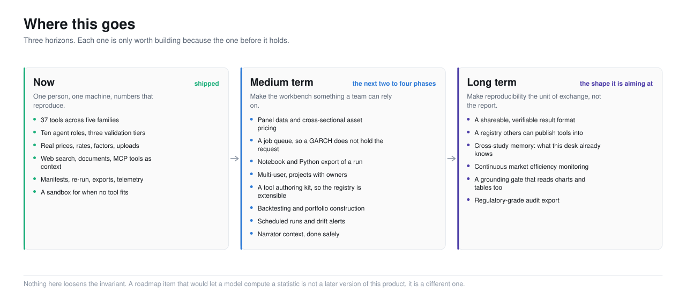
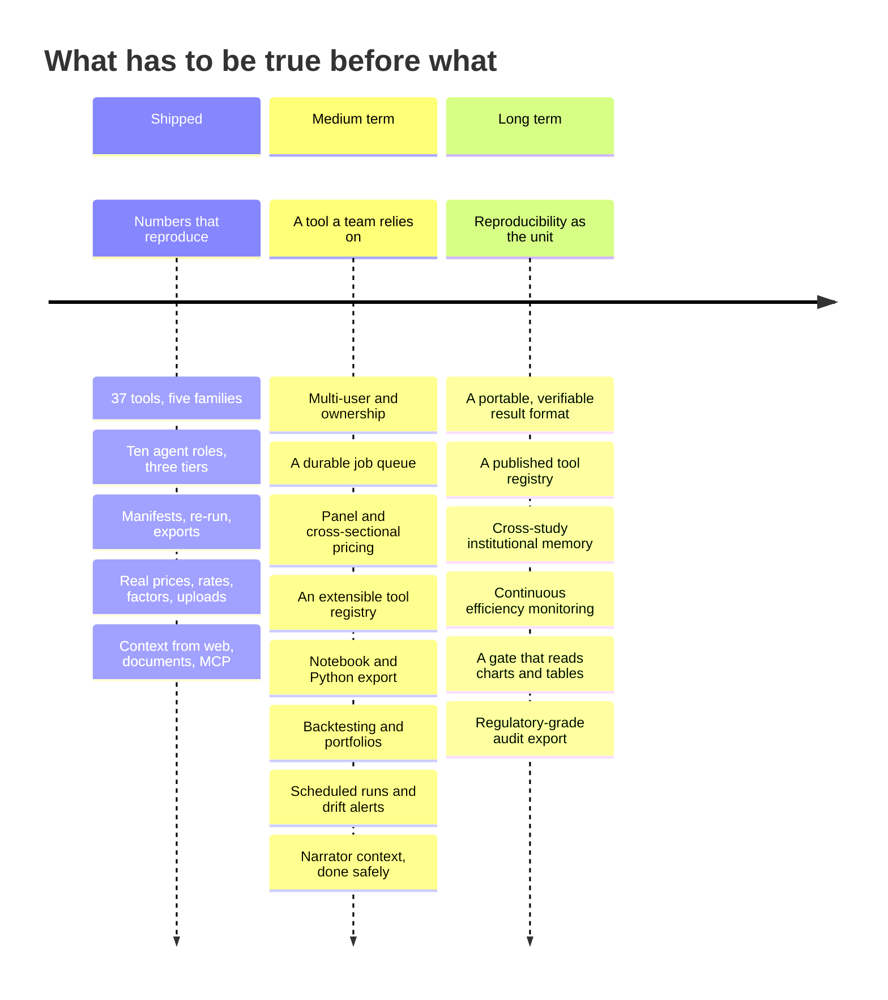
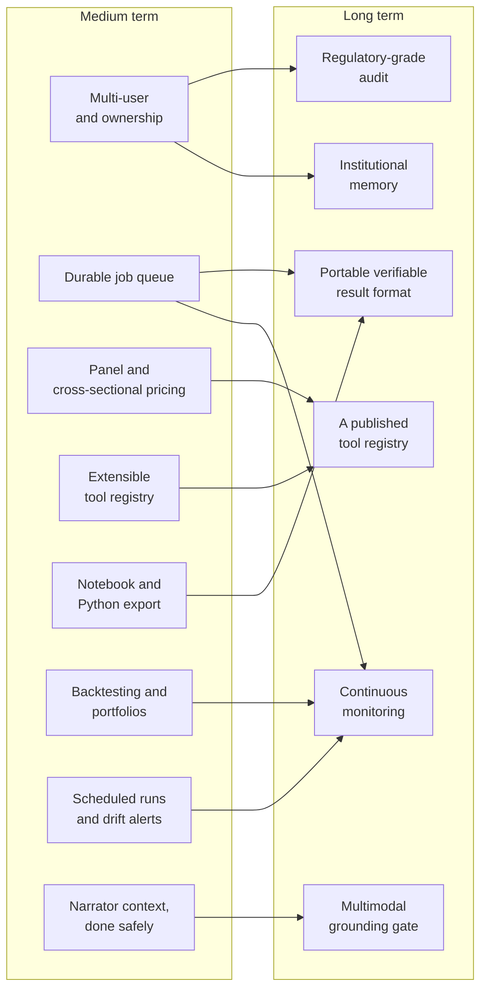
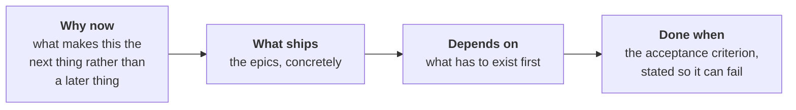

<picture>
  <source media="(prefers-color-scheme: dark)" srcset="../assets/doc-roadmap-horizons-dark.svg">
  <source media="(prefers-color-scheme: light)" srcset="../assets/doc-roadmap-horizons-light.svg">
  
</picture>

# 5. The roadmap

- **The point:** eight medium-term themes, six long-term bets, and one rule:
  nothing on this roadmap lets a model compute a statistic.
- **Read time:** about 3 minutes
- **Do first:** read [the rule](#the-rule). Three short paragraphs, and it
  governs every item.

| Page | Covers |
|---|---|
| **This page** | The three horizons, the one rule that governs all of them, and how the sequencing works |
| **[Medium term](medium-term.md)** | The next two to four phases. Eight themes, with epics, dependencies and acceptance criteria |
| **[Long term](long-term.md)** | Where this is aiming. Six bets, what each requires, and what would tell us we are wrong |

---

## The rule

**Nothing on this roadmap loosens the invariant.**

A roadmap item that would let a model compute a statistic is not a later
version of this product. It is a different product, and it is the product
this one exists as an alternative to.

The rule is not a constraint on ambition. It is what makes the ambitious
items possible:

1. Every long-term item depends on results being reproducible.
2. Results are reproducible because models do not compute them.

## Three horizons

**Shipped, medium term, long term. Each is what the next one needs.**

## How the sequencing works

**Every medium-term theme is a prerequisite for at least one long-term bet.**
The dependency graph below is the actual reason for the ordering.

**Read it right to left and it is more useful:**

| You cannot have | Without |
|---|---|
| Institutional memory | Knowing who ran what |
| Continuous monitoring | A queue that survives a restart |

The medium term is not a list of nice things. It is the set of things the
long term needs.

## What is deliberately absent

**Five things are not on the roadmap. Their absence is a decision, not an
oversight.**

| Not on the roadmap | Why |
|---|---|
| Letting a model compute statistics | The invariant. This is the whole product |
| Trade execution or order routing | A different regulatory category and a different product |
| Personalised investment advice | The application produces statistics and their interpretation. It does not recommend positions |
| A hosted multi-tenant SaaS | Possible later, but it changes the security model from "your machine" to "our machine", which is a different set of promises |
| Replacing the registry with a general code agent | See [the central decision](../4-decisions/the-central-decision.md). We measured what that costs |

## How to read the two roadmap pages

**Each theme is written as four beats:**

**"Done when" matters most.** A roadmap item without a falsifiable done
condition is a wish, and wishes accumulate.

**Next, 2 minutes:** open [Medium term](medium-term.md) and read M5, notebook
export. It is the smallest theme.

---

[Documentation](../README.md) · [1. Why](../1-why/) · [2. Product](../2-product/) ·
[3. Architecture](../3-architecture/) · [4. Decisions](../4-decisions/) ·
**5. Roadmap** · [6. The art of the possible](../6-art-of-the-possible/)
