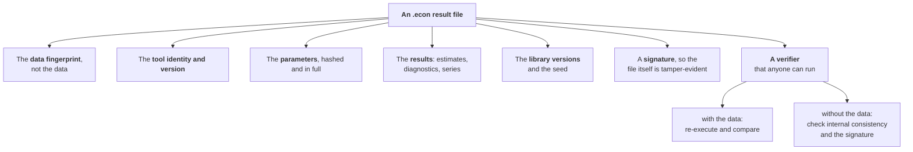
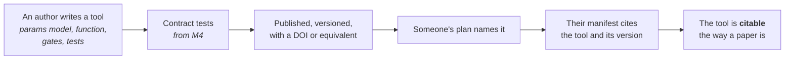
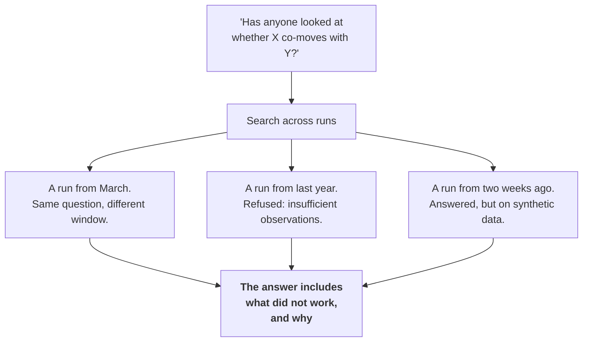
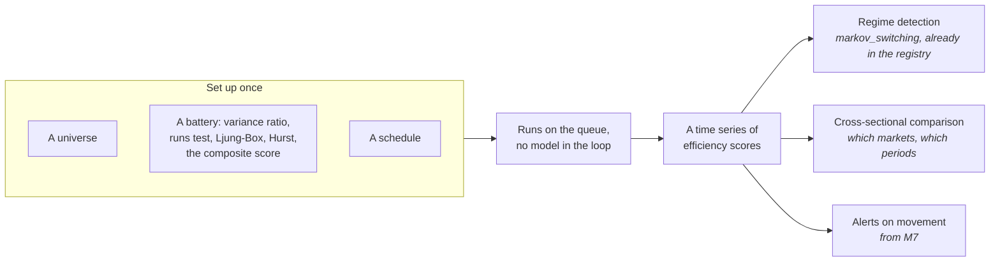
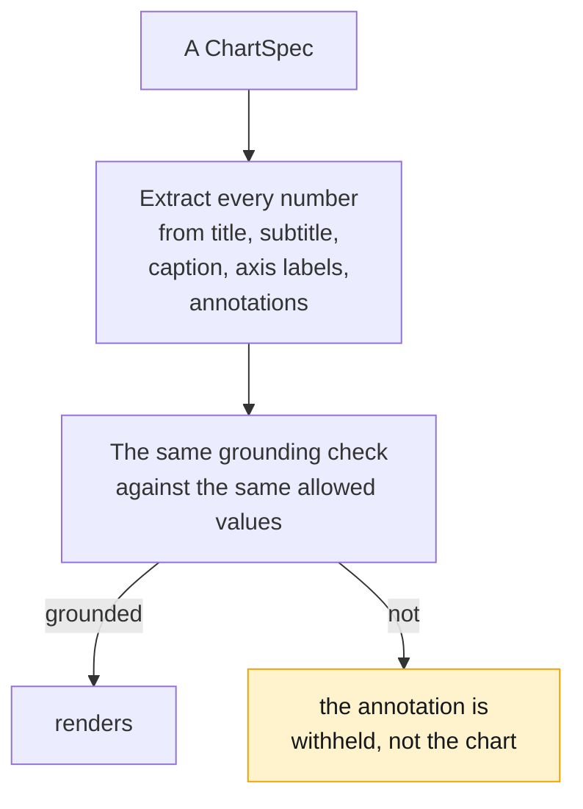
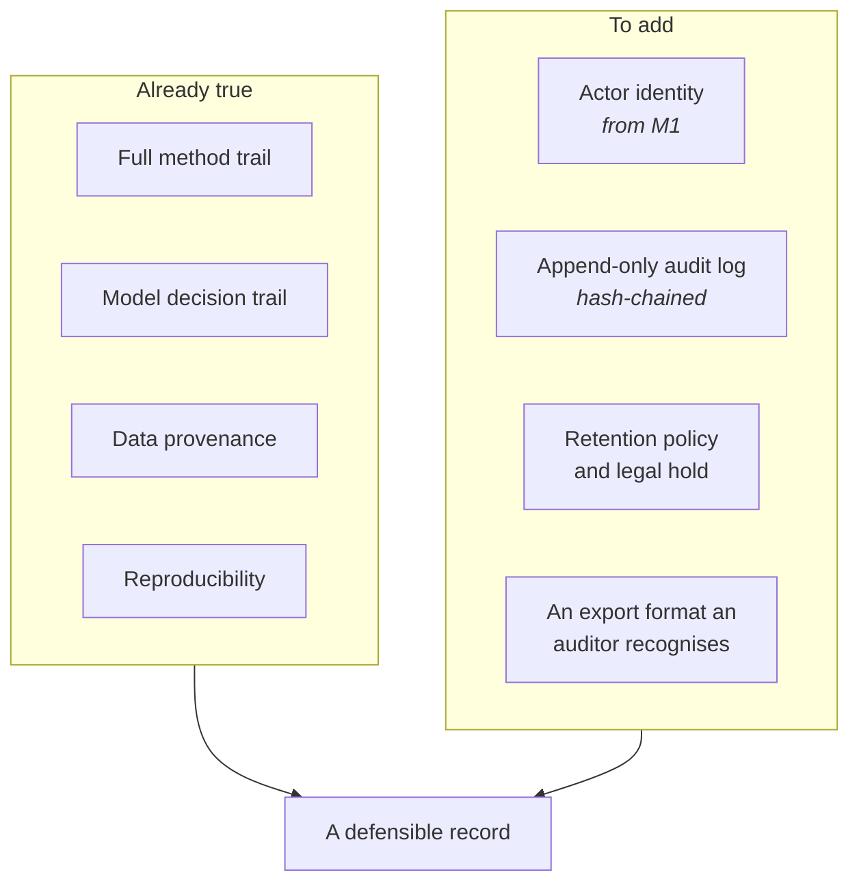
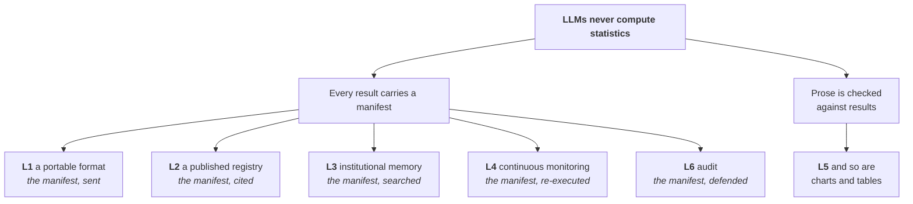

# Long term

- **The point:** six bets, and five of them are the same object, the
  manifest, used five different ways.
- **Read time:** about 9 minutes end to end. Each bet stands alone.
- **Do first:** read the Confidence column in the Contents table below. Three
  are high, three are medium.

These are further out than the [medium term](medium-term.md) and less
certain. So they are written as bets, not plans. Each one says:

1. what it requires
2. what it would change
3. what would tell us it was wrong

The thesis running through all six:

> **Make reproducibility the unit of exchange, not the report.**

| Today | The problem |
|---|---|
| An analyst finishes a piece of work, and what leaves the building is a PDF or a slide | The evidence stays behind |

That is backwards, for a technical reason, not a cultural one. Until recently
there was no compact, verifiable way to send the evidence.

There is now, and this project already produces one. It is called a manifest.

---

## Contents

| # | Bet | Confidence | Requires |
|---|---|---|---|
| [L1](#l1-a-portable-verifiable-result-format) | A portable, verifiable result format | High | M2, M5 |
| [L2](#l2-a-published-tool-registry) | A published tool registry | Medium | M3, M4 |
| [L3](#l3-institutional-memory) | Institutional memory | High | M1 |
| [L4](#l4-continuous-market-efficiency-monitoring) | Continuous market efficiency monitoring | High | M2, M6, M7 |
| [L5](#l5-a-grounding-gate-that-reads-charts-and-tables) | A grounding gate that reads charts and tables | Medium | M8 |
| [L6](#l6-regulatory-grade-audit-export) | Regulatory-grade audit export | Medium | M1 |

---

## L1. A portable, verifiable result format

### The bet

**A result should be able to leave this application and still be checkable by
someone who does not have it.**

### What that means concretely

**A single file that carries six things, plus a verifier anyone can run:**

**The second verification mode, without the data, is the interesting one.**

You cannot re-derive the numbers. You **can** check that:

- the file has not been edited
- the tool version exists
- the parameters are ones that tool accepts
- the estimates are internally consistent with the diagnostics

That is a much weaker check than re-execution. It is far stronger than
nothing, which is what a PDF offers.

### Why this is the highest-confidence bet

**Most of it exists.** `Manifest` is already the thing. Two pieces are
missing:

1. a serialisation someone outside the project can read
2. a verifier that runs without the application

### What would tell us we are wrong

**Nobody ever asking to check a result they were sent.**

That is possible. Trust may flow through institutions, not artifacts, and a
verifiable file would then solve a problem nobody has.

The counter-evidence would be any regulated context where "show your working"
is already a requirement. There are several.

---

## L2. A published tool registry

### The bet

**The registry should be something people outside this project publish into,
and cite.**

### What that looks like

**The key property: a manifest already names `tool` and `tool_version`.** If
those become globally meaningful, not only locally meaningful, a manifest
becomes a citation.

### Why this matters more than it sounds

**How a new econometric method reaches practitioners today:**

1. It appears in a paper.
2. Someone implements it in a notebook.
3. The notebook is shared.
4. Three people copy it with slight differences.

Nobody can tell which version anybody used.

A versioned, tested, citable function fixes that. A package on PyPI does not,
because a package has no notion of "the result was produced by version 2.1.0
of this specific function".

### What it requires beyond M4

- A naming and namespacing scheme that survives two people writing a `garch`
- A trust model. **This is the hard part**: a registry tool runs in-process,
  unsandboxed, with full trust. Installing one is installing a dependency
- A deprecation story, so a manifest naming a withdrawn tool still means
  something

### What would tell us we are wrong

**The contract tests turning out wrong in either direction:**

| Too weak | Too strong |
|---|---|
| Bad tools pass | Good tools cannot |

Both are discoverable early, in
[M4](medium-term.md#m4-an-extensible-tool-registry). That is why M4 comes
first.

---

## L3. Institutional memory

### The bet

**Every question a desk has ever asked, with its evidence, searchable.**

### Why this is different from a wiki

**A wiki holds what someone wrote down. This holds what actually happened.**

A run is a row with structured artifacts:

- the question in prose, and the typed plan
- the resolved data with its fingerprint
- the results and the diagnostics
- the trace of who and what decided
- the verdict and the narration

All of that is already persisted. None of it depends on anyone remembering to
document anything.

**The last box is the point.** The most valuable thing an institution knows
is usually what it has already tried and abandoned. That is exactly the
information that never gets written down.

**Econometrica records refusals as first-class results.**

- A refused GARCH is a persisted step with a reason.
- So "we tried that and the data could not support it" becomes searchable. It
  never is otherwise.

### What it requires

- [M1](medium-term.md#m1-multi-user-and-ownership), for the concept of a desk
  rather than a person
- Semantic search over runs, which is a small extension: pgvector is already
  there for documents
- A view that answers "what do we know about X" rather than "show me run 4821"

### What would tell us we are wrong

**The search returning mostly noise**, because most runs are exploratory and
half-finished.

That is a real risk. The mitigation is probably to let people mark a run as a
conclusion, not to try to infer it.

---

## L4. Continuous market efficiency monitoring

### The bet

**Efficiency is not a property you measure once. It moves, and the movement
is the finding.**

### What that looks like

### Why this is nearly free

**Every component exists.**

| Component | Where it comes from |
|---|---|
| The efficiency battery | Ten registered tools |
| The scheduling | [M7](medium-term.md#m7-scheduled-runs-and-drift-alerts) |
| The regime detection | `markov_switching`, already in the registry |
| Execution without a model | The re-run, already built |

**What is missing is a view:** a chart of a composite score over time, per
market, with regimes shaded. That is a frontend feature over data the backend
would already have.

### The genuinely novel part

**An efficiency score with a manifest is different from one in a paper,
because you can check it.**

Published efficiency studies are notoriously hard to replicate:

- different windows
- different adjustments
- different handling of non-trading days
- none of it recorded

A monitored score whose every point carries a data fingerprint and a tool
version is a different kind of object.

### What would tell us we are wrong

**The scores turning out to be dominated by data-handling choices, not by
market behaviour.**

That would be an interesting finding in itself. This system is unusually well
set up to detect it, because you could hold the data fixed and vary the
handling.

---

## L5. A grounding gate that reads charts and tables

### The bet

**The grounding gate checks prose. Numbers reach readers through charts and
tables too, and those are currently unchecked.**

### The gap, stated precisely

| Channel | Checked? |
|---|---|
| Narrator prose | Yes, every number |
| Chart data | **Structurally**: `unresolved_references` must be empty, so a chart cannot reference a series that does not exist |
| Chart annotations, titles, captions | **No** |
| Table cells | Bound to the result, so yes by construction |
| A number in a chart title | **No** |

So a model that writes a chart titled "Beta of 1.4 over the period" when beta
is 1.27 is not caught. The chart's *data* is bound. Its *text* is not.

### What ships

**The asymmetry with prose:**

| Where the bad number is | What is withheld | Why |
|---|---|---|
| Prose | The whole narration | Nothing is left once you remove the number |
| A chart's text | The **annotation**, not the chart | The chart's data is independently verified, and the chart without its title is still true |

The asymmetry is defensible because the data binding already exists.

### What it requires

[M8](medium-term.md#m8-giving-the-narrator-context-safely). The design work
there is about exactly this question: when is a number allowed to come from
somewhere other than a tool, and how is it marked?

### What would tell us we are wrong

**Models never putting numbers in chart titles in practice.** That would make
this a gate that never fires.

It is measurable cheaply: log the would-be violations before enforcing
anything.

---

## L6. Regulatory-grade audit export

### The bet

**For one category of user, "I can show you exactly how this number was
produced" is a requirement, not a nice-to-have.** This system is already most
of the way there.

### What exists already

| Requirement | Status |
|---|---|
| Every number traces to a tested function | Yes |
| Every model decision is recorded with its provider, model and cost | Yes |
| Rejected attempts are recorded | Yes, because they were billed |
| The prompt and response of every call | Yes, truncated at a limit |
| Data provenance including adjustment policy | Yes |
| The result can be re-derived | Yes, and per-step differences are named |
| Generated data and generated code are marked | Yes, in four places |
| **Who did it** | **No.** See [M1](medium-term.md#m1-multi-user-and-ownership) |
| **When, immutably** | **No** |
| **Retention and legal hold** | **No** |

**The first seven are the hard ones, and they are done. The last three are
ordinary engineering.**

### What ships

### The honest caveat

**This is a compliance-adjacent claim, and it needs a compliance-literate
reviewer before it is made.**

- Nothing in this documentation should be read as saying the product
  satisfies any particular regulation.
- What it says: the technical substrate a regulation would demand is unusually
  complete.

**The right next step is not to build it.** It is to take the existing trace
to someone whose job is reviewing these things and ask what is missing.

### What would tell us we are wrong

**The gap between "technically complete" and "acceptable to a regulator"
being dominated by process and attestation, not by evidence.**

That is quite possible. It would mean this is a smaller opportunity than it
looks.

---

## What connects all six

**Five of the six bets are the same object used five different ways.** That
is usually a sign that the object is the right one.

**It is also why the invariant is not negotiable.** Every one of these
depends on a number being traceable to a tested function. The moment a model
computes one, all five stop being true at once.

**Next, 2 minutes:** open [The art of the possible](../6-art-of-the-possible/)
and read the rule that page holds itself to.

---

[Documentation](../README.md) · [5. Roadmap](README.md) ·
[Medium term](medium-term.md) · **Long term**
