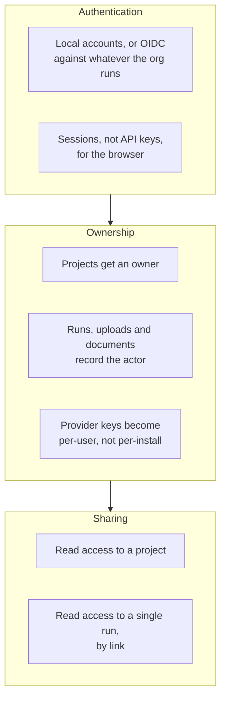
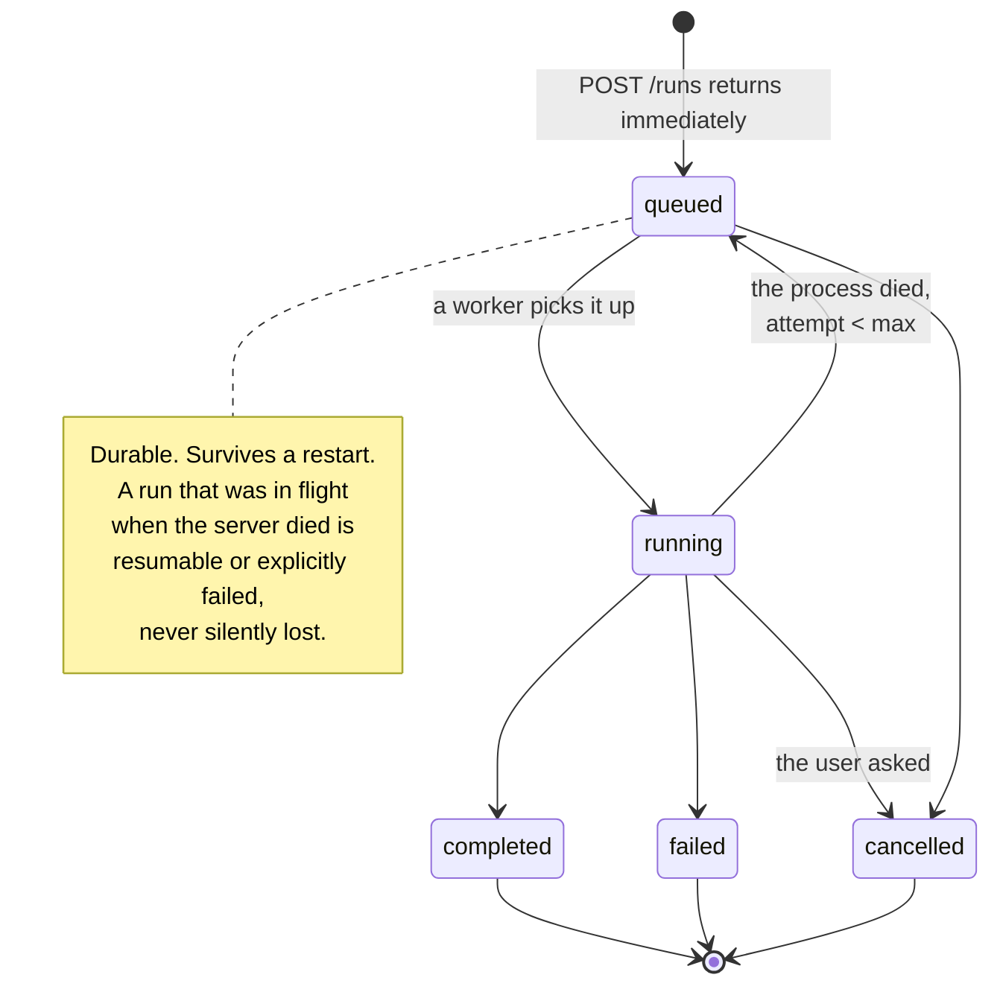
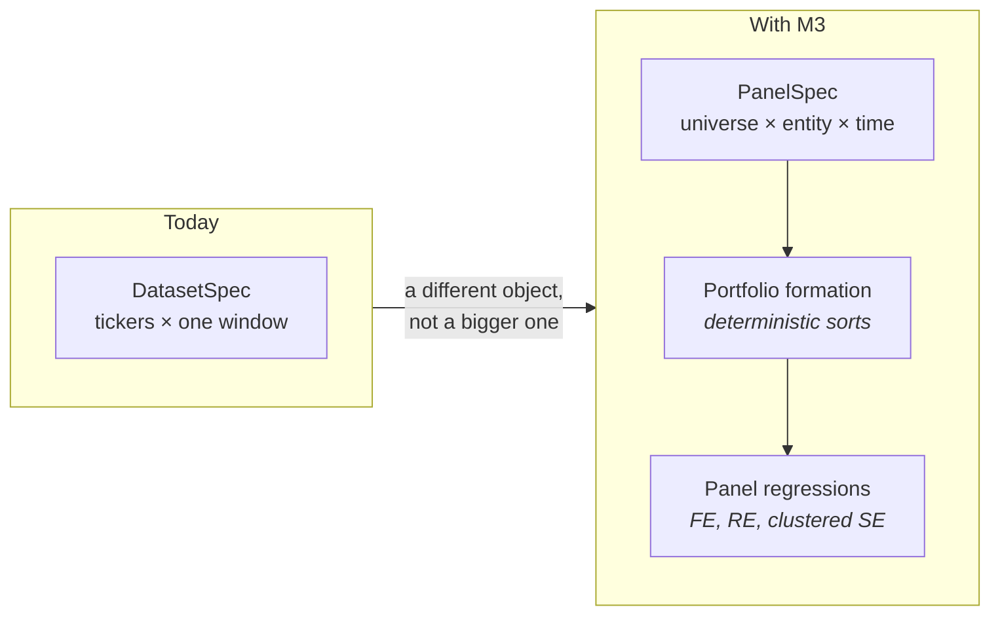
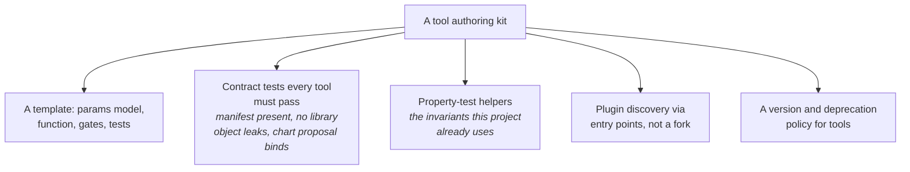
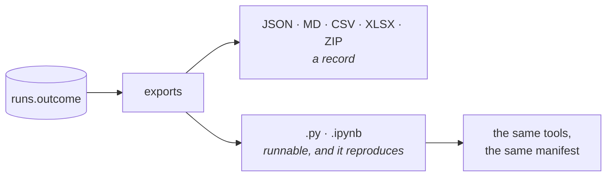
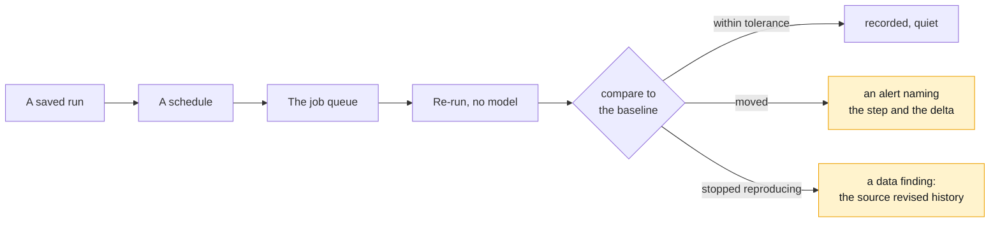
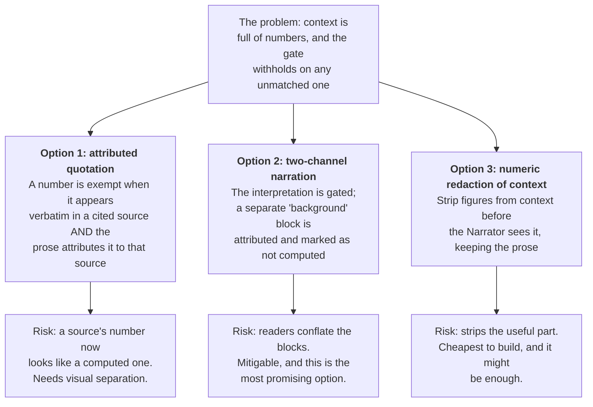
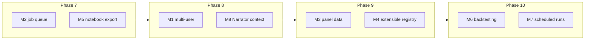

# Medium term

The next two to four phases. Eight themes.

The organising question for all of them: **what stops this being something a
team relies on rather than something one person uses?**

Almost every answer is about durability, ownership or reach. None of them is
about adding another model.

---

## Contents

| # | Theme | Rough size | Unblocks |
|---|---|---|---|
| [M1](#m1-multi-user-and-ownership) | Multi-user and ownership | Large | Institutional memory, audit |
| [M2](#m2-a-durable-job-queue) | A durable job queue | Medium | Continuous monitoring, long fits |
| [M3](#m3-panel-data-and-cross-sectional-pricing) | Panel data and cross-sectional pricing | Large | A published registry |
| [M4](#m4-an-extensible-tool-registry) | An extensible tool registry | Medium | A published registry |
| [M5](#m5-notebook-and-python-export) | Notebook and Python export | Small | A portable result format |
| [M6](#m6-backtesting-and-portfolio-construction) | Backtesting and portfolio construction | Large | Continuous monitoring |
| [M7](#m7-scheduled-runs-and-drift-alerts) | Scheduled runs and drift alerts | Medium | Continuous monitoring |
| [M8](#m8-giving-the-narrator-context-safely) | Giving the Narrator context, safely | Medium | A multimodal grounding gate |

---

## M1. Multi-user and ownership

### Why now

This is the largest single gap between what the product is and what it claims
to be about.

The whole argument for Econometrica is auditability: you can reconstruct a
decision you were not present for. But right now there is no concept of "who
ran this", because there is no concept of "who". A risk officer can open a run
and see which *model* decided what. They cannot see which *person* asked.

That is a strange hole in an audit product, and it exists purely because
[D12](../4-decisions/platform-choices.md#d12) traded it away for scope.

### What ships

| Epic | Notes |
|---|---|
| **E1.1 Identity** | Local accounts first. OIDC second, because it is what an organisation will actually want and it is a bigger job |
| **E1.2 Ownership columns** | Every root object takes an owner. Runs, uploads and documents take an actor |
| **E1.3 Authorization** | Project-scoped. Everything already is, which is why this is tractable |
| **E1.4 Per-user keystore** | Currently one encrypted store per install. It has to become per-user or the first shared install leaks a key |
| **E1.5 Share a run by link** | Read-only, revocable. The most requested thing a risk officer will want |
| **E1.6 The trace records the person** | `run_steps` gains nothing; `runs` gains an actor. The trace already handles a chain of custody for models, and this is the same idea for people |

### Depends on

Nothing. It is the one theme that could start today.

### Done when

- A second person can be given read access to a project without seeing the
  first person's other projects
- A run's detail view names the person who started it
- An export carries the actor alongside the manifest
- A provider key set by one user is not usable by another

### The thing to be careful about

**Do not let authorization leak upward into `agents/`.** The whole reason
`agents/` knows nothing about projects is that it would otherwise be
untestable without a database. Authorization belongs in the routers, which is
already the composition root.

---

## M2. A durable job queue

### Why now

A GARCH fit occupies a request for its duration, and a restart mid-fit loses
it. At one user that is an annoyance. At five it is the reason people stop
using it, and at zero users on a schedule ([M7](#m7-scheduled-runs-and-drift-alerts))
it is a blocker.

The original design anticipated this: `asyncio` plus a `ProcessPoolExecutor`
plus a `jobs` table, with progress streamed over SSE. Two of the three exist.

### What ships

| Epic | Notes |
|---|---|
| **E2.1 A `jobs` table** | Status, attempts, heartbeat, payload, result reference |
| **E2.2 Worker loop** | In-process to start. Redis stays out until there is a reason, per [D18](../4-decisions/platform-choices.md#d18) |
| **E2.3 Reconnectable SSE** | The stream becomes a view onto a job rather than the job itself. Closing the tab stops watching, not running |
| **E2.4 Cancellation** | Cooperative, and it has to reach the sandbox child, which already has a wall clock |
| **E2.5 Queue depth in `/api/metrics`** | The design asked for it. It is measurable only once there is a queue |

### Depends on

Nothing hard. It touches the run router and the orchestrator's streaming
contract.

### Done when

- Killing the server mid-run and restarting it leaves the run either resumed
  or explicitly failed, never in `running` forever
- Closing the browser tab does not stop the analysis
- A user can cancel a run and the sandbox child dies with it
- `GET /api/metrics` reports queue depth

### The thing to be careful about

**The streaming contract is the interesting part, not the queue.** Today
`run.finished` always fires, even after `run.failed`, and that is what makes a
partial run readable. A reconnecting client has to get the same guarantee, and
that means the event log has to be replayable, not just live.

---

## M3. Panel data and cross-sectional pricing

### Why now

The registry covers 37 tools and there is a shape of question it cannot
express at all: **many assets, many periods, at once.**

`fama_macbeth` and `grs_test` gesture at it, but the `DatasetSpec` is a list
of tickers over a window, and a genuine panel is a different object. Anyone
doing serious cross-sectional asset pricing hits this in the first hour.

### What ships

| Epic | Notes |
|---|---|
| **E3.1 A panel dataset spec** | Entity, time, and the frame shape that follows. This is the schema change everything else waits on |
| **E3.2 Portfolio formation** | Sorts on characteristics: size, book-to-market, momentum. Deterministic, like the Data Steward |
| **E3.3 Panel regressions** | Fixed and random effects, clustered standard errors. `linearmodels` already carries these, which is why it is a dependency |
| **E3.4 Characteristic-sorted portfolios as a first-class result** | With the chart types they imply |
| **E3.5 Extend the Data Steward** | To resolve a universe rather than a ticker list |

### Depends on

Nothing structurally, but it is the largest theme here. The `DatasetSpec`
change ripples through the Data Steward, the fingerprint, the manifest and the
Planner's catalogue.

### Done when

- A user can ask for decile portfolios sorted on a characteristic and get back
  a `ResultSet` with a manifest
- A panel regression runs with clustered standard errors and its diagnostics
  are the right ones for a panel
- The re-run reproduces a panel result, including the portfolio formation

### The thing to be careful about

**Portfolio formation must be deterministic**, for exactly the reason the Data
Steward is. A sort with a tie-breaking rule that depends on row order is not
reproducible, and it will look reproducible until the data source changes its
ordering.

---

## M4. An extensible tool registry

### Why now

The registry is the product's moat and its ceiling. 37 tools is a lot and it
is also finite, and every question outside it either falls to the sandbox
(marked `unvalidated`) or is refused.

There should be a supported way to add tool 38 that does not require
understanding the whole codebase.

### What ships

| Epic | Notes |
|---|---|
| **E4.1 The contract test suite** | Every registered tool, from anywhere, must pass it. This is the actual deliverable |
| **E4.2 A cookiecutter or template** | Params model, function, gates, known-answer fixture, property test |
| **E4.3 Entry-point discovery** | So a tool package installs rather than forks |
| **E4.4 Tool versioning policy** | What a major bump means, what happens to a manifest naming an old version |
| **E4.5 Docs: writing a tool** | The one document that decides whether anyone does |

### Depends on

Nothing, but it is much more valuable after [M3](#m3-panel-data-and-cross-sectional-pricing),
because panel tools are the obvious first thing someone would want to add.

### Done when

- A tool living in a separate pip-installable package is selectable by a
  Planner, runs, produces a manifest, and re-runs
- The contract test suite fails on a tool that leaks a statsmodels object
- The re-run report handles a manifest naming a tool version that no longer
  exists, gracefully and with an explanation

### The thing to be careful about

**A third-party tool is trusted code in-process.** That is a genuinely
different security posture from the sandbox, and it needs to be said out loud
in the documentation rather than discovered. The honest framing is that
installing a tool package is like installing any dependency, and the
`unvalidated` marking does not apply because a registry tool is not sandboxed.

---

## M5. Notebook and Python export

### Why now

The smallest theme here and possibly the highest ratio of value to effort.

Every export today is a **record** of an analysis. None of them is a
**runnable** version of it. An analyst who wants to take a result and poke at
it has to reconstruct the pandas by hand, which is the exact work the product
was meant to remove.

### What ships

| Epic | Notes |
|---|---|
| **E5.1 A Python script export** | The resolved dataset spec, the tool calls with their parameters, the manifest as a header comment |
| **E5.2 A Jupyter notebook export** | The same, plus the narration as markdown cells and the chart calls |
| **E5.3 A thin runtime package** | So the exported script imports `econometrica` and calls the same tools rather than reimplementing them |

### Depends on

Nothing. It reads `runs.outcome`, which already holds everything.

### Done when

- An exported script, run on a clean machine with the package installed,
  produces a `ResultSet` whose manifest matches the original
- The notebook renders the same charts

### The thing to be careful about

**The exported script must call the registry, not inline the statistics.** An
export that reimplements the CAPM in pandas would break the invariant at the
one moment it matters most: when the number leaves the building.

---

## M6. Backtesting and portfolio construction

### Why now

The natural next question after "is this factor loading real" is "what would
it have been worth", and there is currently no honest way to answer it.

It is also the theme with the largest gap between how easy it looks and how
easy it is, which is a reason to do it carefully rather than a reason to skip
it.

### What ships

| Epic | Notes |
|---|---|
| **E6.1 A backtest as a first-class result** | With a manifest, like everything else |
| **E6.2 Look-ahead detection as a gate** | Executable, refusing. This is the whole value of doing it here rather than in a notebook |
| **E6.3 Transaction cost models** | Explicit, parameterised, and named in the manifest |
| **E6.4 Portfolio construction** | Mean-variance, risk parity, minimum variance |
| **E6.5 Performance attribution** | Against the factor sets that already exist |

### Depends on

[M3](#m3-panel-data-and-cross-sectional-pricing), because portfolio
construction over a universe needs a panel.

### Done when

- A backtest refuses when the strategy uses information not available at the
  decision time, and names where
- A backtest's manifest pins the cost model, the rebalancing rule and the
  universe as-of date
- Two runs of the same backtest produce identical numbers

### The thing to be careful about

**This is the theme where the product could most easily start lying.** A
backtest is the single most over-claimed artifact in finance, and the reasons
are all things a gate can catch: survivorship in the universe, look-ahead in
the signal, costs assumed away, and a rebalancing rule chosen after seeing the
result.

If those cannot be gated, the honest move is to ship the backtest with
mandatory disclosures in the same place the `synthetic_data` flag sits, rather
than not to ship it. But gates first.

---

## M7. Scheduled runs and drift alerts

### Why now

A run is already re-runnable without a model in the loop. That is an unusual
property and it makes something available almost for free: **run it again next
month and tell me what moved.**

The barrier is not the analysis. It is the queue.

### What ships

| Epic | Notes |
|---|---|
| **E7.1 Schedules on a run** | Cron-shaped, per project |
| **E7.2 Baseline and tolerance** | Per estimate. A beta moving 0.02 is noise; 0.4 is not, and only the user knows which |
| **E7.3 A drift record** | A time series of one estimate across scheduled runs. This is itself chartable |
| **E7.4 Alerting** | Start with in-app. Email and webhooks after |
| **E7.5 Distinguish drift from non-reproduction** | These are completely different findings and must never share a message |

### Depends on

[M2](#m2-a-durable-job-queue). Absolutely and entirely.

### Done when

- A saved run executes on a schedule with no browser open
- An estimate moving beyond its tolerance produces an alert naming the step,
  the estimate, the old value and the new one
- A source that revised its history produces a **different** message from an
  estimate that genuinely moved

### The thing to be careful about

That last bullet. "Your beta changed" and "your data vendor changed your data"
look identical in the numbers and are opposite findings. The re-run report
already distinguishes them by fingerprint, and the alerting must not flatten
that.

---

## M8. Giving the Narrator context, safely

### Why now

This is the one acknowledged design compromise in the shipped product.

The Narrator sees no web results, no retrieved documents and no MCP output,
because the grounding gate withholds an entire narration over one unmatched
number, and those channels are dense with numbers. The result is
interpretations that are less informed than they could be.

See [D10](../4-decisions/trust-mechanisms.md#d10). It is an open item, and it
needs a design rather than a toggle.

### What ships

The design work is the deliverable. Three candidate mechanisms, in the order
we would try them:

| Epic | Notes |
|---|---|
| **E8.1 Design note** | With the failure modes enumerated, as the sandbox design note was |
| **E8.2 A prototype behind a flag** | Measured on real narrations, not on fixtures |
| **E8.3 Whichever option survives** | With the visual separation it needs |

### Depends on

Nothing technically. It depends on someone thinking hard for a day.

### Done when

- A narration can say "the index rebalanced in March 2024, per [source]"
  without being withheld
- A number originating from a source is **visually and structurally
  distinguishable** from a computed one, in the canvas and in the printout
- The `-15.066` test still fails

That third criterion is the real one. Any solution that loosens the gate for
computed numbers has solved a different problem.

---

## Sequencing

If you had to pick an order, this one:

The reasoning: phase 7 is small and unblocks the most. Phase 8 is the
credibility phase, since an audit tool with no users is odd and an
acknowledged compromise should not stay acknowledged for ever. Phase 9 is the
big one. Phase 10 is what the first three make safe.

---

[Documentation](../README.md) · [5. Roadmap](README.md) · **Medium term** ·
[Long term](long-term.md)
