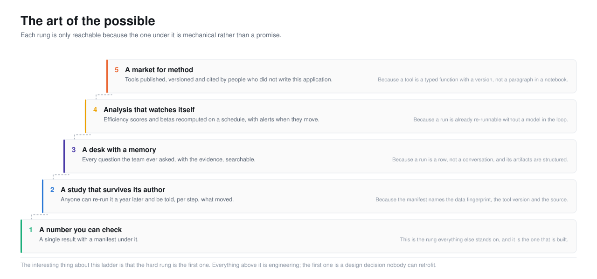
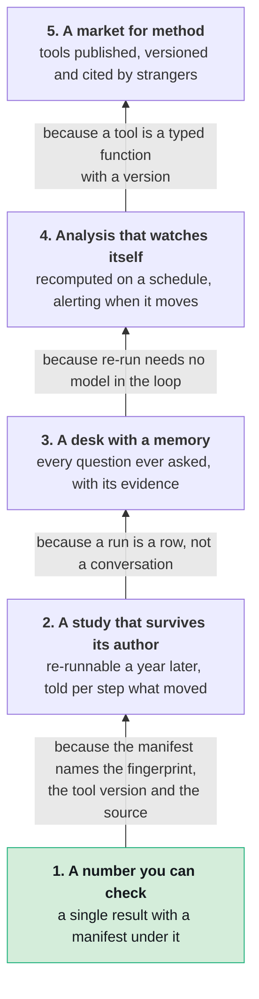
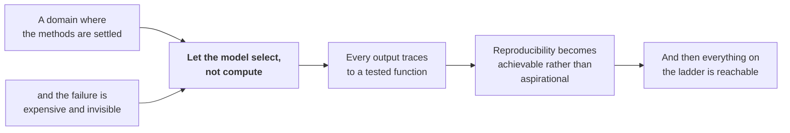

<picture>
  <source media="(prefers-color-scheme: dark)" srcset="../assets/doc-art-of-the-possible-dark.svg">
  <source media="(prefers-color-scheme: light)" srcset="../assets/doc-art-of-the-possible-light.svg">
  
</picture>

# 6. The art of the possible

This is the speculative section. Everything before it describes what is or
what is planned. This one is about what becomes **reachable** if the thing
holds.

I want to be careful here, because "the art of the possible" is usually where
documentation stops being honest. So the rule for this page is that every
claim has to name what makes it possible, and the answer has to be something
that already exists.

---

## The ladder

The interesting thing about the ladder in the illustration above is that
**the hard rung is the first one.**

Everything above rung one is engineering. Rung one is a design decision, and
it is the one you cannot retrofit. You can add scheduling to a system that
produces trustworthy numbers. You cannot add trustworthy numbers to a system
that schedules untrustworthy ones.

That is the whole argument for building it in this order, and it is why the
capability that looks least impressive in a demo is the one that matters.

---

## Six things that become possible

### 1. Analysis you can send instead of describe

Today an analyst finishes a piece of work and what leaves the building is a
slide. The evidence stays behind, in a notebook, on a laptop, in a form nobody
else can execute.

**What makes it possible:** the manifest. A file that carries the data
fingerprint, the tool identity and version, the parameters and the results is
small, and it is checkable in two modes: with the data, by re-executing; and
without it, by verifying internal consistency and a signature.

**What changes:** the unit of exchange between analysts stops being a
narrative and starts being an artifact. That is a bigger shift than it sounds,
because narratives are unfalsifiable and artifacts are not.

**Roadmap:** [L1](../5-roadmap/long-term.md#l1-a-portable-verifiable-result-format).

---

### 2. Knowing what your organisation has already tried

Every organisation's most valuable knowledge is what it tried and abandoned,
and that is exactly the knowledge that never gets written down. Nobody
documents a failure. They just quietly stop.

**What makes it possible:** refusals are first-class results here. A GARCH
declined for lack of ARCH effects is a persisted step with a reason attached.
So is a run blocked because the narration could not be grounded. So is a
window that had too few observations.

**What changes:** "has anyone looked at this?" gets an answer that includes
the dead ends. A new analyst can find out in thirty seconds that the desk
tried a cointegration approach in March and the Johansen test refused, rather
than spending a week rediscovering it.

**Roadmap:** [L3](../5-roadmap/long-term.md#l3-institutional-memory).

---

### 3. Efficiency as a monitored quantity, not a paper

Market efficiency studies are published as snapshots: this market, this
window, this battery of tests, this conclusion. They are famously hard to
replicate, because the handling choices that drive the result are rarely
recorded.

**What makes it possible:** ten efficiency tools in the registry, a composite
score, a re-run that consults no model, and a manifest under every point.

**What changes:** an efficiency score becomes a time series rather than a
finding. You can watch a market's weak-form efficiency move, shade the
regimes with a model that is already in the registry, and, critically, hold
the data fixed and vary the handling to find out how much of the movement is
real.

That last capability is genuinely rare. Most efficiency research cannot do it
because the handling was never pinned down.

**Roadmap:** [L4](../5-roadmap/long-term.md#l4-continuous-market-efficiency-monitoring).

---

### 4. Method that circulates the way papers do

A new econometric method reaches practitioners like this: it appears in a
paper, someone implements it in a notebook, the notebook gets shared, and
three people copy it with small differences. A year later nobody can say which
version produced which result.

**What makes it possible:** a tool is a typed function with a version and a
contract test suite, and a manifest already names both.

**What changes:** `tool_version: "2.1.0"` in a manifest becomes a citation. Not
"we used a GARCH", but "we used *this* GARCH, and here is the exact function".
The difference matters more in econometrics than in most fields, because the
implementation choices (which optimiser, which starting values, which variance
targeting) genuinely move the answer.

**Roadmap:** [L2](../5-roadmap/long-term.md#l2-a-published-tool-registry),
after [M4](../5-roadmap/medium-term.md#m4-an-extensible-tool-registry).

---

### 5. Teaching by refusal

This one is not on the roadmap and it is the one I would most like someone to
build.

**What makes it possible:** a gate refusal carries a `because`, and the
`because` is written for a person.

> `garch` requires ARCH effects. The ARCH-LM test gives a statistic of 4.21
> with a p-value of 0.52, so the null of no ARCH effects is not rejected.
> Fitting a GARCH here would return a persistence figure with nothing behind
> it.

**What changes:** a learner asks for something wrong and gets told exactly why
it is wrong, on their own data, with the statistic in front of them. That is a
better econometrics tutorial than most textbooks, because it is responsive and
because the example is theirs.

The thing that makes it work is that it is not a tutorial mode bolted on. It
is the same refusal a professional gets. Nobody had to write a curriculum.

---

### 6. A defensible record, without anyone having to be diligent

**What makes it possible:** everything is recorded by default. The trace, the
prompts, the rejected attempts, the token counts, the data fingerprint, the
adjustment policy, the refusals, the withheld narrations.

None of it requires the analyst to remember to record anything, which is
important, because the analyst will not.

**What changes:** the gap between "what a regulator would want" and "what
exists" narrows to identity, immutability and retention, which are ordinary
engineering rather than a cultural change.

**Roadmap:** [L6](../5-roadmap/long-term.md#l6-regulatory-grade-audit-export),
with the honest caveat attached: this needs a compliance-literate reviewer
before anyone claims it.

---

## What this generalises to

The pattern here is not about econometrics.

Three conditions make a domain a candidate:

1. **The methods are settled.** Nobody needs a model to invent a new way to
   estimate a CAPM beta. The reference implementations are correct and have
   been for years. What people need is help choosing among them.
2. **The failure is expensive and invisible.** A wrong number does not throw
   an exception. It gets put in a memo and someone acts on it.
3. **Correctness is checkable given the inputs.** This is what makes
   reproducibility possible in principle, and it is what rules out domains
   where the output is a judgement.

Domains that fit: clinical trial analysis. Actuarial work. Structural
engineering calculations. Environmental modelling. Anywhere with a body of
validated methods, a regulator, and a habit of putting numbers in documents.

Domains that do not fit: anything where the answer is an opinion, where the
methods are still being invented, or where nobody would notice a wrong answer.
In those, a model that computes is fine, because there was never a
reproducibility claim to break.

---

## The thing I would most want to be true

Not a feature. A change in what people expect.

Right now, if you show someone a number produced by an AI system, the
reasonable response is to check it, and checking it is expensive. That
expense is what limits how much of this work can be delegated, and it limits
it much more than model capability does.

If a number could arrive with its evidence attached, cheaply, verifiably, by
default, the expensive step goes away. Not because the model got better, but
because you stopped having to trust it.

**That is the actual bet.** Not that AI will do econometrics. That AI will
select econometrics, and that the selection is the part worth having.

---

## Read next

You have reached the end of the documentation. If you want to go back to
something concrete:

- **[What is in the box](../2-product/)** for what exists today
- **[The central decision](../4-decisions/the-central-decision.md)** for the
  choice this all rests on
- **[`CLAUDE.md`](../../CLAUDE.md)** for the working notes, which are more
  useful than any of this if you are about to change something

---

[Documentation](../README.md) · [1. Why](../1-why/) · [2. Product](../2-product/) ·
[3. Architecture](../3-architecture/) · [4. Decisions](../4-decisions/) ·
[5. Roadmap](../5-roadmap/) · **6. The art of the possible**
