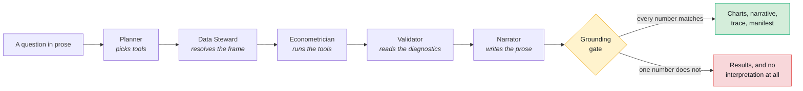

# Econometrica documentation

- **The point:** models decide what to compute. A registry of 37 tested
  functions does the computing. Every page here follows from that.
- **Read time:** about 3 minutes for this page.
- **Do first:** pick one row from the table below and open it. New here? Open
  row 1.

**Six sections.** Read them in order if you are new, or jump to the one that
matches what you came for.

| | Section | For | What it answers |
|---|---|---|---|
| 1 | **[Why this exists](1-why/)** | everyone | What problem is this, and why is the obvious solution wrong? |
| 2 | **[What is in the box](2-product/)** | product, users | What does it do today, exactly, and what does it refuse to do? |
| 3 | **[The architect's view](3-architecture/)** | engineers | How is it built, layer by layer, and where are the seams? |
| 4 | **[Key decisions](4-decisions/)** | everyone | What was chosen, what was rejected, and what changed our minds? |
| 5 | **[The roadmap](5-roadmap/)** | product, sponsors | Where does this go next, and what has to be true first? |
| 6 | **[The art of the possible](6-art-of-the-possible/)** | everyone | If this holds, what becomes buildable that was not before? |

## The short version

**The problem.** An LLM asked for a beta will give you one.

- It will be a number, formatted like a number, delivered with the same
  confidence as a correct one.
- It will sometimes be right.
- That "sometimes" is the whole problem. A number you have to check by hand is
  not worth having.

**The answer.** Econometrica takes the arithmetic away from the model.

- Models decide *what to compute*.
- A registry of 37 typed, versioned, unit-tested functions does the computing.
- Every figure a user sees traces back to one of those functions and carries a
  manifest that reproduces it.

**What the rest of this documentation is about.** That single decision, and:

- the shape it forces on the product
- the architecture it implies
- the things it makes impossible
- the things it makes possible that were not before



## Where the source of truth is

**This documentation explains the system. It does not replace these three:**

| File | What it is |
|---|---|
| [`CLAUDE.md`](../CLAUDE.md) | Working notes. Every sharp edge found the hard way, with the probe output that found it. The most useful file in the repository if you are about to change something. |
| [`docs/plans/`](plans/) | The dated design and step plans, one per phase and per feature. These are the record of what was decided and when. |
| The tests | 1,492 backend, 326 frontend, 6 end to end. Where the documentation and the tests disagree, the tests are right. |

## A note on the diagrams

**Most diagrams are [Mermaid](https://mermaid.js.org/), rendered by GitHub
from the source in the Markdown.** That is deliberate.

| A diagram that lives | Gets updated |
|---|---|
| Next to the prose it explains | When the prose does |
| In a design tool | It does not |

**The six section heroes are SVG.**
[`assets/build_doc_diagrams.py`](assets/build_doc_diagrams.py) generates them
from a single definition into a light and a dark file. Hand-maintaining two
copies of a drawing is how they drift apart.

Regenerate them with:

```bash
uv run python docs/assets/build_doc_diagrams.py
```

**Next, 2 minutes:** open [Why this exists](1-why/) and read its first
section, "The thing that is actually wrong".

---

[Repository root](../README.md) · **Documentation** ·
[1. Why](1-why/) · [2. Product](2-product/) · [3. Architecture](3-architecture/) ·
[4. Decisions](4-decisions/) · [5. Roadmap](5-roadmap/) ·
[6. The art of the possible](6-art-of-the-possible/)
